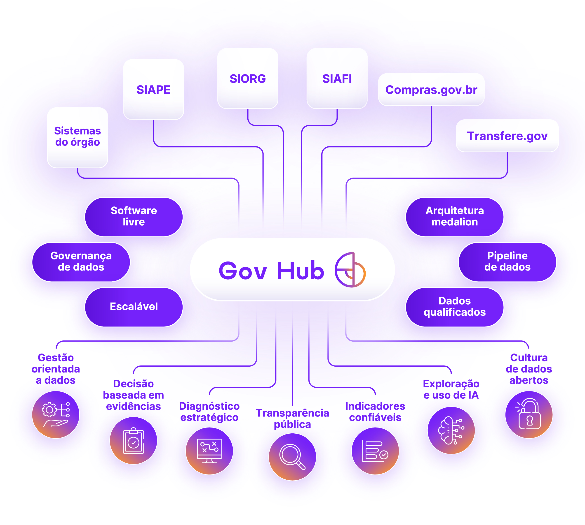

# Gov Hub BR - Transformando Dados em Valor para Gestão Pública

O Gov Hub BR é uma iniciativa para enfrentar os desafios da fragmentação, redundância e inconsistências nos sistemas estruturantes do governo federal. O projeto busca transformar dados públicos em ativos estratégicos, promovendo eficiência administrativa, transparência e melhor tomada de decisão. A partir da integração de dados, gestores públicos terão acesso a informações qualificadas para subsidiar decisões mais assertivas, reduzir custos operacionais e otimizar processos internos. 

Potencializamos informações de sistemas como TransfereGov, Siape, Siafi, ComprasGov e Siorg para gerar diagnósticos estratégicos, indicadores confiáveis e decisões baseadas em evidências.



- Transparência pública e cultura de dados abertos
- Indicadores confiáveis para acompanhamento e monitoramento
- Decisões baseadas em evidências e diagnósticos estratégicos
- Exploração de inteligência artificial para gerar insights
- Gestão orientada a dados em todos os níveis

## Fluxo/Arquitetura de Dados

A arquitetura do Gov Hub BR é baseada na Arquitetura Medallion,  em um fluxo de dados que permite a coleta, transformação e visualização de dados.


Para mais informações sobre o projeto, veja o nosso [e-book](docs/land/dist/ebook/GovHub_Livro-digital_0905.pdf).
E temos também alguns slides falando do projeto e como ele pode ajudar a transformar a gestão pública.

[Slides](https://www.figma.com/slides/PlubQE0gaiBBwFAV5GcVlH/Gov-Hub---F%C3%B3rum-IA---Giga-candanga?node-id=5-131&t=hlLiJiwfyPEPRFys-1)

## Apoio

Esse trabalho  é mantido pelo [Lab Livre](https://www.instagram.com/lab.livre/) e apoiado pelo [IPEA/Dides](https://www.ipea.gov.br/portal/categorias/72-estrutura-organizacional/210-dides-estrutura-organizacional).

## Contato

Para dúvidas, sugestões ou para contribuir com o projeto, entre em contato conosco: [lablivreunb@gmail.com](mailto:lablivreunb@gmail.com)

## Tecnologias utilizadas

O projeto adota um stack tecnológico baseado em soluções open-source, incluindo Apache Airflow para orquestração de pipelines de dados, DBT para transformação e modelagem de informações, Apache Superset para visualização e exploração, PostgreSQL como banco de dados relacional e Docker para containerização e implantação. A escolha dessas tecnologias permite maior flexibilidade, escalabilidade e integração com diferentes sistemas governamentais.
- [Apache Airflow](https://airflow.apache.org/) - Orquestração de pipelines de dados
- [DBT (Data Build Tool)](https://www.getdbt.com/) - Transformação e modelagem de dados
- [Apache Superset](https://superset.apache.org/) - Visualização e exploração de dados
- [PostgreSQL](https://www.postgresql.org/) - Banco de dados relacional
- [Docker](https://www.docker.com/) - Containerização e implantação de aplicações

## Primeiros passo

###  Pré-requisitos

Antes de começar, certifique-se de ter os seguintes softwares instalados:

- **Docker e Docker Compose**: Para gerenciamento de contêineres.
- **Make**: Ferramenta de automação de build.
- **Python 3.x**: Para execução de scripts e desenvolvimento.
- **Git**: Controle de versão.

Caso precise de ajuda para instalar esses componentes, consulte a documentação oficial de cada ferramenta:

- [Instalação do Docker](https://docs.docker.com/get-docker/)
- [Guia do Python](https://www.python.org/downloads/)
- [Guia do Git](https://git-scm.com/book/en/v2/Getting-Started-Installing-Git)

---

## 🚀 Instalação

### 1. Clonando o Repositório

Para obter o código-fonte do projeto, clone o repositório Git:

```bash
git clone git@gitlab.com:lappis-unb/gest-odadosipea/app-lappis-ipea.git
cd app-lappis-ipea
sudo docker-compose --profile dev up govhub-dev
```

### 2. Configurando o Ambiente

Execute o comando abaixo para configurar automaticamente o ambiente de desenvolvimento:

```bash
make setup
```

Este comando irá:

- Criar ambientes virtuais necessários.
- Instalar dependências do projeto.
- Configurar hooks de pré-commit.
- Preparar o ambiente de desenvolvimento para execução local.

!!! note "Dica" Caso encontre problemas durante a configuração, verifique se o Docker está rodando corretamente e se você possui permissões administrativas no sistema.

## 🏃‍♂️ Executando o Projeto Localmente

Após a configuração, inicialize todos os serviços com o Docker Compose:

```bash
docker-compose up -d
```

### Acessando os Componentes

Uma vez que os serviços estejam em execução, você pode acessar as ferramentas principais nos seguintes URLs:

- Airflow: http://localhost:8080
- Jupyter: http://localhost:8888
- Superset: http://localhost:8088

Certifique-se de que todas as portas mencionadas estejam disponíveis no seu ambiente.

## 🛠 Estrutura do Projeto

A estrutura do projeto é organizada para separar cada componente da stack, facilitando a manutenção e o desenvolvimento:

```bash
.
├── airflow/           # Configurações e DAGs do Airflow
│   ├── dags/          # Definição de workflows
│   └── plugins/       # Plugins personalizados
├── dbt/               # Modelos e configurações do dbt
│   └── models/        # Modelagem de dados
├── jupyter/           # Notebooks interativos
│   └── notebooks/     # Análises exploratórias
├── superset/          # Dashboards e visualizações
│   └── dashboards/    # Configurações de dashboards
├── docker-compose.yml # Configuração do Docker Compose
├── Makefile           # Comandos automatizados
└── README.md          # Documentação inicial
```

Essa organização modular permite que cada componente seja desenvolvido e mantido de forma independente.

---

## 🎯 Comandos Úteis no Makefile

O **Makefile** facilita a execução de tarefas repetitivas e a configuração do ambiente. Aqui estão os principais comandos disponíveis:

- `make setup`: Configuração inicial do projeto, incluindo instalação de dependências e configuração do ambiente.
- `make lint`: Verificação de qualidade do código com ferramentas de linting.
- `make tests`: Execução da suíte de testes para validar mudanças no código.
- `make clean`: Remoção de arquivos gerados automaticamente.
- `make build`: Criação de imagens Docker para o ambiente de desenvolvimento.


## Equipe

Gov Hub BR - transformando dados públicos em ativos estratégicos.
