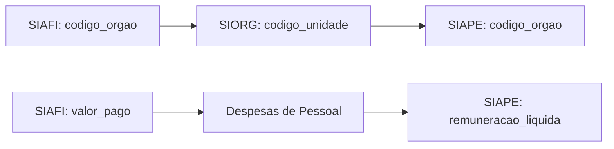
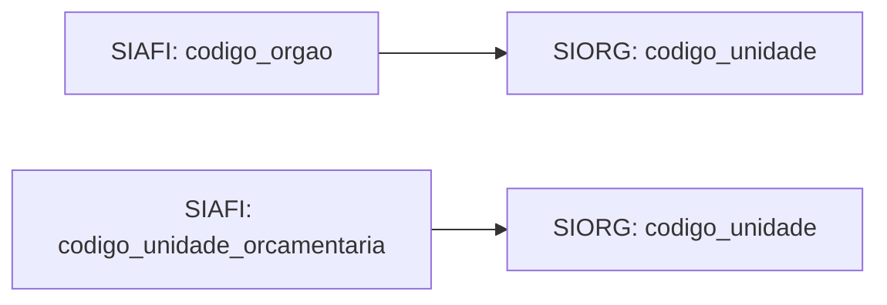

# Dicionário de Dados dos Sistemas Estruturantes

Este dicionário apresenta a documentação completa dos metadados dos principais sistemas estruturantes do governo federal integrados ao GovHub.

## Visão Geral

Os sistemas estruturantes são as bases de dados centrais que suportam as operações governamentais. Este dicionário fornece:

- **Definições de campos**: Explicação detalhada de cada campo/coluna
- **Tipos de dados**: Formatos e estruturas dos dados
- **Relacionamentos**: Como as tabelas se conectam entre sistemas
- **Chaves de integração**: Campos utilizados para vincular dados entre sistemas
- **Regras de negócio**: Validações e restrições aplicadas aos dados

## Sistemas Documentados

### SIAFI (Sistema Integrado de Administração Financeira)

O SIAFI é o principal sistema de execução orçamentária e financeira do governo federal.

#### Principais Entidades

##### Tabela: `siafi_execucao_orcamentaria`

| Campo | Tipo | Descrição | Chave |
|-------|------|-----------|-------|
| `codigo_orgao` | VARCHAR(5) | Código do órgão executor | FK |
| `codigo_unidade_orcamentaria` | VARCHAR(5) | Código da unidade orçamentária | FK |
| `codigo_funcao` | VARCHAR(2) | Código da função orçamentária | FK |
| `codigo_subfuncao` | VARCHAR(3) | Código da subfunção orçamentária | FK |
| `codigo_programa` | VARCHAR(4) | Código do programa orçamentário | FK |
| `codigo_acao` | VARCHAR(4) | Código da ação orçamentária | FK |
| `valor_dotacao_inicial` | DECIMAL(15,2) | Valor da dotação orçamentária inicial | - |
| `valor_dotacao_atual` | DECIMAL(15,2) | Valor atual da dotação após créditos/anulações | - |
| `valor_empenhado` | DECIMAL(15,2) | Valor total empenhado | - |
| `valor_liquidado` | DECIMAL(15,2) | Valor total liquidado | - |
| `valor_pago` | DECIMAL(15,2) | Valor total pago | - |
| `ano_exercicio` | INTEGER | Ano do exercício orçamentário | PK |
| `mes_referencia` | INTEGER | Mês de referência dos dados | PK |

**Chaves de Integração:**
- `codigo_orgao` + `codigo_unidade_orcamentaria`: Liga com SIORG
- `codigo_programa` + `codigo_acao`: Liga com PPA (Plano Plurianual)

##### Tabela: `siafi_empenhos`

| Campo | Tipo | Descrição | Chave |
|-------|------|-----------|-------|
| `numero_empenho` | VARCHAR(20) | Número único do empenho | PK |
| `codigo_orgao` | VARCHAR(5) | Código do órgão | FK |
| `codigo_unidade_gestora` | VARCHAR(6) | Código da unidade gestora | FK |
| `cnpj_favorecido` | VARCHAR(14) | CNPJ do favorecido | FK |
| `valor_empenho` | DECIMAL(15,2) | Valor do empenho | - |
| `data_empenho` | DATE | Data de emissão do empenho | - |
| `modalidade_licitacao` | VARCHAR(2) | Código da modalidade de licitação | FK |
| `numero_processo` | VARCHAR(20) | Número do processo de compra | - |

**Chaves de Integração:**
- `cnpj_favorecido`: Liga com base de fornecedores
- `numero_processo`: Liga com COMPRASNET

##### Tabela: `siafi_liquidacoes`

| Campo | Tipo | Descrição | Chave |
|-------|------|-----------|-------|
| `numero_liquidacao` | VARCHAR(20) | Número único da liquidação | PK |
| `numero_empenho` | VARCHAR(20) | Número do empenho relacionado | FK |
| `codigo_orgao` | VARCHAR(5) | Código do órgão | FK |
| `valor_liquidacao` | DECIMAL(15,2) | Valor da liquidação | - |
| `data_liquidacao` | DATE | Data da liquidação | - |
| `documento_fiscal` | VARCHAR(50) | Número do documento fiscal | - |
| `cnpj_credor` | VARCHAR(14) | CNPJ do credor | FK |
| `observacao` | TEXT | Observações da liquidação | - |
| `situacao_liquidacao` | VARCHAR(1) | Situação (A=Ativa, C=Cancelada) | - |

**Regras de Negócio:**
- Valor da liquidação não pode exceder o saldo do empenho
- Data de liquidação deve ser posterior à data do empenho
- Documento fiscal é obrigatório para liquidações > R$ 8.000

##### Tabela: `siafi_pagamentos`

| Campo | Tipo | Descrição | Chave |
|-------|------|-----------|-------|
| `numero_pagamento` | VARCHAR(20) | Número único do pagamento | PK |
| `numero_liquidacao` | VARCHAR(20) | Número da liquidação relacionada | FK |
| `codigo_orgao` | VARCHAR(5) | Código do órgão | FK |
| `valor_pagamento` | DECIMAL(15,2) | Valor do pagamento | - |
| `data_pagamento` | DATE | Data do pagamento | - |
| `forma_pagamento` | VARCHAR(2) | Forma de pagamento (01=TED, 02=DOC, etc.) | FK |
| `banco_favorecido` | VARCHAR(3) | Código do banco do favorecido | FK |
| `agencia_favorecido` | VARCHAR(5) | Agência do favorecido | - |
| `conta_favorecido` | VARCHAR(20) | Conta do favorecido | - |
| `situacao_pagamento` | VARCHAR(1) | Situação (P=Pago, E=Estornado) | - |

##### Tabela: `siafi_restos_pagar`

| Campo | Tipo | Descrição | Chave |
|-------|------|-----------|-------|
| `numero_empenho` | VARCHAR(20) | Número do empenho | PK |
| `ano_empenho` | INTEGER | Ano do empenho original | PK |
| `ano_exercicio` | INTEGER | Ano do exercício de pagamento | PK |
| `codigo_orgao` | VARCHAR(5) | Código do órgão | FK |
| `tipo_resto` | VARCHAR(1) | Tipo (P=Processado, N=Não Processado) | - |
| `valor_inscrito` | DECIMAL(15,2) | Valor inscrito em restos a pagar | - |
| `valor_pago` | DECIMAL(15,2) | Valor pago no exercício | - |
| `valor_cancelado` | DECIMAL(15,2) | Valor cancelado | - |
| `saldo_final` | DECIMAL(15,2) | Saldo final de restos a pagar | - |

##### Tabela: `siafi_transferencias`

| Campo | Tipo | Descrição | Chave |
|-------|------|-----------|-------|
| `numero_convenio` | VARCHAR(20) | Número do convênio/transferência | PK |
| `codigo_orgao_concedente` | VARCHAR(5) | Órgão que concede o recurso | FK |
| `codigo_orgao_recebedor` | VARCHAR(5) | Órgão que recebe o recurso | FK |
| `tipo_transferencia` | VARCHAR(2) | Tipo (01=Voluntária, 02=Obrigatória) | FK |
| `valor_transferencia` | DECIMAL(15,2) | Valor da transferência | - |
| `data_assinatura` | DATE | Data de assinatura do convênio | - |
| `data_inicio_vigencia` | DATE | Início da vigência | - |
| `data_fim_vigencia` | DATE | Fim da vigência | - |
| `objeto_convenio` | TEXT | Descrição do objeto | - |
| `situacao_convenio` | VARCHAR(1) | Situação (A=Ativo, E=Encerrado) | - |

### SIAPE (Sistema Integrado de Administração de Recursos Humanos)

O SIAPE gerencia as informações de pessoal do governo federal.

#### Principais Entidades

##### Tabela: `siape_servidores`

| Campo | Tipo | Descrição | Chave |
|-------|------|-----------|-------|
| `cpf` | VARCHAR(11) | CPF do servidor | PK |
| `matricula_siape` | VARCHAR(7) | Matrícula SIAPE | UK |
| `nome_servidor` | VARCHAR(100) | Nome completo do servidor | - |
| `codigo_orgao` | VARCHAR(5) | Código do órgão de lotação | FK |
| `codigo_unidade_organizacional` | VARCHAR(10) | Código da unidade organizacional | FK |
| `cargo_codigo` | VARCHAR(6) | Código do cargo | FK |
| `funcao_codigo` | VARCHAR(6) | Código da função (se aplicável) | FK |
| `situacao_funcional` | VARCHAR(2) | Código da situação funcional | FK |
| `data_ingresso_servico_publico` | DATE | Data de ingresso no serviço público | - |
| `data_ingresso_orgao` | DATE | Data de ingresso no órgão atual | - |
| `data_nascimento` | DATE | Data de nascimento do servidor | - |
| `sexo` | VARCHAR(1) | Sexo (M=Masculino, F=Feminino) | - |
| `estado_civil` | VARCHAR(1) | Estado civil (S=Solteiro, C=Casado, etc.) | - |
| `escolaridade` | VARCHAR(2) | Nível de escolaridade | FK |
| `regime_juridico` | VARCHAR(1) | Regime jurídico (E=Estatutário, C=CLT) | - |
| `jornada_trabalho` | INTEGER | Jornada de trabalho em horas | - |
| `nivel_cargo` | VARCHAR(3) | Nível do cargo (NS=Nível Superior, etc.) | - |
| `classe_cargo` | VARCHAR(1) | Classe do cargo (A, B, C, etc.) | - |
| `padrao_vencimento` | VARCHAR(2) | Padrão de vencimento | - |
| `data_aposentadoria` | DATE | Data de aposentadoria (se aplicável) | - |
| `tipo_aposentadoria` | VARCHAR(2) | Tipo de aposentadoria | FK |

**Chaves de Integração:**
- `codigo_orgao`: Liga com SIORG e SIAFI
- `cpf`: Chave única para integração com outros sistemas
- `cargo_codigo`: Liga com tabela de cargos públicos
- `funcao_codigo`: Liga com tabela de funções

##### Tabela: `siape_remuneracao`

| Campo | Tipo | Descrição | Chave |
|-------|------|-----------|-------|
| `cpf` | VARCHAR(11) | CPF do servidor | FK |
| `ano_mes_referencia` | VARCHAR(6) | Ano e mês (YYYYMM) | PK |
| `remuneracao_basica` | DECIMAL(10,2) | Valor da remuneração básica | - |
| `vantagens_pessoais` | DECIMAL(10,2) | Vantagens pessoais nominalmente identificadas | - |
| `funcao_comissao` | DECIMAL(10,2) | Valor da função comissionada | - |
| `gratificacao_natalina` | DECIMAL(10,2) | 13º salário (quando aplicável) | - |
| `ferias` | DECIMAL(10,2) | Valor de férias (quando aplicável) | - |
| `outras_remuneracoes_eventuais` | DECIMAL(10,2) | Outras remunerações eventuais | - |
| `abono_permanencia` | DECIMAL(10,2) | Abono de permanência | - |
| `reversao_teto_constitucional` | DECIMAL(10,2) | Reversão do teto constitucional | - |
| `imposto_renda` | DECIMAL(10,2) | Imposto de renda retido | - |
| `previdencia_oficial` | DECIMAL(10,2) | Contribuição previdenciária | - |
| `faltas` | DECIMAL(10,2) | Descontos por faltas | - |
| `remuneracao_apos_deducoes` | DECIMAL(10,2) | Remuneração após deduções obrigatórias | - |
| `verbas_indenizatorias` | DECIMAL(10,2) | Total de verbas indenizatórias | - |
| `auxilio_alimentacao` | DECIMAL(10,2) | Auxílio alimentação | - |
| `auxilio_pre_escolar` | DECIMAL(10,2) | Auxílio pré-escolar | - |
| `auxilio_saude` | DECIMAL(10,2) | Auxílio saúde | - |
| `auxilio_natalidade` | DECIMAL(10,2) | Auxílio natalidade | - |
| `auxilio_moradia` | DECIMAL(10,2) | Auxílio moradia | - |
| `ajuda_custo` | DECIMAL(10,2) | Ajuda de custo | - |

**Chaves de Integração:**
- `cpf`: Liga com `siape_servidores`

##### Tabela: `siape_afastamentos`

| Campo | Tipo | Descrição | Chave |
|-------|------|-----------|-------|
| `cpf` | VARCHAR(11) | CPF do servidor | FK |
| `codigo_afastamento` | VARCHAR(10) | Código do tipo de afastamento | PK |
| `data_inicio_afastamento` | DATE | Data de início do afastamento | PK |
| `data_fim_afastamento` | DATE | Data de fim do afastamento | - |
| `tipo_afastamento` | VARCHAR(3) | Tipo de afastamento | FK |
| `motivo_afastamento` | TEXT | Descrição do motivo | - |
| `orgao_destino` | VARCHAR(5) | Órgão de destino (se aplicável) | FK |
| `com_remuneracao` | BOOLEAN | Se mantém remuneração | - |
| `situacao_afastamento` | VARCHAR(1) | Situação (A=Ativo, E=Encerrado) | - |

##### Tabela: `siape_dependentes`

| Campo | Tipo | Descrição | Chave |
|-------|------|-----------|-------|
| `cpf_servidor` | VARCHAR(11) | CPF do servidor | FK |
| `cpf_dependente` | VARCHAR(11) | CPF do dependente | PK |
| `nome_dependente` | VARCHAR(100) | Nome do dependente | - |
| `data_nascimento` | DATE | Data de nascimento do dependente | - |
| `grau_parentesco` | VARCHAR(2) | Grau de parentesco | FK |
| `situacao_dependente` | VARCHAR(1) | Situação (A=Ativo, I=Inativo) | - |
| `data_inicio_dependencia` | DATE | Início da dependência | - |
| `data_fim_dependencia` | DATE | Fim da dependência | - |

##### Tabela: `siape_movimentacoes`

| Campo | Tipo | Descrição | Chave |
|-------|------|-----------|-------|
| `cpf` | VARCHAR(11) | CPF do servidor | FK |
| `sequencial_movimentacao` | INTEGER | Sequencial da movimentação | PK |
| `data_movimentacao` | DATE | Data da movimentação | - |
| `tipo_movimentacao` | VARCHAR(3) | Tipo de movimentação | FK |
| `orgao_origem` | VARCHAR(5) | Órgão de origem | FK |
| `orgao_destino` | VARCHAR(5) | Órgão de destino | FK |
| `cargo_origem` | VARCHAR(6) | Cargo de origem | FK |
| `cargo_destino` | VARCHAR(6) | Cargo de destino | FK |
| `motivo_movimentacao` | TEXT | Motivo da movimentação | - |
| `ato_legal` | VARCHAR(100) | Ato legal que fundamenta | - |

### SIORG (Sistema de Organização e Inovação Institucional)

O SIORG mantém a estrutura organizacional do governo federal.

#### Principais Entidades

##### Tabela: `siorg_estrutura`

| Campo | Tipo | Descrição | Chave |
|-------|------|-----------|-------|
| `codigo_unidade` | VARCHAR(10) | Código único da unidade | PK |
| `nome_unidade` | VARCHAR(200) | Nome da unidade organizacional | - |
| `sigla_unidade` | VARCHAR(20) | Sigla da unidade | - |
| `codigo_unidade_pai` | VARCHAR(10) | Código da unidade hierárquica superior | FK |
| `tipo_unidade` | VARCHAR(2) | Tipo da unidade (órgão, secretaria, etc.) | - |
| `situacao` | VARCHAR(1) | Situação da unidade (A=Ativa, I=Inativa) | - |
| `data_criacao` | DATE | Data de criação da unidade | - |
| `data_extincao` | DATE | Data de extinção (se aplicável) | - |
| `nivel_hierarquico` | INTEGER | Nível na hierarquia organizacional | - |
| `poder` | VARCHAR(1) | Poder (E=Executivo, L=Legislativo, J=Judiciário) | - |
| `esfera` | VARCHAR(1) | Esfera (F=Federal, E=Estadual, M=Municipal) | - |
| `natureza_juridica` | VARCHAR(4) | Código da natureza jurídica | FK |
| `cnpj` | VARCHAR(14) | CNPJ da unidade (quando aplicável) | - |
| `endereco` | TEXT | Endereço da unidade | - |
| `telefone` | VARCHAR(20) | Telefone de contato | - |
| `email` | VARCHAR(100) | Email institucional | - |
| `site` | VARCHAR(200) | Site oficial | - |

**Chaves de Integração:**
- `codigo_unidade`: Referenciado por SIAFI e SIAPE através de `codigo_orgao`
- `codigo_unidade_pai`: Hierarquia organizacional

## Tabelas de Apoio e Dimensões

### Dimensões Orçamentárias

##### Tabela: `dim_funcoes_orcamentarias`

| Campo | Tipo | Descrição | Chave |
|-------|------|-----------|-------|
| `codigo_funcao` | VARCHAR(2) | Código da função orçamentária | PK |
| `nome_funcao` | VARCHAR(100) | Nome da função | - |
| `descricao_funcao` | TEXT | Descrição detalhada da função | - |

##### Tabela: `dim_subfuncoes_orcamentarias`

| Campo | Tipo | Descrição | Chave |
|-------|------|-----------|-------|
| `codigo_subfuncao` | VARCHAR(3) | Código da subfunção orçamentária | PK |
| `codigo_funcao` | VARCHAR(2) | Código da função relacionada | FK |
| `nome_subfuncao` | VARCHAR(100) | Nome da subfunção | - |
| `descricao_subfuncao` | TEXT | Descrição detalhada da subfunção | - |

##### Tabela: `dim_programas_orcamentarios`

| Campo | Tipo | Descrição | Chave |
|-------|------|-----------|-------|
| `codigo_programa` | VARCHAR(4) | Código do programa orçamentário | PK |
| `nome_programa` | VARCHAR(200) | Nome do programa | - |
| `tipo_programa` | VARCHAR(1) | Tipo (T=Temático, G=Gestão) | - |
| `objetivo_programa` | TEXT | Objetivo do programa | - |
| `publico_alvo` | TEXT | Público-alvo do programa | - |
| `orgao_responsavel` | VARCHAR(5) | Órgão responsável pelo programa | FK |

##### Tabela: `dim_acoes_orcamentarias`

| Campo | Tipo | Descrição | Chave |
|-------|------|-----------|-------|
| `codigo_acao` | VARCHAR(4) | Código da ação orçamentária | PK |
| `codigo_programa` | VARCHAR(4) | Programa relacionado | FK |
| `nome_acao` | VARCHAR(200) | Nome da ação | - |
| `tipo_acao` | VARCHAR(1) | Tipo (P=Projeto, A=Atividade, O=Operação Especial) | - |
| `finalidade_acao` | TEXT | Finalidade da ação | - |
| `produto_acao` | VARCHAR(200) | Produto esperado da ação | - |
| `unidade_medida` | VARCHAR(50) | Unidade de medida do produto | - |

### Dimensões de Pessoal

##### Tabela: `dim_cargos_publicos`

| Campo | Tipo | Descrição | Chave |
|-------|------|-----------|-------|
| `codigo_cargo` | VARCHAR(6) | Código do cargo público | PK |
| `denominacao_cargo` | VARCHAR(200) | Denominação do cargo | - |
| `nivel_cargo` | VARCHAR(3) | Nível do cargo (NS, NM, NA, AUX) | - |
| `classe_cargo` | VARCHAR(1) | Classe do cargo (A, B, C, etc.) | - |
| `carreira` | VARCHAR(100) | Nome da carreira | - |
| `escolaridade_minima` | VARCHAR(2) | Escolaridade mínima exigida | FK |
| `carga_horaria` | INTEGER | Carga horária semanal | - |
| `vencimento_inicial` | DECIMAL(10,2) | Vencimento inicial do cargo | - |
| `vencimento_final` | DECIMAL(10,2) | Vencimento final do cargo | - |

##### Tabela: `dim_funcoes_publicas`

| Campo | Tipo | Descrição | Chave |
|-------|------|-----------|-------|
| `codigo_funcao` | VARCHAR(6) | Código da função pública | PK |
| `denominacao_funcao` | VARCHAR(200) | Denominação da função | - |
| `tipo_funcao` | VARCHAR(2) | Tipo (CC=Cargo Comissão, FG=Função Gratificada) | - |
| `nivel_funcao` | VARCHAR(3) | Nível da função | - |
| `valor_funcao` | DECIMAL(10,2) | Valor da função | - |
| `requisitos` | TEXT | Requisitos para exercer a função | - |

##### Tabela: `dim_situacoes_funcionais`

| Campo | Tipo | Descrição | Chave |
|-------|------|-----------|-------|
| `codigo_situacao` | VARCHAR(2) | Código da situação funcional | PK |
| `descricao_situacao` | VARCHAR(100) | Descrição da situação | - |
| `ativo_inativo` | VARCHAR(1) | Se é situação ativa (A) ou inativa (I) | - |
| `conta_para_lotacao` | BOOLEAN | Se conta para lotação do órgão | - |

### Dimensões de Compras

##### Tabela: `dim_modalidades_licitacao`

| Campo | Tipo | Descrição | Chave |
|-------|------|-----------|-------|
| `codigo_modalidade` | VARCHAR(2) | Código da modalidade de licitação | PK |
| `nome_modalidade` | VARCHAR(50) | Nome da modalidade | - |
| `descricao_modalidade` | TEXT | Descrição da modalidade | - |
| `limite_valor` | DECIMAL(15,2) | Limite de valor (quando aplicável) | - |

##### Tabela: `dim_naturezas_despesa`

| Campo | Tipo | Descrição | Chave |
|-------|------|-----------|-------|
| `codigo_natureza` | VARCHAR(8) | Código da natureza de despesa | PK |
| `nome_natureza` | VARCHAR(200) | Nome da natureza de despesa | - |
| `categoria_economica` | VARCHAR(1) | Categoria (3=Despesas Correntes, 4=Despesas Capital) | - |
| `grupo_natureza` | VARCHAR(1) | Grupo da natureza | - |
| `modalidade_aplicacao` | VARCHAR(2) | Modalidade de aplicação | - |
| `elemento_despesa` | VARCHAR(2) | Elemento de despesa | - |

### Tabelas de Controle e Auditoria

##### Tabela: `log_processamento_dados`

| Campo | Tipo | Descrição | Chave |
|-------|------|-----------|-------|
| `id_processamento` | BIGINT | ID único do processamento | PK |
| `sistema_origem` | VARCHAR(20) | Sistema de origem (SIAFI, SIAPE, SIORG) | - |
| `tabela_processada` | VARCHAR(100) | Nome da tabela processada | - |
| `data_inicio_processamento` | TIMESTAMP | Início do processamento | - |
| `data_fim_processamento` | TIMESTAMP | Fim do processamento | - |
| `registros_processados` | INTEGER | Quantidade de registros processados | - |
| `registros_com_erro` | INTEGER | Quantidade de registros com erro | - |
| `status_processamento` | VARCHAR(10) | Status (SUCESSO, ERRO, PARCIAL) | - |
| `mensagem_erro` | TEXT | Mensagem de erro (se aplicável) | - |

##### Tabela: `qualidade_dados`

| Campo | Tipo | Descrição | Chave |
|-------|------|-----------|-------|
| `id_verificacao` | BIGINT | ID único da verificação | PK |
| `tabela_verificada` | VARCHAR(100) | Tabela verificada | - |
| `campo_verificado` | VARCHAR(100) | Campo verificado | - |
| `tipo_verificacao` | VARCHAR(20) | Tipo (COMPLETUDE, CONSISTENCIA, VALIDADE) | - |
| `data_verificacao` | DATE | Data da verificação | - |
| `total_registros` | INTEGER | Total de registros verificados | - |
| `registros_validos` | INTEGER | Registros que passaram na verificação | - |
| `percentual_qualidade` | DECIMAL(5,2) | Percentual de qualidade | - |
| `detalhes_verificacao` | TEXT | Detalhes da verificação | - |

## Relacionamentos Entre Sistemas

### Integração SIAFI ↔ SIAPE



### Integração SIAFI ↔ SIORG



## Glossário de Termos

### Termos Orçamentários

- **Dotação Orçamentária**: Valor autorizado na LOA para determinada despesa
- **Empenho**: Ato que cria obrigação de pagamento pendente ou não de implemento de condição
- **Liquidação**: Verificação do direito adquirido pelo credor
- **Pagamento**: Despacho exarado por autoridade competente determinando que a despesa seja paga

### Termos de Pessoal

- **Matrícula SIAPE**: Identificador único do servidor no sistema
- **Situação Funcional**: Status atual do servidor (ativo, aposentado, etc.)
- **Remuneração Básica**: Vencimento do cargo efetivo ou emprego público

### Termos Organizacionais

- **Órgão**: Unidade de atuação integrante da estrutura da Administração Federal
- **Unidade Orçamentária**: Segmento da administração a que o orçamento consigna dotações específicas

## Exemplos de Consultas SQL

Esta seção apresenta consultas SQL práticas para explorar os dados dos sistemas estruturantes, demonstrando como utilizar as chaves de integração e relacionamentos documentados.

### Consultas de Execução Orçamentária

#### 1. Execução Orçamentária por Órgão (Ano Atual)

```sql
SELECT 
    o.nome_unidade AS nome_orgao,
    o.sigla_unidade AS sigla_orgao,
    SUM(e.valor_dotacao_atual) AS dotacao_atual,
    SUM(e.valor_empenhado) AS valor_empenhado,
    SUM(e.valor_liquidado) AS valor_liquidado,
    SUM(e.valor_pago) AS valor_pago,
    ROUND(
        (SUM(e.valor_empenhado) / NULLIF(SUM(e.valor_dotacao_atual), 0)) * 100, 2
    ) AS percentual_execucao
FROM siafi_execucao_orcamentaria e
JOIN siorg_estrutura o ON e.codigo_orgao = o.codigo_unidade
WHERE e.ano_exercicio = EXTRACT(YEAR FROM CURRENT_DATE)
  AND o.situacao = 'A'
GROUP BY o.codigo_unidade, o.nome_unidade, o.sigla_unidade
ORDER BY SUM(e.valor_empenhado) DESC
LIMIT 20;
```

#### 2. Evolução Mensal de Empenhos por Função

```sql
SELECT 
    f.nome_funcao,
    e.mes_referencia,
    SUM(e.valor_empenhado) AS total_empenhado,
    LAG(SUM(e.valor_empenhado)) OVER (
        PARTITION BY e.codigo_funcao 
        ORDER BY e.mes_referencia
    ) AS empenhado_mes_anterior,
    ROUND(
        ((SUM(e.valor_empenhado) - LAG(SUM(e.valor_empenhado)) OVER (
            PARTITION BY e.codigo_funcao 
            ORDER BY e.mes_referencia
        )) / NULLIF(LAG(SUM(e.valor_empenhado)) OVER (
            PARTITION BY e.codigo_funcao 
            ORDER BY e.mes_referencia
        ), 0)) * 100, 2
    ) AS variacao_percentual
FROM siafi_execucao_orcamentaria e
JOIN dim_funcoes_orcamentarias f ON e.codigo_funcao = f.codigo_funcao
WHERE e.ano_exercicio = EXTRACT(YEAR FROM CURRENT_DATE)
GROUP BY f.codigo_funcao, f.nome_funcao, e.mes_referencia
ORDER BY f.nome_funcao, e.mes_referencia;
```

### Consultas de Recursos Humanos

#### 3. Distribuição de Servidores por Faixa Etária e Órgão

```sql
SELECT 
    o.nome_unidade AS orgao,
    CASE 
        WHEN EXTRACT(YEAR FROM AGE(CURRENT_DATE, s.data_nascimento)) < 30 THEN '< 30 anos'
        WHEN EXTRACT(YEAR FROM AGE(CURRENT_DATE, s.data_nascimento)) < 40 THEN '30-39 anos'
        WHEN EXTRACT(YEAR FROM AGE(CURRENT_DATE, s.data_nascimento)) < 50 THEN '40-49 anos'
        WHEN EXTRACT(YEAR FROM AGE(CURRENT_DATE, s.data_nascimento)) < 60 THEN '50-59 anos'
        ELSE '60+ anos'
    END AS faixa_etaria,
    COUNT(*) AS quantidade_servidores,
    ROUND(AVG(r.remuneracao_apos_deducoes), 2) AS remuneracao_media
FROM siape_servidores s
JOIN siorg_estrutura o ON s.codigo_orgao = o.codigo_unidade
LEFT JOIN siape_remuneracao r ON s.cpf = r.cpf 
    AND r.ano_mes_referencia = TO_CHAR(CURRENT_DATE - INTERVAL '1 month', 'YYYYMM')
WHERE s.situacao_funcional = '01'  -- Ativo permanente
  AND s.data_nascimento IS NOT NULL
GROUP BY o.codigo_unidade, o.nome_unidade, 
    CASE 
        WHEN EXTRACT(YEAR FROM AGE(CURRENT_DATE, s.data_nascimento)) < 30 THEN '< 30 anos'
        WHEN EXTRACT(YEAR FROM AGE(CURRENT_DATE, s.data_nascimento)) < 40 THEN '30-39 anos'
        WHEN EXTRACT(YEAR FROM AGE(CURRENT_DATE, s.data_nascimento)) < 50 THEN '40-49 anos'
        WHEN EXTRACT(YEAR FROM AGE(CURRENT_DATE, s.data_nascimento)) < 60 THEN '50-59 anos'
        ELSE '60+ anos'
    END
ORDER BY o.nome_unidade, faixa_etaria;
```

#### 4. Análise de Despesas de Pessoal vs Folha de Pagamento

```sql
SELECT 
    o.nome_unidade AS orgao,
    DATE_TRUNC('month', p.data_pagamento) AS mes_referencia,
    
    -- Dados do SIAFI (Despesas de Pessoal)
    SUM(CASE WHEN n.categoria_economica = '3' 
             AND n.grupo_natureza = '1' 
             AND n.modalidade_aplicacao = '90' 
        THEN p.valor_pagamento ELSE 0 END) AS despesa_pessoal_siafi,
    
    -- Dados do SIAPE (Folha de Pagamento)
    (SELECT SUM(r.remuneracao_apos_deducoes + r.verbas_indenizatorias)
     FROM siape_remuneracao r
     JOIN siape_servidores s ON r.cpf = s.cpf
     WHERE s.codigo_orgao = o.codigo_unidade
       AND r.ano_mes_referencia = TO_CHAR(DATE_TRUNC('month', p.data_pagamento), 'YYYYMM')
    ) AS folha_pagamento_siape,
    
    -- Diferença entre sistemas
    SUM(CASE WHEN n.categoria_economica = '3' 
             AND n.grupo_natureza = '1' 
             AND n.modalidade_aplicacao = '90' 
        THEN p.valor_pagamento ELSE 0 END) - 
    COALESCE((SELECT SUM(r.remuneracao_apos_deducoes + r.verbas_indenizatorias)
              FROM siape_remuneracao r
              JOIN siape_servidores s ON r.cpf = s.cpf
              WHERE s.codigo_orgao = o.codigo_unidade
                AND r.ano_mes_referencia = TO_CHAR(DATE_TRUNC('month', p.data_pagamento), 'YYYYMM')
             ), 0) AS diferenca_sistemas

FROM siafi_pagamentos p
JOIN siafi_liquidacoes l ON p.numero_liquidacao = l.numero_liquidacao
JOIN siafi_empenhos e ON l.numero_empenho = e.numero_empenho
JOIN siorg_estrutura o ON e.codigo_orgao = o.codigo_unidade
JOIN dim_naturezas_despesa n ON e.codigo_natureza_despesa = n.codigo_natureza
WHERE p.data_pagamento >= CURRENT_DATE - INTERVAL '12 months'
  AND n.categoria_economica = '3'  -- Despesas correntes
  AND n.grupo_natureza = '1'       -- Pessoal e encargos sociais
GROUP BY o.codigo_unidade, o.nome_unidade, DATE_TRUNC('month', p.data_pagamento)
HAVING SUM(CASE WHEN n.categoria_economica = '3' 
                AND n.grupo_natureza = '1' 
                AND n.modalidade_aplicacao = '90' 
           THEN p.valor_pagamento ELSE 0 END) > 0
ORDER BY o.nome_unidade, mes_referencia;
```

### Consultas de Integração Entre Sistemas

#### 5. Rastreamento Completo: Empenho → Liquidação → Pagamento

```sql
SELECT 
    e.numero_empenho,
    e.data_empenho,
    e.valor_empenho,
    o.nome_unidade AS orgao_executor,
    p.nome_programa,
    a.nome_acao,
    
    -- Liquidações
    l.numero_liquidacao,
    l.data_liquidacao,
    l.valor_liquidacao,
    
    -- Pagamentos
    pg.numero_pagamento,
    pg.data_pagamento,
    pg.valor_pagamento,
    
    -- Status do empenho
    CASE 
        WHEN pg.numero_pagamento IS NOT NULL THEN 'PAGO'
        WHEN l.numero_liquidacao IS NOT NULL THEN 'LIQUIDADO'
        ELSE 'EMPENHADO'
    END AS status_empenho,
    
    -- Tempo de processamento
    CASE 
        WHEN pg.data_pagamento IS NOT NULL 
        THEN pg.data_pagamento - e.data_empenho
        WHEN l.data_liquidacao IS NOT NULL 
        THEN l.data_liquidacao - e.data_empenho
        ELSE CURRENT_DATE - e.data_empenho
    END AS dias_processamento

FROM siafi_empenhos e
LEFT JOIN siafi_liquidacoes l ON e.numero_empenho = l.numero_empenho
LEFT JOIN siafi_pagamentos pg ON l.numero_liquidacao = pg.numero_liquidacao
JOIN siorg_estrutura o ON e.codigo_orgao = o.codigo_unidade
JOIN dim_programas_orcamentarios p ON e.codigo_programa = p.codigo_programa
JOIN dim_acoes_orcamentarias a ON e.codigo_acao = a.codigo_acao
WHERE e.data_empenho >= CURRENT_DATE - INTERVAL '6 months'
ORDER BY e.data_empenho DESC, e.valor_empenho DESC
LIMIT 100;
```

#### 6. Análise de Qualidade de Dados Entre Sistemas

```sql
-- Verificação de consistência entre SIAFI e SIORG
SELECT 
    'SIAFI x SIORG' AS verificacao,
    COUNT(*) AS total_registros_siafi,
    COUNT(o.codigo_unidade) AS registros_com_orgao_valido,
    COUNT(*) - COUNT(o.codigo_unidade) AS registros_sem_orgao,
    ROUND(
        (COUNT(o.codigo_unidade)::DECIMAL / COUNT(*)) * 100, 2
    ) AS percentual_consistencia
FROM siafi_execucao_orcamentaria e
LEFT JOIN siorg_estrutura o ON e.codigo_orgao = o.codigo_unidade AND o.situacao = 'A'
WHERE e.ano_exercicio = EXTRACT(YEAR FROM CURRENT_DATE)

UNION ALL

-- Verificação de consistência entre SIAPE e SIORG
SELECT 
    'SIAPE x SIORG' AS verificacao,
    COUNT(*) AS total_registros_siape,
    COUNT(o.codigo_unidade) AS registros_com_orgao_valido,
    COUNT(*) - COUNT(o.codigo_unidade) AS registros_sem_orgao,
    ROUND(
        (COUNT(o.codigo_unidade)::DECIMAL / COUNT(*)) * 100, 2
    ) AS percentual_consistencia
FROM siape_servidores s
LEFT JOIN siorg_estrutura o ON s.codigo_orgao = o.codigo_unidade AND o.situacao = 'A'
WHERE s.situacao_funcional = '01';
```

### Consultas de Monitoramento e Auditoria

#### 7. Monitoramento de Processamento de Dados

```sql
SELECT 
    sistema_origem,
    tabela_processada,
    DATE(data_inicio_processamento) AS data_processamento,
    COUNT(*) AS total_execucoes,
    SUM(CASE WHEN status_processamento = 'SUCESSO' THEN 1 ELSE 0 END) AS execucoes_sucesso,
    SUM(CASE WHEN status_processamento = 'ERRO' THEN 1 ELSE 0 END) AS execucoes_erro,
    AVG(EXTRACT(EPOCH FROM (data_fim_processamento - data_inicio_processamento))/60) AS tempo_medio_minutos,
    SUM(registros_processados) AS total_registros_processados
FROM log_processamento_dados
WHERE data_inicio_processamento >= CURRENT_DATE - INTERVAL '30 days'
GROUP BY sistema_origem, tabela_processada, DATE(data_inicio_processamento)
ORDER BY sistema_origem, tabela_processada, data_processamento DESC;
```

#### 8. Relatório de Qualidade de Dados

```sql
SELECT 
    tabela_verificada,
    tipo_verificacao,
    AVG(percentual_qualidade) AS qualidade_media,
    MIN(percentual_qualidade) AS qualidade_minima,
    MAX(percentual_qualidade) AS qualidade_maxima,
    COUNT(*) AS total_verificacoes,
    MAX(data_verificacao) AS ultima_verificacao
FROM qualidade_dados
WHERE data_verificacao >= CURRENT_DATE - INTERVAL '7 days'
GROUP BY tabela_verificada, tipo_verificacao
HAVING AVG(percentual_qualidade) < 95  -- Alertar para qualidade abaixo de 95%
ORDER BY qualidade_media ASC;
```

## Documentação Técnica Interativa - DBT Docs

Para uma exploração mais detalhada e interativa dos modelos de dados, acesse a **documentação técnica do DBT**:

🔗 **[DBT Docs - GovHub](https://app-lappis-ipea-cb102b.gitlab.io/#!/overview)**

### O que é o DBT Docs?

O DBT Docs é uma interface web interativa que documenta automaticamente todos os modelos de dados, testes e linhagem do projeto GovHub. Ele oferece:

#### **Funcionalidades Principais:**

1. **Exploração de Modelos**
   - Visualização de todas as tabelas Bronze, Silver e Gold
   - Descrição detalhada de cada campo
   - Tipos de dados e restrições
   - Documentação de regras de negócio

2. **Linhagem de Dados (Data Lineage)**
   - Gráfico interativo mostrando como os dados fluem entre tabelas
   - Rastreamento desde a origem até as tabelas finais
   - Identificação de dependências entre modelos

3. **Testes de Qualidade**
   - Lista de todos os testes implementados
   - Status de execução dos testes
   - Descrição das validações aplicadas

4. **Código Fonte**
   - Acesso direto ao código SQL/DBT de cada modelo
   - Visualização das transformações aplicadas
   - Histórico de alterações

#### **Como Navegar no DBT Docs:**

1. **Página Overview**: Visão geral do projeto com estatísticas
2. **Menu lateral esquerdo**: Lista de todos os modelos organizados por pasta
3. **Busca**: Campo de pesquisa para encontrar modelos específicos
4. **Graph**: Visualização da linhagem completa dos dados

#### **Casos de Uso Práticos:**

- **Analistas de Dados**: Entender a estrutura e origem dos dados
- **Desenvolvedores**: Verificar dependências antes de modificar modelos
- **Gestores**: Compreender o fluxo de dados para tomada de decisão
- **Auditores**: Rastrear a origem e transformações dos dados

#### **Exemplo de Navegação:**

Para explorar dados de execução orçamentária:
1. Acesse o DBT Docs
2. Navegue até `models > gold > orcamento`
3. Clique em `fct_execucao_orcamentaria_mensal`
4. Visualize a documentação completa e clique em "Graph" para ver a linhagem

### Integração com Este Dicionário

Este dicionário de dados fornece o **contexto de negócio** e **definições conceituais**, enquanto o DBT Docs oferece a **documentação técnica detalhada** e **implementação específica**. Use ambos em conjunto para uma compreensão completa dos dados do GovHub.

---

*Este dicionário é atualizado regularmente conforme evoluções nos sistemas estruturantes. Para dúvidas específicas, consulte a equipe técnica do GovHub.*
