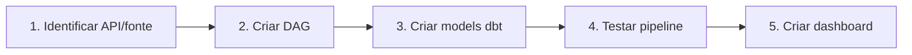

# Conectar Fontes de Dados

Como adicionar fontes de dados do seu órgão ao GovHub.

## Pré-requisitos

- [Deploy inicial](deploy-inicial.md) funcionando
- Airflow acessível
- PostgreSQL operacional e object storage disponível quando a fonte exigir arquivos brutos
- Credenciais/APIs das fontes identificadas

## Fluxo para Nova Fonte



## 1. Identificar a Fonte

Documente antes de codificar:

| Item | Exemplo |
|------|---------|
| Nome do sistema | "SisGestão" |
| Tipo de acesso | API REST / banco / arquivo |
| Autenticação | API Key / certificado / pública |
| Formato | JSON / CSV / XML |
| Volume estimado | 10k registros/dia |
| Frequência | Diária / semanal |
| Sensibilidade | Pública / restrita |

## 2. Criar a DAG de Ingestão

Crie a DAG em `airflow_lappis/dags/data_ingest/<origem>/`. Em DAGs novas, prefira TaskFlow API, clientes em `plugins/` e helpers existentes.

```python
# airflow_lappis/dags/data_ingest/minhafonte/minhafonte_ingest_dag.py
from airflow.decorators import dag, task
from datetime import datetime, timedelta
from schedule_loader import get_dynamic_schedule

@dag(
    schedule_interval=get_dynamic_schedule("minhafonte_ingest_dag"),
    start_date=datetime(2025, 1, 1),
    catchup=False,
    tags=["ingestao", "minhafonte"],
    default_args={
        "owner": "meuorgao",
        "retries": 1,
        "retry_delay": timedelta(minutes=5),
    },
)
def minhafonte_ingest_dag() -> None:
    @task
    def fetch_and_store() -> None:
        ...

    fetch_and_store()

dag_instance = minhafonte_ingest_dag()
```

Se a fonte gerar modelos analíticos, crie ou atualize os models dbt no projeto correspondente (`airflow_lappis/dags/dbt/ipea` ou `airflow_lappis/dags/dbt/mir`).

## 3. Configurar Connections no Airflow

Via UI (Admin → Connections) ou CLI:

```bash
# Exemplo: API com autenticação
airflow connections add minhafonte_api \
    --conn-type http \
    --conn-host api.minhafonte.gov.br \
    --conn-extra '{"api_key": "xxx"}'
```

## 4. Criar Bucket ou área de dados brutos, se aplicável

Algumas fontes podem exigir preservação de arquivos brutos em object storage. Quando isso for necessário, combine o nome do bucket ou prefixo com a equipe de infraestrutura.

```bash
# Exemplo via mc (MinIO Client)
mc alias set govhub http://minio:9000 <ACCESS_KEY> <SECRET_KEY>
mc mb govhub/bronze-minhafonte
```

## 5. Criar Models dbt

### Source (staging)

```yaml
# airflow_lappis/dags/dbt/<projeto>/models/<dominio>_dbt/bronze/schema.yml
sources:
  - name: bronze
    tables:
      - name: minhafonte_raw
        freshness:
          warn_after: {count: 24, period: hour}
          error_after: {count: 48, period: hour}
```

### Model Silver

```sql
-- airflow_lappis/dags/dbt/<projeto>/models/<dominio>_dbt/silver/minhafonte.sql
{{ config(materialized='table', schema='silver') }}

SELECT
    id,
    TRIM(campo_texto) AS campo_texto,
    CAST(valor AS NUMERIC(15,2)) AS valor,
    CAST(data AS DATE) AS data,
    NOW() AS loaded_at
FROM {{ source('bronze', 'minhafonte_raw') }}
WHERE id IS NOT NULL
```

### Testes

```yaml
# airflow_lappis/dags/dbt/<projeto>/models/<dominio>_dbt/silver/schema.yml
models:
  - name: minhafonte
    columns:
      - name: id
        tests: [not_null, unique]
      - name: valor
        tests: [not_null]
```

## 6. Testar o Pipeline

```bash
# Trigger manual da DAG
airflow dags trigger minhafonte_ingest_dag

# Verificar no Airflow UI
# http://localhost:8080 → minhafonte_ingest_dag → Graph

# Rodar dbt localmente
cd airflow_lappis/dags/dbt/<projeto>
dbt run --select minhafonte
dbt test --select minhafonte
```

## 7. Criar Dataset no Superset

1. Data → Datasets → + Dataset
2. Database: GovHub, Schema: silver (ou gold), Table: minhafonte
3. Save → Create Chart

## Checklist

- [ ] API/fonte documentada
- [ ] DAG criada em `airflow_lappis/dags/data_ingest/<origem>/`
- [ ] Connection configurada no Airflow
- [ ] Bucket/prefixo de dados brutos criado, se aplicável
- [ ] Models dbt (staging + silver + testes)
- [ ] Pipeline testado end-to-end
- [ ] Dataset no Superset criado

## Próximo Passo

→ [Guia de Criação de Forks](../forks/guia-criar-fork.md) para isolar um novo contexto quando necessário.
