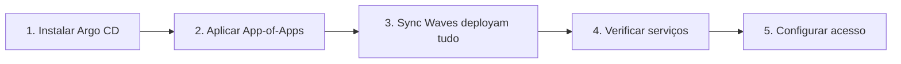

# Deploy Inicial

Passo a passo para o primeiro deploy do GovHub BR no seu cluster.

## Pré-requisitos

- [Requisitos](requisitos.md) atendidos
- Cluster K8s operacional
- `kubectl`, `helm`, `argocd` CLI instalados e configurados
- Acesso ao cluster confirmado (`kubectl get nodes`)

!!! tip "Comece pequeno"
    Para o primeiro deploy, valide a plataforma com uma fonte aberta e um caso de uso simples. A expansão para fontes com certificado digital, dados sensíveis ou integrações específicas deve acontecer depois que secrets, acessos, logs e revisão de PR estiverem funcionando.

## Visão Geral do Deploy



O deploy técnico é só uma parte da adoção. Em paralelo, mantenha três trilhas claras:

| Trilha | O que validar |
| --- | --- |
| Dados | fonte piloto, chaves de integração, qualidade mínima e responsável de negócio |
| Plataforma | cluster, secrets, banco, Airflow, dbt, Superset e observabilidade básica |
| Operação | fluxo de PR, revisão de segurança, backups, acessos e rotina de suporte |

## 1. Fork do Repositório de Infra

```bash
# Fork de continuous-deployment para sua organização
git clone git@github.com:SuaOrg/continuous-deployment.git
cd continuous-deployment
```

## 2. Configurar Overlays

Crie seus overlays de produção para cada componente:

```bash
# Copiar base para customizar
cp airflow/values.yaml airflow/values.meuorgao.yaml
cp postgres/values.yaml postgres/values.meuorgao.yaml
cp minio/values.yaml minio/values.meuorgao.yaml
cp superset/values.yaml superset/values.meuorgao.yaml
```

Ajuste pelo menos:

- **PostgreSQL**: senha, storage size, recursos
- **MinIO**: senha root, storage size
- **Airflow**: executor, resources, secrets
- **Superset**: SECRET_KEY, database URL

## 3. Instalar Argo CD

```bash
# Criar namespace
kubectl create namespace argocd

# Instalar Argo CD
kubectl apply -n argocd -f argocd/install.yaml

# Esperar ficar pronto
kubectl wait --for=condition=available -n argocd deployment/argocd-server --timeout=300s

# Obter senha inicial
kubectl -n argocd get secret argocd-initial-admin-secret -o jsonpath="{.data.password}" | base64 -d
```

## 4. Criar Secrets

```bash
# PostgreSQL
kubectl create namespace postgres
kubectl -n postgres create secret generic postgres-credentials \
    --from-literal=username=govhub \
    --from-literal=password=<SUA_SENHA>

# MinIO
kubectl create namespace minio
kubectl -n minio create secret generic minio-root-credentials \
    --from-literal=accesskey=<ACCESS_KEY> \
    --from-literal=secretkey=<SECRET_KEY>

# Airflow
kubectl create namespace airflow
kubectl -n airflow create secret generic minio-credentials \
    --from-literal=aws_access_key_id=<ACCESS_KEY> \
    --from-literal=aws_secret_access_key=<SECRET_KEY>
```

## 5. Aplicar App-of-Apps

```bash
# Editar application.yaml com URL do seu repo e overlay
vim argocd/application.meuorgao.yaml

# Aplicar — Argo CD criará todos os Applications filhos
kubectl apply -f argocd/application.meuorgao.yaml
```

Sync waves garantem a ordem:

| Wave | Componentes |
|------|-------------|
| -1 | PostgreSQL, MinIO |
| 0 | Airflow |
| 1+ | Superset, JupyterHub |

## 6. Verificar Deploy

```bash
# Status das Applications
argocd app list

# Verificar pods
kubectl get pods -A | grep -v kube-system

# Testar serviços
kubectl port-forward -n airflow svc/airflow-webserver 8080:8080
kubectl port-forward -n superset svc/superset 8088:8088
```

## 7. Configurar DNS/Ingress

Configure Ingress para acesso externo:

```yaml
# Exemplo: ingress para Superset
apiVersion: networking.k8s.io/v1
kind: Ingress
metadata:
  name: superset-ingress
  namespace: superset
  annotations:
    cert-manager.io/cluster-issuer: letsencrypt
spec:
  tls:
    - hosts: [superset.meuorgao.gov.br]
      secretName: superset-tls
  rules:
    - host: superset.meuorgao.gov.br
      http:
        paths:
          - path: /
            pathType: Prefix
            backend:
              service:
                name: superset
                port:
                  number: 8088
```

## Troubleshooting

| Problema | Solução |
|----------|---------|
| Application OutOfSync | `argocd app sync <name>` |
| Pod CrashLoopBackOff | Verificar secrets: `kubectl logs -n <ns> <pod>` |
| PVC Pending | Verificar StorageClass disponível |
| Timeout no sync | Aumentar timeout ou verificar recursos |

## Próximo Passo

→ [Conectar Fontes de Dados](conectar-fontes.md)
