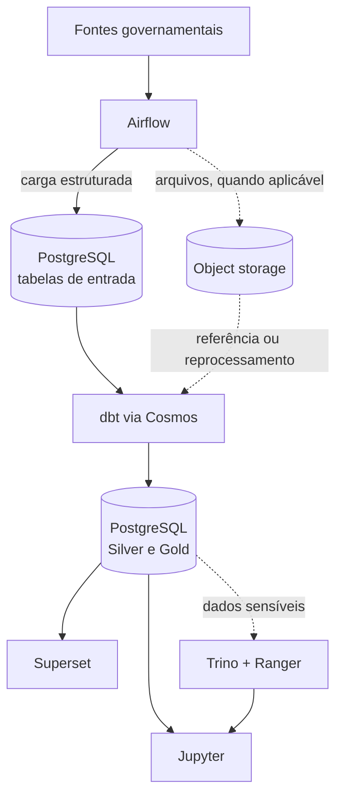

# Fluxo de Dados

O fluxo do GovHub BR conecta fontes governamentais, DAGs Airflow, PostgreSQL, projetos dbt e ferramentas de consumo. A implementação varia por fonte, mas o desenho abaixo representa o caminho conceitual do dado.

## Visão geral



## 1. Ingestão

As DAGs em `airflow_lappis/dags/data_ingest/` extraem dados de APIs, arquivos, e-mails ou bancos externos. A lógica de comunicação com cada provedor fica nos clientes em `airflow_lappis/plugins/`.

Responsabilidades da ingestão:

- ler parâmetros de execução no Airflow;
- buscar dados na fonte;
- validar retornos vazios ou inesperados;
- registrar logs com volumes processados;
- persistir dados no PostgreSQL via `ClientPostgresDB`;
- disparar dependências quando houver.

## 2. Transformação

Os projetos dbt ficam em `airflow_lappis/dags/dbt/` e são executados por DAGs Cosmos:

| Projeto | DAG | Caminho |
| --- | --- | --- |
| `ipea` | `ipea_cosmos_dag` | `airflow_lappis/dags/dbt/ipea` |
| `mir` | `mir_cosmos_dag` | `airflow_lappis/dags/dbt/mir` |

O dbt organiza os dados em camadas Bronze, Silver e Gold conforme o domínio. Nem todo domínio possui todas as camadas, e isso deve seguir a necessidade real de análise.

## 3. Consumo

| Ferramenta | Uso |
| --- | --- |
| Superset | dashboards e exploração visual de dados tratados |
| Jupyter / JupyterHub | análises exploratórias, pesquisa e validações ad hoc |
| OpenMetadata | catálogo, linhagem e ownership quando configurado |
| Trino + Ranger | acesso governado a dados sensíveis quando habilitado |

Dados públicos e agregados podem ser consumidos diretamente do PostgreSQL. Dados sensíveis devem passar por regras de acesso e mascaramento antes de serem disponibilizados a usuários finais.

## Schedules

As DAGs de ingestão usam, preferencialmente, `get_dynamic_schedule()`, que consulta a Airflow Variable `dynamic_schedules`. Isso evita codificar cronogramas diretamente nas DAGs.

Exemplo de configuração local:

```json
{
  "empenhos_tesouro_ingest_dag": {
    "type": "cron",
    "value": "0 13 * * 1-6"
  }
}
```

## Qualidade de dados

| Etapa | Mecanismo |
| --- | --- |
| Ingestão | retries, logs, validação de retorno e conexões Airflow |
| Bronze/Silver | testes dbt e normalização de tipos |
| Gold | testes de integridade, regras de negócio e revisão de consumo |
| Governança | catalogação, classificação e ownership quando configurados |

Veja também [Ingestão de Dados](../pipeline/ingestao.md), [dbt](../pipeline/dbt.md) e [Qualidade de Dados](../pipeline/qualidade.md).
