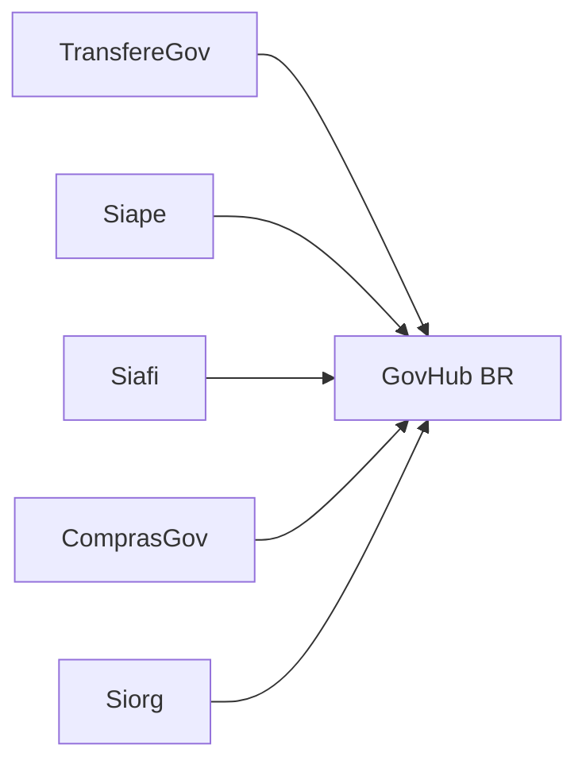
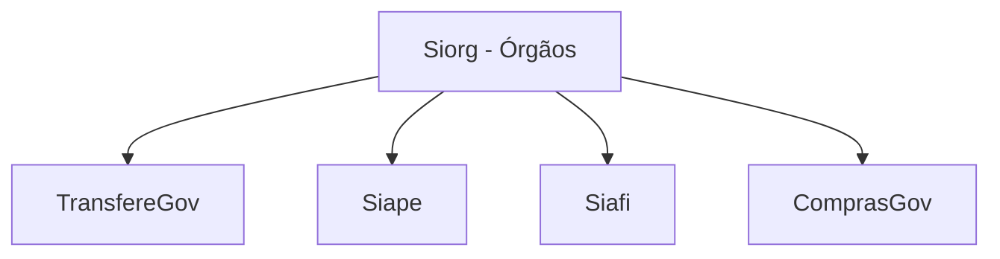

# Fontes de Dados

Glossário dos sistemas governamentais integrados pelo GovHub BR. Esta página é voltada para estudantes e novos contribuidores que não têm contexto prévio sobre a administração pública federal.

## Visão Geral

O GovHub integra cinco sistemas estruturantes do governo federal brasileiro. Cada um cobre um domínio específico da gestão pública.

| Sistema | Domínio | Volume | Sensibilidade |
|---------|---------|--------|---------------|
| TransfereGov | Transferências voluntárias | Alto | Baixa (público) |
| Siape | Pessoal civil/militar | Muito alto | Alta (dados pessoais) |
| Siafi | Execução financeira | Alto | Média |
| ComprasGov | Compras públicas | Alto | Baixa (público) |
| Siorg | Estrutura organizacional | Médio | Baixa (público) |

---

## TransfereGov

**O que é**: Sistema que gerencia convênios e contratos de repasse entre a União e entes subnacionais (estados, municípios, ONGs, consórcios). Registra todo o ciclo de vida de uma transferência voluntária — da proposta à prestação de contas.

**Entidades principais**:

| Entidade | Descrição | Exemplo |
|----------|-----------|---------|
| Programa | Linha de financiamento do governo federal | "Apoio à Infraestrutura Urbana" |
| Convênio | Acordo entre concedente (União) e convenente (ente) | Convênio nº 123456/2025 |
| Órgão Concedente | Ministério/órgão que libera os recursos | Ministério das Cidades |
| Órgão Convenente | Ente que recebe e executa | Prefeitura de Goiânia |
| Cronograma | Parcelas e metas de execução | Parcela 1: R$ 500k até 06/2026 |

**Perguntas que o GovHub responde**:

- Qual o volume de transferências por órgão/período?
- Quais convênios estão em atraso na prestação de contas?
- Como se distribui geograficamente o investimento federal?

**Acesso**: API REST pública (API Key)

---

## Siape

**O que é**: Sistema Integrado de Administração de Pessoal — cadastro de todos os servidores civis e militares da União. Contém dados de folha de pagamento, cargos, carreiras e lotações.

**Entidades principais**:

| Entidade | Descrição | Exemplo |
|----------|-----------|---------|
| Servidor | Pessoa vinculada ao serviço público federal | Matrícula 1234567 |
| Cargo | Posição funcional | Analista de TI |
| Carreira | Agrupamento de cargos | Carreira de C&T |
| Órgão de Lotação | Onde o servidor trabalha | IPEA |
| Remuneração | Componentes da folha | Vencimento básico + gratificações |

**Perguntas que o GovHub responde**:

- Quantos servidores por órgão/carreira?
- Qual a distribuição etária e por tempo de serviço?
- Indicadores agregados de pessoal (sem dados individuais)

**Acesso**: Certificado digital (e-CPF/e-CNPJ)

!!! warning "Dados sensíveis"
    Dados individuais do Siape são protegidos por LGPD. O GovHub armazena
    dados brutos de forma controlada e recomenda **acesso governado via Trino + Ranger**
    para consultas que toquem registros individuais, quando esse caminho estiver habilitado no ambiente.

---

## Siafi

**O que é**: Sistema Integrado de Administração Financeira do Governo Federal — registra toda a execução orçamentária e financeira da União. Cada real gasto pelo governo federal passa pelo Siafi.

**Entidades principais**:

| Entidade | Descrição | Exemplo |
|----------|-----------|---------|
| Empenho | Compromisso de gasto | Empenho 2025NE000123 |
| Liquidação | Confirmação de entrega/serviço | Liquidação sobre NE000123 |
| Pagamento | Efetivação do pagamento | OB (Ordem Bancária) |
| Dotação | Crédito orçamentário disponível | Função 12 (Educação), Ação 1234 |
| Unidade Gestora | Responsável pela execução | UG 123456 (IPEA) |

**Perguntas que o GovHub responde**:

- Qual a execução orçamentária por órgão/programa?
- Quanto foi empenhado vs. pago em determinado período?
- Quais unidades gestoras têm maior volume de execução?

**Acesso**: API + certificado digital

---

## ComprasGov

**O que é**: Plataforma de compras públicas do governo federal — registra licitações, contratos, atas de registro de preço e fornecedores. Dados são públicos por força de lei (transparência).

**Entidades principais**:

| Entidade | Descrição | Exemplo |
|----------|-----------|---------|
| Licitação | Processo de seleção de fornecedor | Pregão Eletrônico 12/2025 |
| Contrato | Acordo firmado com fornecedor | Contrato 45/2025 |
| Ata de Registro | Preços registrados para compra futura | Ata SRP 07/2025 |
| Fornecedor | Empresa contratada | CNPJ 12.345.678/0001-99 |
| Item | Bem ou serviço adquirido | "Notebook 16GB RAM" |

**Perguntas que o GovHub responde**:

- Quais os maiores fornecedores do governo por valor?
- Qual o tempo médio entre licitação e contratação?
- Como se distribui o gasto por tipo de despesa?

**Acesso**: API REST pública (sem autenticação)

---

## Siorg

**O que é**: Sistema de Informações Organizacionais — mapeia toda a estrutura organizacional do governo federal: ministérios, secretarias, departamentos, coordenações, cargos em comissão.

**Entidades principais**:

| Entidade | Descrição | Exemplo |
|----------|-----------|---------|
| Órgão | Ministério ou entidade vinculada | Ministério da Fazenda |
| Unidade | Subdivisão de um órgão | Secretaria de Política Econômica |
| Cargo em Comissão | Posição de livre nomeação | DAS-5 |
| Hierarquia | Relação de subordinação | Secretaria → Departamento → Coordenação |
| Competência | Atribuições legais da unidade | "Formular política tributária" |

**Perguntas que o GovHub responde**:

- Qual a estrutura completa de um ministério?
- Quantos cargos em comissão por órgão?
- Como a estrutura mudou ao longo do tempo (reformas administrativas)?

**Acesso**: API REST pública (sem autenticação)

---

## Relações Entre Fontes

Os dados se conectam via **código de órgão** (Siorg como dimensão central):

Exemplo: o código do órgão no Siorg é a chave para cruzar transferências (TransfereGov), servidores (Siape), execução financeira (Siafi) e contratos (ComprasGov) de um mesmo ministério.

### Interoperabilidade

Nem todo cruzamento entre sistemas estruturantes tem uma chave única perfeita. Em alguns domínios, como compras e execução financeira, campos aparentemente úteis — por exemplo CNPJ, número de processo ou unidade gestora — podem não ser suficientes para identificar um vínculo único entre registros.

Quando uma integração depender de combinação de chaves ou heurísticas, documente:

- quais campos foram usados para relacionar as bases;
- quais casos ficam sem correspondência;
- quais ambiguidades foram aceitas ou descartadas;
- qual regra precisa ser revisada com a área de negócio.

Essa documentação é parte da governança do dado: ela explica não apenas que duas tabelas se conectam, mas também o grau de confiança dessa conexão.

## Referências

- [Portal de Dados Abertos](https://dados.gov.br/)
- [Portal Transferegov.br](https://www.gov.br/transferegov/pt-br)
- [ComprasGov](https://compras.gov.br/)
- [Painel Estatístico de Pessoal](https://www.gov.br/servidor/pt-br/observatorio-de-pessoal-govbr/painel-estatistico-de-pessoal/)
