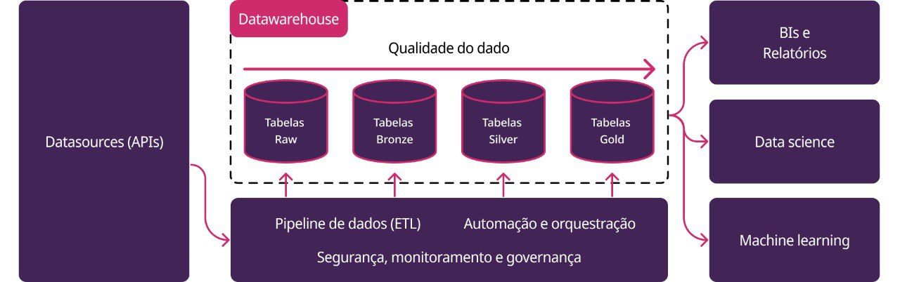

# Arquitetura Medallion

O GovHub BR usa a arquitetura Medallion como modelo de organização progressiva dos dados: dados mais próximos da fonte entram nas primeiras camadas e, a cada etapa, ganham tratamento, padronização, testes e finalidade analítica mais clara.

## Camadas



*Figura 1: evolução da qualidade entre as camadas e serviços transversais do pipeline.*

| Camada | Papel | Onde aparece no projeto |
| --- | --- | --- |
| Raw / origem | dado como recebido da fonte, arquivo ou resposta externa | APIs, arquivos, e-mails, tabelas de origem e, quando aplicável, object storage |
| Bronze | primeira materialização controlada no pipeline | modelos `bronze/` nos projetos dbt e tabelas base carregadas por DAGs |
| Silver | dado limpo, tipado, deduplicado e integrado | modelos `silver/` em domínios dbt |
| Gold | fatos, dimensões, métricas e tabelas prontas para consumo | modelos `gold/` e dashboards Superset |

!!! note "Implementação varia por fonte"
    Nem toda fonte passa pelas mesmas etapas físicas. Algumas DAGs inserem diretamente no PostgreSQL; outras podem envolver arquivos ou object storage. A regra importante é manter a rastreabilidade da origem e separar transformação analítica em modelos dbt quando houver consumo recorrente.

## Bronze

Bronze representa o primeiro estado controlado dos dados dentro do pipeline. Deve preservar o máximo possível da estrutura original, adicionando apenas metadados operacionais quando necessário, como `dt_ingest`.

Boas práticas:

- manter nomes e tipos próximos da fonte quando isso facilitar auditoria;
- registrar data/hora de ingestão;
- evitar regra de negócio complexa;
- documentar origem, filtros e parâmetros usados na coleta.

No dbt, fontes brutas devem ser declaradas com `source()` para manter a
linhagem desde a origem:

```sql
select * from {{ source('transfere_gov', 'contratos') }}
```

## Silver

Silver é a camada de dados confiáveis para análise exploratória e para composição de modelos finais.

Transformações comuns:

- normalização de datas, códigos e valores financeiros;
- deduplicação;
- padronização de chaves;
- junção entre tabelas do mesmo domínio;
- testes de unicidade, nulos e valores aceitos.

Use `ref()` para declarar dependências entre modelos. Além de evitar nomes de
schema fixos no SQL, isso permite que o dbt determine a ordem de execução e
produza a linhagem automaticamente:

```sql
select * from {{ ref('contratos_bronze') }}
```

## Gold

Gold é a camada de consumo: dashboards, indicadores, tabelas agregadas e visões orientadas a perguntas de negócio.

Modelos Gold devem:

- ter nomes e descrições claros;
- listar colunas explicitamente no `select` final;
- incluir testes de integridade quando houver chaves e dimensões;
- evitar expor dados sensíveis em granularidade individual;
- servir diretamente ferramentas como Superset, Jupyter ou APIs de consumo.

## Materialização e qualidade

A materialização depende do volume e do uso do modelo. Bronze pode ser
incremental quando a fonte é volumosa; Silver e Gold podem usar `table`,
`incremental` ou `view` conforme os requisitos de atualização e consulta.
Evite assumir uma materialização única para toda a camada.

Cada modelo deve ter descrição e testes compatíveis com seu contrato de dados.
Priorize `not_null`, `unique`, `relationships` e `accepted_values` nas colunas
que sustentam chaves, relacionamentos e regras de negócio.

## Projetos dbt

No repositório principal, os projetos dbt atuais ficam em:

| Projeto | Caminho |
| --- | --- |
| `ipea` | `airflow_lappis/dags/dbt/ipea` |
| `mir` | `airflow_lappis/dags/dbt/mir` |

Cada domínio organiza suas camadas dentro de `models/<dominio>_dbt/`, por exemplo `contratos_dbt/bronze`, `pessoas_dbt/silver` ou `empenhos_ted_dbt/gold`.

## Benefícios

- **Rastreabilidade:** fica claro de onde cada tabela veio.
- **Qualidade progressiva:** cada camada adiciona validação e significado.
- **Manutenção:** erros podem ser isolados por origem, domínio e camada.
- **Reuso:** Silver evita duplicação de tratamento entre vários modelos Gold.
- **Governança:** dados sensíveis podem ser classificados antes do consumo.
