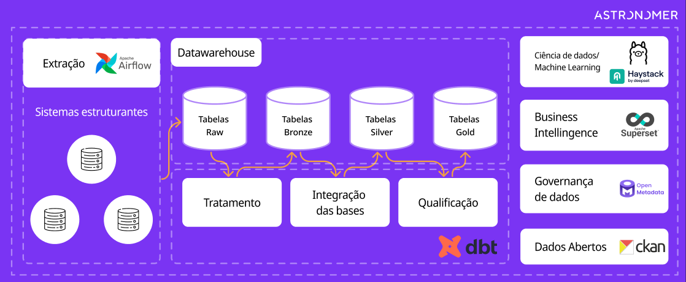

# Visão Geral da Arquitetura

O GovHub BR adota a **Arquitetura Medallion** (Raw → Bronze → Silver → Gold) para processar dados de sistemas estruturantes do governo federal.

## Diagrama de Arquitetura

*Figura 1: fluxo conceitual desde os sistemas estruturantes até as camadas de dados e os serviços de consumo.*

## Camadas Medallion

| Camada | Storage | Descrição |
|--------|---------|-----------|
| **Raw** | Fonte / PostgreSQL / MinIO | Dados preservados conforme recebidos da origem |
| **Bronze** | MinIO | Dados brutos ingeridos (JSON, CSV, Parquet raw) |
| **Silver** | PostgreSQL | Dados limpos, deduplicados, normalizados |
| **Gold** | PostgreSQL | Dados agregados, métricas, prontos para BI |

## Stack Tecnológica

| Componente | Tecnologia | Papel |
|------------|-----------|-------|
| Orquestração | Apache Airflow | DAGs de ingestão (extract → load → trigger dbt) |
| Transformação | dbt | Models SQL, testes, documentação |
| Object Storage | MinIO | Camada Bronze (dados brutos) |
| Banco Analítico | PostgreSQL | Camadas Silver e Gold (schemas por fork) |
| BI / Dashboards | Apache Superset | Visualização (acesso direto ao PG) |
| Notebooks | JupyterHub | Análise interativa (via Trino para dados sensíveis) |
| Governança | OpenMetadata | Catálogo, linhagem, ownership |
| Acesso Governado | Trino + Ranger | Row-level security para dados sensíveis |
| GitOps | Argo CD | Deploy declarativo em K8s |
| Containers | Docker / Kubernetes | Runtime de todos os serviços |

## Repositórios

| Repositório | Descrição |
|-------------|-----------|
| `gov-hub` | Site oficial e documentação pública do GovHub BR |
| `data-application-gov-hub` | Pipeline principal (Airflow, dbt, Jupyter, Superset) |
| `continuous-deployment` | Infra GitOps (K8s manifests, Helm, Argo CD) |
| `data-application-cidades` | Fork temático para dados municipais |
| `data-application-minc` | Fork temático para o Ministério da Cultura |
| `dados-desestruturados` | Processamento e experimentos com dados não estruturados |
| `govhub-research` | Pesquisa: IA, OCR, parsers |
| `openmetadata-declarative-governance` | Governança declarativa |
| `data-governance-workshop` | Workshop Ranger + Trino |

!!! note "Repositórios internos"
    A organização também possui repositórios privados de apoio. Eles não são detalhados nesta documentação pública.

## Decisões Arquiteturais

- **Medallion Architecture**: Separação clara entre raw (Bronze), limpo (Silver) e agregado (Gold)
- **GitOps**: Infraestrutura de produção gerenciada declarativamente via Argo CD, evitando alterações manuais fora do fluxo acordado
- **App-of-Apps**: Padrão Argo CD para gerenciar múltiplos serviços com sync waves
- **Forks leves**: Possibilidade de compartilhar infraestrutura com isolamento lógico por schemas
- **Código aberto**: Os componentes públicos priorizam tecnologias abertas e colaboração comunitária

## Ambientes

| Ambiente | Descrição | Overlay |
|----------|-----------|---------|
| Local | Docker Compose (`docker compose up -d`) | — |
| Pré-produção | Cluster K8s (validação) | `values.preprod.yaml` |
| Produção | Cluster K8s (GitOps) | `values.prod.yaml` |
