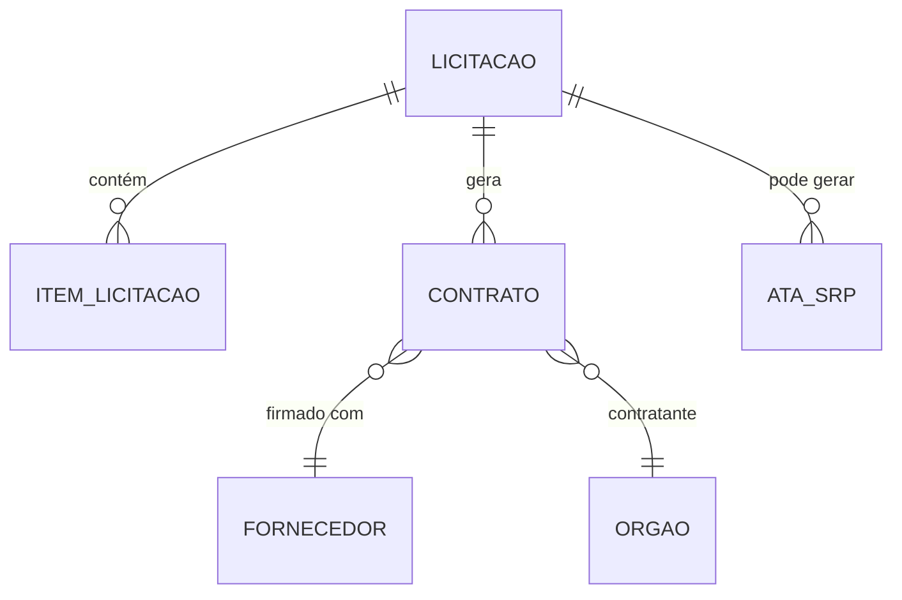

# ComprasGov — Dicionário de Dados

Plataforma de compras públicas do governo federal.

## Contexto

O ComprasGov (antigo ComprasNet) é o sistema onde o governo federal realiza licitações, registra contratos e gerencia atas de registro de preço. Dados são públicos por força da Lei de Licitações e da Lei de Acesso à Informação.

## Modelo Conceitual



## Entidades

### Licitação

Processo de seleção de fornecedor.

| Campo conceitual | Descrição |
|------------------|-----------|
| Número | Identificador (ex: PE 12/2025) |
| Modalidade | Pregão eletrônico, concorrência, dispensa |
| Órgão | Quem está comprando |
| Objeto | Descrição do que se quer adquirir |
| Valor estimado | Preço de referência |
| Data abertura | Início do certame |
| Situação | Aberta, homologada, deserta, fracassada |

### Contrato

Acordo firmado com o fornecedor vencedor.

| Campo conceitual | Descrição |
|------------------|-----------|
| Número | Identificador (ex: 45/2025) |
| Licitação de origem | Processo que gerou o contrato |
| Fornecedor | CNPJ e razão social |
| Valor | Montante contratado |
| Vigência | Período de execução |
| Objeto | Bem ou serviço |

### Ata de Registro de Preço

Preços registrados para compras futuras (sem obrigação imediata).

| Campo conceitual | Descrição |
|------------------|-----------|
| Número | Identificador |
| Itens | Produtos/serviços com preço registrado |
| Fornecedor | Detentor do registro |
| Validade | Até 12 meses |
| Órgão gerenciador | Responsável pela ata |

### Fornecedor

Empresa que vende ao governo.

| Campo conceitual | Descrição |
|------------------|-----------|
| CNPJ | Identificador fiscal |
| Razão social | Nome empresarial |
| Porte | ME, EPP, Demais |
| Localidade | UF/Município |

## Tabelas no GovHub

| Camada | Tabela | Descrição |
|--------|--------|-----------|
| Staging | `stg_comprasgov` | Dados raw carregados |
| Silver | `silver.contratos` | Contratos normalizados |
| Gold | `gold.fato_compras` | Métricas de compras por tipo/órgão |

## Exemplos de Uso

```sql
-- Maiores fornecedores por valor contratado
SELECT
    fornecedor_cnpj,
    fornecedor_nome,
    SUM(valor_contrato) AS total,
    COUNT(*) AS qtd_contratos
FROM silver.contratos
GROUP BY 1, 2
ORDER BY 3 DESC
LIMIT 20;

-- Métricas de compras por modalidade
SELECT
    modalidade,
    COUNT(*) AS qtd,
    SUM(valor_contrato) AS total,
    AVG(valor_contrato) AS media
FROM gold.fato_compras
GROUP BY 1
ORDER BY 3 DESC;
```

## Referências

- [ComprasGov](https://compras.gov.br/)
- [API de Dados Abertos](https://compras.dados.gov.br/)
- [dbt docs — stg_comprasgov](https://dbt.ipea.gov-hub.io/#!/model/model.govhub.stg_comprasgov)
