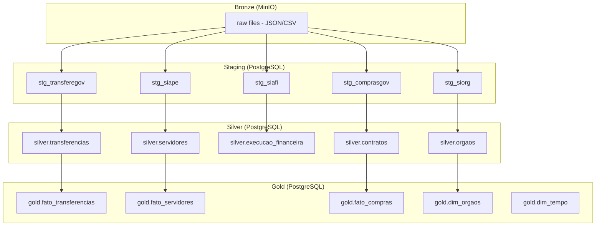

# Dicionário de Dados

Visão conceitual dos dados integrados pelo GovHub BR. Para detalhe de colunas, tipos e linhagem, consulte o [dbt docs](https://dbt.ipea.gov-hub.io/#!/overview).

## Abordagem Híbrida

| Nível | Onde | Conteúdo |
|-------|------|----------|
| **Conceitual** | Este site (MkDocs) | Entidades, relacionamentos, exemplos de uso |
| **Físico** | [dbt docs](https://dbt.ipea.gov-hub.io/#!/overview) | Colunas, tipos, testes, linhagem por model |

O dicionário conceitual explica **o que os dados significam** no contexto governamental. O dbt docs mostra **como estão implementados** no pipeline.

## Organização por Camada



## Fontes → Tabelas

| Fonte | Staging | Silver | Gold |
|-------|---------|--------|------|
| TransfereGov | `stg_transferegov` | `silver.transferencias` | `gold.fato_transferencias` |
| Siape | `stg_siape` | `silver.servidores` | `gold.fato_servidores` |
| Siafi | `stg_siafi` | `silver.execucao_financeira` | — |
| ComprasGov | `stg_comprasgov` | `silver.contratos` | `gold.fato_compras` |
| Siorg | `stg_siorg` | `silver.orgaos` | `gold.dim_orgaos` |

## Dimensões Compartilhadas

| Dimensão | Tabela | Fonte | Uso |
|----------|--------|-------|-----|
| Órgãos | `gold.dim_orgaos` | Siorg | Chave para cruzar todas as fontes |
| Tempo | `gold.dim_tempo` | Gerada | Calendário (dia, mês, trimestre, ano) |

## Exemplos de Queries (Gold)

### Transferências por órgão (top 10)

```sql
SELECT
    d.nome AS orgao,
    SUM(f.valor_total) AS total,
    COUNT(*) AS qtd_convenios
FROM gold.fato_transferencias f
JOIN gold.dim_orgaos d ON f.orgao_concedente = d.codigo
GROUP BY 1
ORDER BY 2 DESC
LIMIT 10;
```

### Servidores por carreira

```sql
SELECT
    carreira,
    COUNT(*) AS total_servidores,
    AVG(tempo_servico_anos) AS media_tempo
FROM gold.fato_servidores
GROUP BY 1
ORDER BY 2 DESC;
```

### Compras por tipo de despesa

```sql
SELECT
    tipo_despesa,
    SUM(valor_contrato) AS total,
    COUNT(DISTINCT fornecedor_cnpj) AS qtd_fornecedores
FROM gold.fato_compras
GROUP BY 1
ORDER BY 2 DESC;
```

## Páginas por Fonte

Para detalhes conceituais de cada fonte, consulte:

- [TransfereGov](transferegov.md)
- [Siape](siape.md)
- [Siafi](siafi.md)
- [ComprasGov](comprasgov.md)
- [Siorg](siorg.md)

## dbt Docs

Para schema completo (colunas, tipos, testes, descrições, linhagem):

**[https://dbt.ipea.gov-hub.io/#!/overview](https://dbt.ipea.gov-hub.io/#!/overview)**
