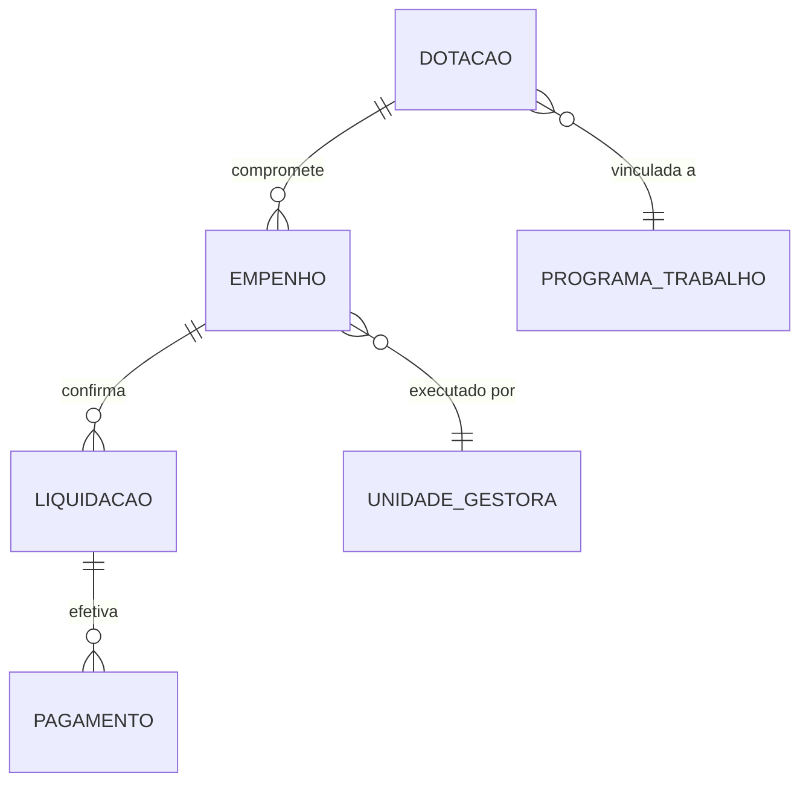

# Siafi — Dicionário de Dados

Sistema Integrado de Administração Financeira do Governo Federal.

## Contexto

O Siafi registra toda a execução orçamentária e financeira da União. Cada real gasto pelo governo federal é registrado neste sistema, seguindo o ciclo: dotação → empenho → liquidação → pagamento.

## Modelo Conceitual



## Entidades

### Dotação Orçamentária

Crédito autorizado na LOA (Lei Orçamentária Anual).

| Campo conceitual | Descrição |
|------------------|-----------|
| Função | Área de atuação (ex: 12 = Educação) |
| Subfunção | Detalhamento da função |
| Programa | Programa de governo |
| Ação | Atividade/projeto específico |
| Natureza de despesa | Tipo de gasto (pessoal, custeio, investimento) |
| Valor autorizado | Crédito disponível |

### Empenho

Compromisso de gasto — primeiro estágio da despesa.

| Campo conceitual | Descrição |
|------------------|-----------|
| Número | Identificador (ex: 2025NE000123) |
| Unidade gestora | Responsável pela execução |
| Credor | Quem receberá o pagamento |
| Valor | Montante empenhado |
| Data | Quando foi registrado |
| Tipo | Ordinário, estimativo, global |

### Liquidação

Confirmação de entrega do bem/serviço.

| Campo conceitual | Descrição |
|------------------|-----------|
| Empenho vinculado | Referência ao empenho |
| Valor liquidado | Montante confirmado |
| Data | Quando foi atestada a entrega |
| Nota fiscal | Documento comprobatório |

### Pagamento

Efetivação do pagamento ao credor.

| Campo conceitual | Descrição |
|------------------|-----------|
| Ordem bancária | Identificador do pagamento |
| Valor pago | Montante transferido |
| Data | Quando o credor recebeu |
| Banco/agência/conta | Destino do recurso |

## Tabelas no GovHub

| Camada | Tabela | Descrição |
|--------|--------|-----------|
| Staging | `stg_siafi` | Dados raw carregados |
| Silver | `silver.execucao_financeira` | Execução normalizada (empenho+liquidação+pagamento) |

## Exemplos de Uso

```sql
-- Execução orçamentária por órgão (últimos 12 meses)
SELECT
    unidade_gestora,
    SUM(valor_empenhado) AS empenhado,
    SUM(valor_liquidado) AS liquidado,
    SUM(valor_pago) AS pago
FROM silver.execucao_financeira
WHERE data_empenho >= CURRENT_DATE - INTERVAL '12 months'
GROUP BY 1
ORDER BY 2 DESC;

-- Taxa de execução (pago / empenhado)
SELECT
    unidade_gestora,
    SUM(valor_pago) / NULLIF(SUM(valor_empenhado), 0) AS taxa_execucao
FROM silver.execucao_financeira
GROUP BY 1
HAVING SUM(valor_empenhado) > 1000000
ORDER BY 2 DESC;
```

## Referências

- [Portal da Transparência — Execução](https://portaldatransparencia.gov.br/despesas)
- [Manual Siafi](https://www.gov.br/tesouronacional/pt-br/siafi)
- [dbt docs — stg_siafi](https://dbt.ipea.gov-hub.io/#!/model/model.govhub.stg_siafi)
