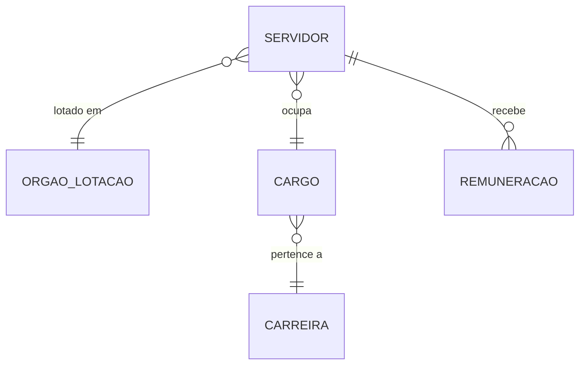

# Siape — Dicionário de Dados

Sistema Integrado de Administração de Pessoal do governo federal.

## Contexto

O Siape registra o cadastro funcional e a folha de pagamento de todos os servidores civis e militares da União. Contém dados altamente sensíveis (LGPD) — o acesso no GovHub é governado via Trino + Ranger.

!!! warning "Dados sensíveis"
    Registros individuais do Siape contêm dados pessoais protegidos por LGPD.
    Acesso obrigatório via Trino + Ranger com row-level security.
    Análises agregadas (contagens, médias por órgão) são públicas.

## Modelo Conceitual



## Entidades

### Servidor

Pessoa vinculada ao serviço público federal.

| Campo conceitual | Descrição | Sensibilidade |
|------------------|-----------|---------------|
| Matrícula | Identificador único | Alta |
| Nome | Nome completo | Alta (mascarado) |
| CPF | Documento | Alta (mascarado) |
| Órgão de lotação | Onde trabalha | Baixa |
| Cargo | Posição funcional | Baixa |
| Carreira | Agrupamento de cargos | Baixa |
| Data de ingresso | Quando entrou no serviço público | Média |
| Situação funcional | Ativo, aposentado, cedido | Baixa |

### Cargo

Posição funcional no serviço público.

| Campo conceitual | Descrição |
|------------------|-----------|
| Código | Identificador |
| Denominação | Nome do cargo |
| Nível | Classificação |
| Carreira | Carreira a que pertence |

### Remuneração

Componentes da folha de pagamento.

| Campo conceitual | Descrição | Sensibilidade |
|------------------|-----------|---------------|
| Remuneração básica | Vencimento do cargo | Alta |
| Gratificações | Adicionais por função | Alta |
| Descontos | IR, previdência, etc. | Alta |
| Líquido | Valor pago | Alta |

## Tabelas no GovHub

| Camada | Tabela | Descrição | Acesso |
|--------|--------|-----------|--------|
| Staging | `stg_siape` | Dados raw carregados | Restrito |
| Silver | `silver.servidores` | Cadastro normalizado | Via Trino |
| Gold | `gold.fato_servidores` | Indicadores agregados | Público (sem PII) |

## Exemplos de Uso

```sql
-- Indicadores agregados (público via PG direto)
SELECT orgao_lotacao, carreira, COUNT(*) AS total
FROM gold.fato_servidores
GROUP BY 1, 2 ORDER BY 3 DESC;

-- Dados individuais (obrigatório via Trino + Ranger)
-- Ranger aplica masking em CPF e nome automaticamente
SELECT matricula, orgao_lotacao, cargo, data_ingresso
FROM silver.servidores
WHERE orgao_lotacao = 'IPEA';
```

## Referências

- [Painel Estatístico de Pessoal](https://www.gov.br/servidor/pt-br/observatorio-de-pessoal-govbr/painel-estatistico-de-pessoal/)
- [dbt docs — stg_siape](https://dbt.ipea.gov-hub.io/#!/model/model.govhub.stg_siape)
