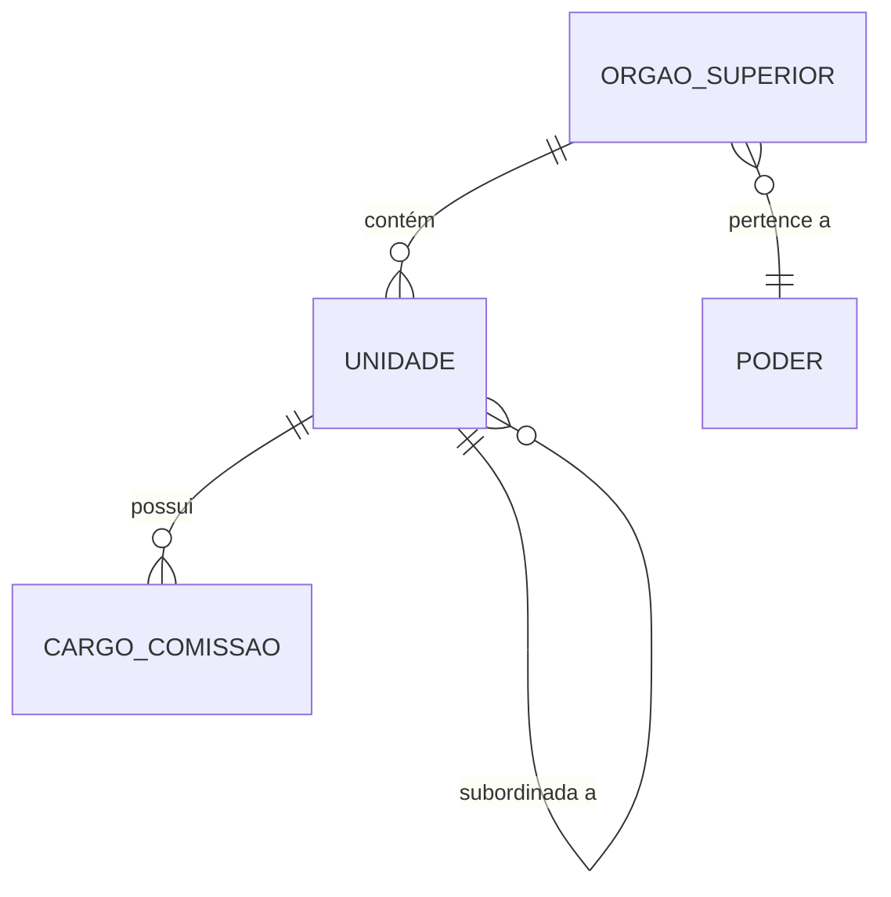

# Siorg — Dicionário de Dados

Sistema de Informações Organizacionais do Governo Federal.

## Contexto

O Siorg mapeia toda a estrutura organizacional do governo federal: ministérios, autarquias, fundações, secretarias, departamentos e coordenações. É a fonte de verdade para hierarquias administrativas e serve como **dimensão central** para cruzar dados de todas as outras fontes.

## Modelo Conceitual



## Entidades

### Órgão

Ministério ou entidade vinculada.

| Campo conceitual | Descrição |
|------------------|-----------|
| Código | Identificador numérico (código SIORG) |
| Nome | Denominação oficial |
| Sigla | Abreviação (ex: MF, MEC, MS) |
| Tipo | Ministério, autarquia, fundação, empresa pública |
| Poder | Executivo, Legislativo, Judiciário |
| Natureza jurídica | Administração direta ou indireta |

### Unidade Organizacional

Subdivisão de um órgão (secretaria, departamento, coordenação).

| Campo conceitual | Descrição |
|------------------|-----------|
| Código | Identificador SIORG |
| Nome | Denominação |
| Sigla | Abreviação |
| Órgão superior | A qual órgão pertence |
| Unidade pai | Hierarquia imediata |
| Nível hierárquico | Profundidade na árvore |
| Competências | Atribuições legais |

### Cargo em Comissão

Posição de livre nomeação (DAS, FCPE, etc.).

| Campo conceitual | Descrição |
|------------------|-----------|
| Tipo | DAS, FCPE, CCE |
| Nível | 1 a 6 (DAS) |
| Unidade | Onde está alocado |
| Denominação | Nome do cargo |

## Tabelas no GovHub

| Camada | Tabela | Descrição |
|--------|--------|-----------|
| Staging | `stg_siorg` | Dados raw carregados |
| Silver | `silver.orgaos` | Estrutura normalizada (flat) |
| Gold | `gold.dim_orgaos` | Dimensão consolidada para joins |

## Papel como Dimensão Central

`gold.dim_orgaos` é a tabela de dimensão usada por todas as tabelas fato:

```sql
-- Estrutura da dimensão
SELECT codigo, nome, sigla, tipo, poder
FROM gold.dim_orgaos;
```

Joins típicos:

```sql
-- Transferências por órgão
FROM gold.fato_transferencias f
JOIN gold.dim_orgaos d ON f.orgao_concedente = d.codigo

-- Servidores por órgão
FROM gold.fato_servidores f
JOIN gold.dim_orgaos d ON f.orgao_lotacao = d.codigo

-- Compras por órgão
FROM gold.fato_compras f
JOIN gold.dim_orgaos d ON f.orgao_contratante = d.codigo
```

## Exemplos de Uso

```sql
-- Estrutura de um ministério (árvore)
SELECT nome, sigla, nivel_hierarquico
FROM silver.orgaos
WHERE orgao_superior_codigo = '26000'  -- Ministério da Educação
ORDER BY nivel_hierarquico, nome;

-- Quantidade de cargos em comissão por órgão
SELECT
    d.nome AS orgao,
    COUNT(*) AS total_cargos_comissao
FROM silver.orgaos o
JOIN gold.dim_orgaos d ON o.orgao_superior_codigo = d.codigo
WHERE o.tipo = 'CARGO_COMISSAO'
GROUP BY 1
ORDER BY 2 DESC;
```

## Referências

- [Siorg](https://siorg.gov.br/)
- [API Siorg](https://estruturaorganizacional.dados.gov.br/)
- [dbt docs — stg_siorg](https://dbt.ipea.gov-hub.io/#!/model/model.govhub.stg_siorg)
