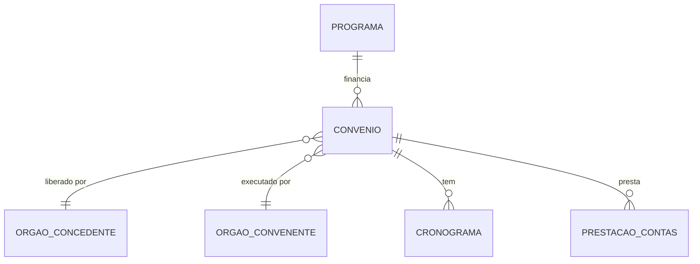

# TransfereGov — Dicionário de Dados

Transferências voluntárias da União para entes subnacionais.

## Contexto

O TransfereGov (antigo Siconv) registra convênios, contratos de repasse e termos de fomento entre o governo federal e estados, municípios, ONGs e consórcios públicos. Cobre todo o ciclo: proposta → celebração → execução → prestação de contas.

## Modelo Conceitual



## Entidades

### Programa

Linha de financiamento criada por um ministério.

| Campo conceitual | Descrição |
|------------------|-----------|
| Código | Identificador único do programa |
| Nome | Nome descritivo |
| Órgão superior | Ministério responsável |
| Modalidade | Convênio, contrato de repasse, termo de fomento |

### Convênio

Acordo entre concedente (União) e convenente (ente receptor).

| Campo conceitual | Descrição |
|------------------|-----------|
| Número | Identificador (ex: 123456/2025) |
| Programa | Programa de origem |
| Órgão concedente | Quem libera recursos |
| Órgão convenente | Quem recebe e executa |
| Valor global | Valor total do convênio |
| Valor repasse | Parcela da União |
| Contrapartida | Parcela do convenente |
| Data celebração | Quando foi assinado |
| Data vigência | Período de execução |
| Situação | Status atual (em execução, prestação de contas, etc.) |

### Cronograma de Desembolso

Parcelas previstas para liberação de recursos.

| Campo conceitual | Descrição |
|------------------|-----------|
| Parcela | Número sequencial |
| Valor | Montante da parcela |
| Data prevista | Quando será liberada |
| Status | Liberada / pendente / atrasada |

## Tabelas no GovHub

| Camada | Tabela | Descrição |
|--------|--------|-----------|
| Staging | `stg_transferegov` | Dados raw carregados do MinIO |
| Silver | `silver.transferencias` | Convênios limpos e normalizados |
| Gold | `gold.fato_transferencias` | Métricas agregadas por órgão/período |

## Exemplos de Uso

```sql
-- Convênios celebrados nos últimos 12 meses
SELECT * FROM silver.transferencias
WHERE data_celebracao >= CURRENT_DATE - INTERVAL '12 months';

-- Top órgãos concedentes por valor
SELECT orgao_concedente, SUM(valor_total) AS total
FROM gold.fato_transferencias
GROUP BY 1 ORDER BY 2 DESC LIMIT 10;
```

## Referências

- [Portal Transferegov.br](https://www.gov.br/transferegov/pt-br)
- [APIs de integração](https://www.gov.br/transferegov/pt-br/sobre/apis-integracao)
- [dbt docs — stg_transferegov](https://dbt.ipea.gov-hub.io/#!/model/model.govhub.stg_transferegov)
