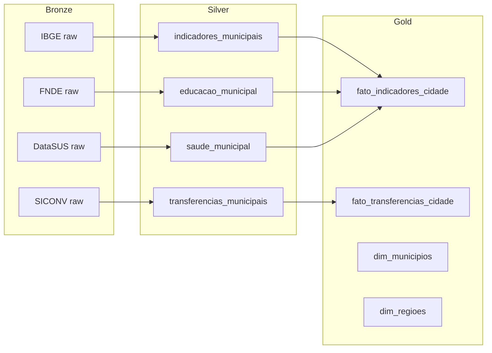

# Fork: Data Application Cidades

Pipeline de dados para integração de dados **municipais**.

## Informações

| Campo | Valor |
|-------|-------|
| **Repositório** | [`data-application-cidades`](https://github.com/GovHub-br/data-application-cidades) |
| **Base** | Fork de `data-application-gov-hub` |
| **Contexto** | Dados municipais e de cidades brasileiras |
| **Status** | Ativo |

## Objetivo

Integrar, qualificar e disponibilizar dados de gestão municipal, permitindo que prefeituras e gestores locais tenham acesso a indicadores e diagnósticos baseados em dados.

## Fontes de Dados

| Fonte | Domínio | Método |
|-------|---------|--------|
| IBGE Cidades | Indicadores socioeconômicos | API REST |
| SICONV/TransfereGov | Convênios municipais | API REST |
| FNDE | Educação (FUNDEB, merenda) | API REST |
| DataSUS | Saúde municipal | Download/API |
| RAIS/CAGED | Emprego e renda | Download |
| MUNIC (IBGE) | Perfil dos municípios | Download |

## Arquitetura Medallion



## Estrutura do Projeto

```
data-application-cidades/
├── airflow/
│   ├── dags/
│   │   ├── ingestao_ibge_cidades.py
│   │   ├── ingestao_siconv_municipios.py
│   │   ├── ingestao_fnde.py
│   │   └── ingestao_datasus.py
│   └── plugins/
├── dbt/
│   └── models/
│       ├── staging/
│       ├── silver/
│       └── gold/
├── jupyter/
│   └── notebooks/
├── superset/
│   └── dashboards/
├── docker-compose.yml
├── Makefile
└── README.md
```

## Dashboards

| Dashboard | Público-alvo | Indicadores |
|-----------|-------------|-------------|
| Painel Municipal | Prefeitos, secretários | IDH, receita, despesa, população |
| Transferências | Gestão de convênios | Valores recebidos, situação, prazos |
| Educação | Secretaria de Educação | IDEB, matrículas, investimento |
| Saúde | Secretaria de Saúde | Leitos, cobertura, mortalidade |

## Setup

```bash
git clone git@github.com:GovHub-br/data-application-cidades.git
cd data-application-cidades
make setup
docker compose up -d
```

## Sincronização com Base

```bash
# Adicionar upstream
git remote add upstream git@github.com:GovHub-br/data-application-gov-hub.git

# Sincronizar melhorias genéricas
git fetch upstream
git merge upstream/main
```
