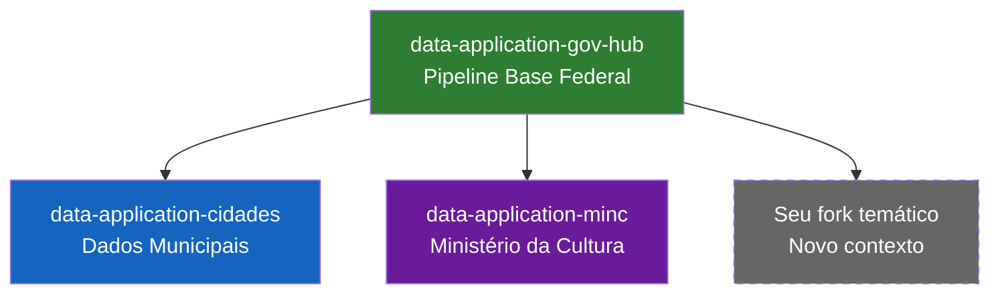

# Forks Temáticos

O GovHub BR adota um modelo de **forks temáticos**: instâncias do pipeline de dados adaptadas para contextos específicos (municípios, ministérios, órgãos).

## Conceito

Cada fork herda toda a infraestrutura do repositório base (`data-application-gov-hub`) e customiza:

- **DAGs de ingestão** — Novas fontes de dados do contexto
- **Models dbt** — Transformações específicas do domínio
- **Dashboards Superset** — Painéis temáticos
- **Notebooks Jupyter** — Análises exploratórias do contexto



## Forks Ativos

| Fork | Contexto | Fontes de Dados | Status |
|------|----------|-----------------|--------|
| [Cidades](cidades.md) | Dados municipais | APIs municipais, IBGE, SICONV | Ativo |
| [MinC](minc.md) | Ministério da Cultura | SALIC, MapaCultural, SNIIC | Ativo |

## Stack Comum

Todos os forks compartilham:

| Componente | Tecnologia | Papel |
|------------|-----------|-------|
| Orquestração | Apache Airflow | DAGs de ingestão |
| Transformação | dbt | Models Bronze/Silver/Gold |
| Notebooks | Jupyter | Análise exploratória |
| BI | Apache Superset | Dashboards |
| Containers | Docker / Docker Compose | Execução local |
| Automação | Make | Setup e builds |

## Acesso Local (qualquer fork)

```bash
# Clonar
git clone git@github.com:GovHub-br/data-application-<fork>.git
cd data-application-<fork>

# Setup
make setup

# Subir serviços
docker compose up -d

# Acessar
# Airflow:  http://localhost:8080
# Jupyter:  http://localhost:8888
# Superset: http://localhost:8088
```

## Como Criar um Novo Fork

Veja o [Guia de Criação de Forks](guia-criar-fork.md).
