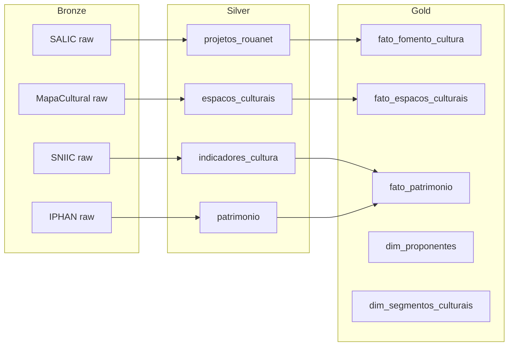

# Fork: Data Application MinC

Pipeline de dados para integração de dados do **Ministério da Cultura**.

## Informações

| Campo | Valor |
|-------|-------|
| **Repositório** | [`data-application-minc`](https://github.com/GovHub-br/data-application-minc) |
| **Base** | Fork de `data-application-gov-hub` |
| **Contexto** | Políticas culturais, fomento, patrimônio |
| **Status** | Ativo |

## Objetivo

Integrar dados de sistemas do Ministério da Cultura para análise de políticas culturais, investimentos em fomento e acesso a informações sobre patrimônio cultural brasileiro.

## Fontes de Dados

| Fonte | Domínio | Método |
|-------|---------|--------|
| SALIC | Lei de Incentivo à Cultura (Rouanet) | API REST |
| MapaCultural | Espaços, agentes, projetos culturais | API REST |
| SNIIC | Informações e indicadores culturais | API/Download |
| IBGE (MUNIC - Cultura) | Perfil cultural dos municípios | Download |
| IPHAN | Patrimônio histórico/cultural | API/Download |
| Funarte | Editais e projetos | Scraping/API |

## Arquitetura Medallion



## Estrutura do Projeto

```
data-application-minc/
├── airflow/
│   ├── dags/
│   │   ├── ingestao_salic.py
│   │   ├── ingestao_mapacultural.py
│   │   ├── ingestao_sniic.py
│   │   └── ingestao_iphan.py
│   └── plugins/
├── dbt/
│   └── models/
│       ├── staging/
│       ├── silver/
│       └── gold/
├── jupyter/
│   └── notebooks/
├── superset/
│   └── dashboards/
├── docker-compose.yml
├── Makefile
└── README.md
```

## Dashboards

| Dashboard | Público-alvo | Indicadores |
|-----------|-------------|-------------|
| Lei Rouanet | Gestores MinC | Projetos aprovados, captação, execução |
| Mapa Cultural | Sociedade civil | Espaços, eventos, agentes por região |
| Patrimônio | IPHAN, gestores | Bens tombados, estado de conservação |
| Investimento Cultural | Secretaria Executiva | Distribuição regional, segmentos |

## Setup

```bash
git clone git@github.com:GovHub-br/data-application-minc.git
cd data-application-minc
make setup
docker compose up -d
```

## Sincronização com Base

```bash
# Adicionar upstream
git remote add upstream git@github.com:GovHub-br/data-application-gov-hub.git

# Sincronizar melhorias genéricas
git fetch upstream
git merge upstream/main
```
