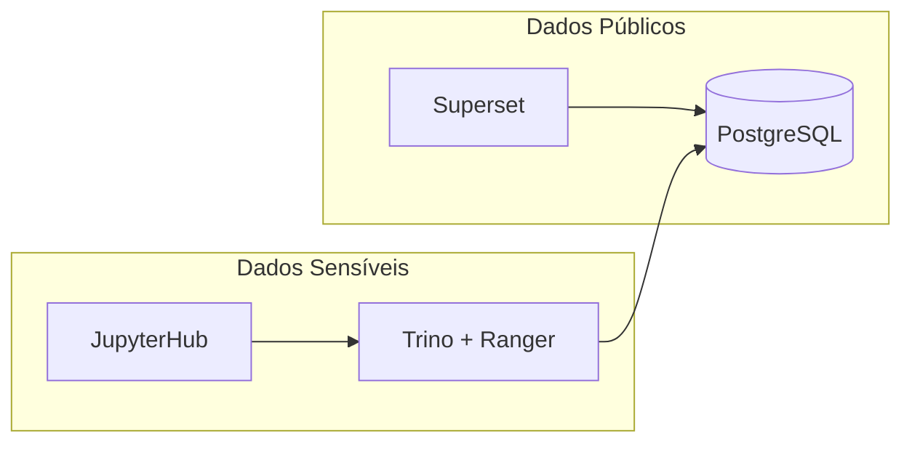

# Controle de Acesso

Políticas de acesso aos dados e serviços do GovHub BR.

## Níveis de Acesso

| Nível | Quem | O que pode |
|-------|------|-----------|
| Admin | Equipe core | Tudo |
| Contribuidor | Devs ativos | Pipeline, notebooks, PRs |
| Visualizador | Gestores, sociedade | Dashboards Superset |
| Público | Qualquer pessoa | Dados abertos (se publicados) |

## Acesso por Serviço

| Serviço | Autenticação | Notas |
|---------|-------------|-------|
| Airflow | User/password ou SSO | Acesso restrito a equipe pipeline |
| Superset | Roles (Admin/Alpha/Gamma) | Dashboards por permissão |
| JupyterHub | Auth do cluster | Pesquisadores e DS |
| MinIO | Access Key / Secret Key | Apenas via pipeline |
| PostgreSQL | User/password | Conexão via services internos |
| Argo CD | RBAC do cluster | Apenas equipe infra |

## Row-Level Security (Superset)

Para limitar dados por perfil de usuário:

```sql
-- Exemplo: gestor vê apenas seu órgão
SELECT * FROM gold.fato_transferencias
WHERE orgao_concedente = '{{ current_user.org_code }}'
```

## Dados Sensíveis

| Fonte | Sensibilidade | Tratamento |
|-------|---------------|------------|
| Siape | Alta (dados pessoais) | Acesso governado via Trino + Ranger, quando habilitado |
| Siafi | Média (financeiro detalhado) | Acesso governado via Trino + Ranger, quando habilitado |
| TransfereGov | Baixa (público) | Acesso direto via PostgreSQL |
| ComprasGov | Baixa (público) | Acesso direto via PostgreSQL |
| Siorg | Baixa (público) | Acesso direto via PostgreSQL |

## Modelo de Dois Níveis

O GovHub opera com dois caminhos de acesso:



| Nível | Caminho | Dados | Controle |
|-------|---------|-------|----------|
| Básico | Superset/JupyterHub → PostgreSQL direto | Públicos (TransfereGov, ComprasGov, Siorg) | Roles PG |
| Governado | JupyterHub → Trino + Ranger → PostgreSQL | Sensíveis (Siape, Siafi detalhado) | Row-level security, column masking |

## Apache Ranger + Trino

Trino + Ranger são a referência do projeto para acesso governado a dados sensíveis. A configuração e os exemplos de políticas ficam no repositório [`data-governance-workshop`](https://github.com/GovHub-br/data-governance-workshop). Antes de tratar esse caminho como obrigatório em um ambiente, confirme o estado do deploy com a equipe de infraestrutura.

Quando habilitados, esses componentes fornecem:

- **Row-level security**: Filtro automático por perfil do usuário
- **Column masking**: Ocultação de colunas sensíveis (CPF, remuneração individual)
- **Audit trail**: Log de todas as queries a dados restritos
- **Políticas centralizadas**: Gerenciadas via Apache Ranger

Repo de referência: [`data-governance-workshop`](https://github.com/GovHub-br/data-governance-workshop)
