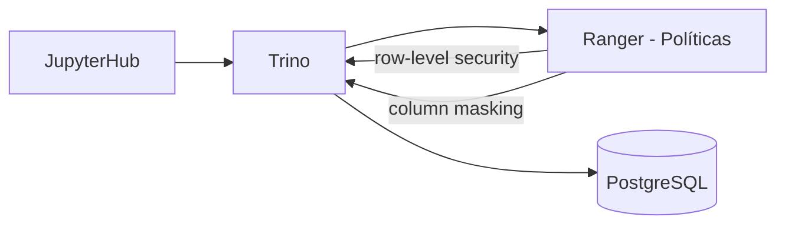
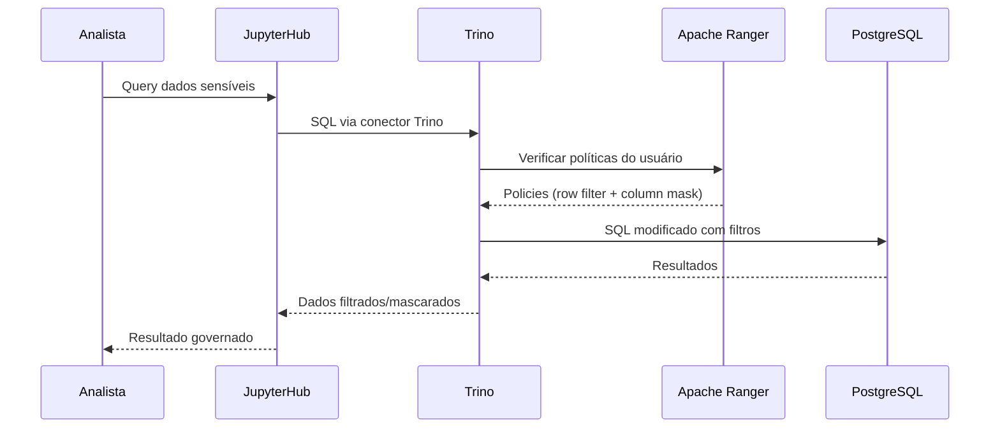

# Trino + Apache Ranger

Acesso governado para dados sensíveis no GovHub BR.

## Visão Geral

Trino + Ranger formam a camada de **acesso governado** para dados que não podem ser consultados diretamente no PostgreSQL. O Ranger define políticas de acesso (quem pode ver o quê), e o Trino as aplica em tempo de query.



## Quando Usar

| Caminho | Quando | Exemplo |
|---------|--------|---------|
| PostgreSQL direto | Dados públicos | TransfereGov, ComprasGov, Siorg |
| Trino + Ranger | Dados sensíveis | Siape (pessoal), Siafi (detalhado) |

!!! note "Regra geral"
    O desenho recomendado mantém Superset voltado a dados Gold públicos ou agregados no PostgreSQL. Para análises que tocam registros individuais de fontes sensíveis, como Siape ou detalhamento Siafi, use o caminho governado com Trino + Ranger quando ele estiver habilitado no ambiente.

## Arquitetura



## Políticas de Acesso

### Row-Level Security

Filtrar linhas baseado no perfil do usuário:

| Política | Regra | Aplicação |
|----------|-------|-----------|
| Órgão próprio | Servidor vê apenas dados do seu órgão | `WHERE orgao_lotacao = user.orgao` |
| Dados agregados | Pesquisador vê apenas contagens | `GROUP BY` forçado |
| Acesso total | Equipe IPEA/Dides | Sem filtro |

### Column Masking

Ocultar ou mascarar colunas sensíveis:

| Coluna | Masking | Quem vê original |
|--------|---------|------------------|
| CPF | `***.***.***-XX` | Ninguém (exceto admin) |
| Nome | Primeiros 3 caracteres | Equipe autorizada |
| Remuneração individual | NULL | Equipe autorizada |
| Remuneração agregada | Valor real | Todos via Gold |

## Configuração

### Trino — Conector PostgreSQL

```properties
# catalog/postgres.properties
connector.name=postgresql
connection-url=jdbc:postgresql://postgres:5432/govhub
connection-user=trino_reader
connection-password=${ENV:TRINO_PG_PASSWORD}
```

### Ranger — Política Exemplo

```json
{
  "policyName": "siape_orgao_proprio",
  "resources": {
    "database": {"values": ["govhub"]},
    "schema": {"values": ["silver"]},
    "table": {"values": ["servidores"]}
  },
  "rowFilterPolicyItems": [{
    "accesses": [{"type": "select"}],
    "users": ["analista_ipea"],
    "rowFilterInfo": {
      "filterExpr": "orgao_lotacao = 'IPEA'"
    }
  }]
}
```

## Conexão via JupyterHub

```python
from sqlalchemy import create_engine
import pandas as pd

# Conexão via Trino — Ranger aplica as políticas configuradas no ambiente
engine = create_engine("trino://trino:8443/postgres/silver")

# O usuário autenticado determina quais filtros Ranger aplica
df = pd.read_sql("SELECT * FROM servidores LIMIT 100", engine)
# → Ranger aplica filtros conforme a política vigente
```

## Deploy

A referência de deploy de Trino e Ranger fica no repositório `continuous-deployment`. Confirme no cluster alvo quais componentes estão ativos e quais namespaces foram adotados:

```
continuous-deployment/
├── trino/
│   ├── values.yaml
│   └── values.prod.yaml
└── ranger/
    ├── values.yaml
    └── values.prod.yaml
```

| Namespace | Componente | Porta comum |
|-----------|-----------|-------|
| `trino` | Trino coordinator | 8443 |
| `trino` | Trino workers | — |
| `trino` | Ranger admin | 6080 |

## Monitoramento

- **Trino UI**: Queries em execução, performance, falhas
- **Ranger Audit**: Log de todas as decisões de acesso (permitido/negado)
- **Alertas**: query lenta, falha de autenticação ou aumento incomum de erros

## Referências

- [Trino Documentation](https://trino.io/docs/current/)
- [Apache Ranger](https://ranger.apache.org/)
- Repo: [`data-governance-workshop`](https://github.com/GovHub-br/data-governance-workshop)
