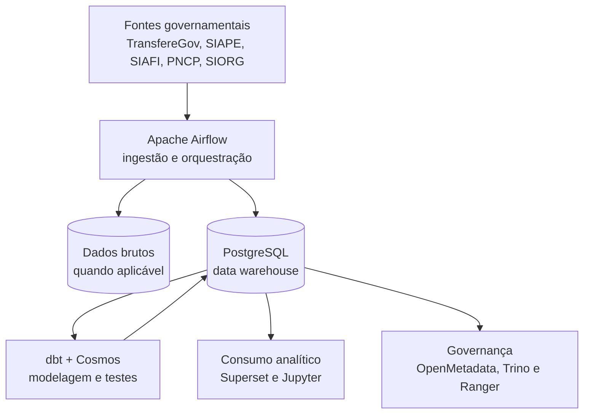

# GovHub BR

> Transformando dados públicos em ativos estratégicos para a gestão pública.

O **GovHub BR** é uma iniciativa open source para integrar, qualificar e disponibilizar dados governamentais de forma estruturada. A plataforma combina pipelines de dados, modelagem analítica, visualização, governança e documentação para apoiar decisões baseadas em evidências.

O projeto responde a problemas recorrentes da gestão pública: fragmentação entre sistemas estruturantes, retrabalho manual, inconsistências entre bases e dificuldade de transformar dados públicos em informação confiável para decisão, transparência e controle social.

Esta documentação reúne a visão técnica do projeto: arquitetura, onboarding, padrões de engenharia, pipeline de dados, infraestrutura, governança e guias de adoção.

## Visão Geral

## Repositórios Principais

| Repositório | Papel |
| --- | --- |
| [`gov-hub`](https://github.com/GovHub-br/gov-hub) | site oficial e documentação pública |
| [`data-application-gov-hub`](https://github.com/GovHub-br/data-application-gov-hub) | pipeline principal com Airflow, dbt, Superset e Jupyter |
| [`continuous-deployment`](https://github.com/GovHub-br/continuous-deployment) | infraestrutura e deploy GitOps |
| [`data-application-cidades`](https://github.com/GovHub-br/data-application-cidades) | fork temático Cidades |
| [`data-application-minc`](https://github.com/GovHub-br/data-application-minc) | fork temático MinC |
| [`openmetadata-declarative-governance`](https://github.com/GovHub-br/openmetadata-declarative-governance) | configuração declarativa de governança no OpenMetadata |
| [`data-governance-workshop`](https://github.com/GovHub-br/data-governance-workshop) | referência de Trino/Ranger e governança de acesso |
| [`govhub-research`](https://github.com/GovHub-br/govhub-research) | pesquisa, IA aplicada, OCR e provas de conceito |

## Por Onde Começar

| Objetivo | Página |
| --- | --- |
| Entender a plataforma | [Visão Geral da Arquitetura](arquitetura/visao-geral.md) |
| Subir o ambiente local | [Instalação](instalacao.md) |
| Criar ou revisar DAGs | [Apache Airflow](pipeline/airflow.md) e [Padrões de Engenharia](pipeline/padroes-engenharia.md) |
| Trabalhar com dbt | [dbt](pipeline/dbt.md) e [Qualidade de Dados](pipeline/qualidade.md) |
| Contribuir com segurança | [Segurança](governanca/seguranca.md) e [Protocolo de PR](pipeline/protocolo-mr.md) |
| Criar fork temático | [Guia de Criação](forks/guia-criar-fork.md) |

## Princípios

- **Transparência:** priorizar dados documentados, rastreáveis e auditáveis.
- **Evidências:** apoiar decisões públicas com indicadores confiáveis.
- **Reuso:** centralizar padrões, helpers, clientes e modelos reutilizáveis.
- **Governança:** tratar dados sensíveis com controle de acesso e cuidado operacional.
- **Colaboração:** manter fluxos de contribuição claros, revisáveis e seguros.

## Fontes de Dados

| Sistema | Domínio |
| --- | --- |
| TransfereGov | transferências voluntárias e instrumentos relacionados |
| Siape | pessoal civil e militar |
| Siafi / Tesouro Gerencial | administração financeira, orçamento e execução |
| ComprasGov / PNCP | compras públicas, contratos e licitações |
| Siorg | estrutura organizacional |

## Links

- **Organização:** [github.com/GovHub-br](https://github.com/GovHub-br)
- **Site oficial:** [gov-hub.io](https://gov-hub.io)
- **Apoio:** Lab Livre (UnB) + IPEA/Dides
