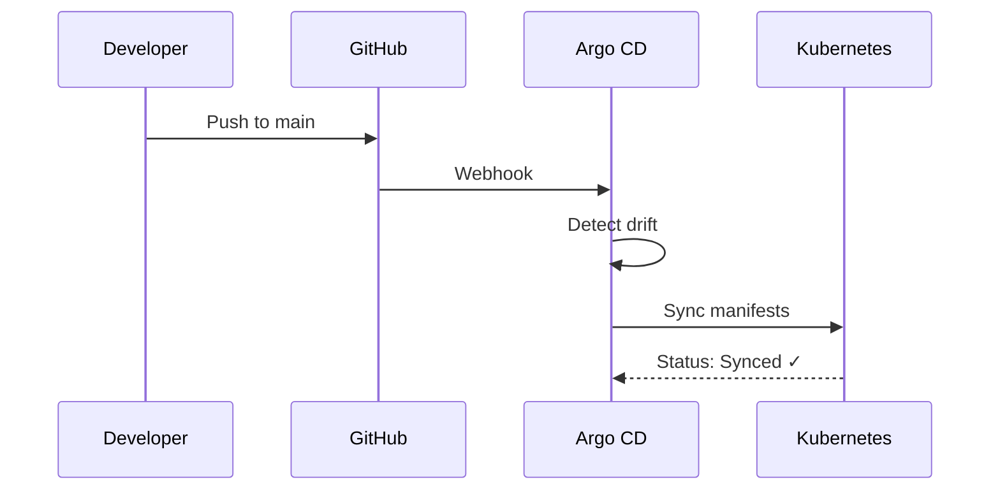
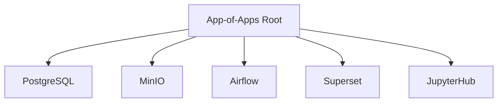

# Argo CD (GitOps)

Referência de deploy declarativo da infraestrutura do GovHub BR via GitOps.

## Conceito

O Argo CD monitora o repositório `continuous-deployment` e sincroniza o estado do cluster Kubernetes com os manifests versionados no Git. Em ambientes controlados, evite `kubectl apply` manual fora do fluxo acordado de GitOps.



## App-of-Apps

Um `Application` raiz gera e gerencia os Applications filhos:



Cada filho pode usar Helm, Kustomize ou plugin `kustomized-helm`.

## Sync Waves

Ordem de deploy controlada por anotações:

```yaml
metadata:
  annotations:
    argocd.argoproj.io/sync-wave: "<N>"
```

| Wave | Componentes | Motivo |
|------|-------------|--------|
| Negativa (-1) | PostgreSQL, MinIO | Dependências de infra |
| 0 | Airflow | Orquestrador |
| 1+ | Superset, JupyterHub | Serviços de consumo |

## Overlays por Ambiente

Arquivos `values.*.yaml` sobrescrevem apenas o que muda por ambiente (deep-merge):

```
component/
├── values.yaml           # Base (herdado)
├── values.preprod.yaml   # Override pré-prod
└── values.prod.yaml      # Override produção
```

## Bootstrap

1. Instalar Argo CD conforme `argocd/README.md`
2. Aplicar `application.<env>.yaml` (cria o Application raiz)
3. Argo CD gera os filhos conforme `app-of-apps/values.<env>.yaml`
4. Sync waves garantem a ordem

```bash
# Instalar Argo CD
kubectl apply -n argocd -f argocd/install.yaml

# Aplicar app-of-apps (produção)
kubectl apply -f argocd/application.prod.yaml
```

## Troubleshooting

### Application OutOfSync

```bash
# Verificar diff
argocd app diff <app-name>

# Forçar sync
argocd app sync <app-name>
```

### Pod CrashLoopBackOff

```bash
# Ver logs
kubectl logs -n <namespace> <pod> --previous

# Verificar secrets
kubectl get secrets -n <namespace>
```

## Referências

- [Argo CD Docs](https://argo-cd.readthedocs.io/)
- [App-of-Apps Pattern](https://argo-cd.readthedocs.io/en/stable/operator-manual/cluster-bootstrapping/)
- Repo: [`continuous-deployment`](https://github.com/GovHub-br/continuous-deployment)
