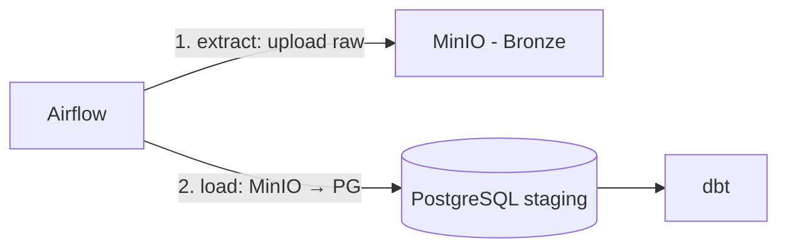

# MinIO

Object storage S3-compatible para dados brutos do GovHub BR quando a fonte ou o ambiente exigem persistência de arquivos.

## Papel na Arquitetura

MinIO pode armazenar dados raw ingeridos pelo Airflow antes de transformações. No projeto, algumas fontes usam PostgreSQL como destino principal; por isso, confirme o padrão da fonte antes de assumir que todo dado bruto passa por object storage.



## Buckets de referência

Os nomes abaixo são uma convenção de referência para organizar dados brutos por fonte. Confirme os buckets reais no ambiente antes de criar integrações novas.

| Bucket | Conteúdo | Retenção |
|--------|----------|----------|
| `bronze-transferegov` | Raw JSON do TransfereGov | Indefinida |
| `bronze-siape` | Raw CSV do Siape | Indefinida |
| `bronze-siafi` | Raw JSON do Siafi | Indefinida |
| `bronze-comprasgov` | Raw JSON do ComprasGov | Indefinida |
| `bronze-siorg` | Raw JSON do Siorg | Indefinida |

## Organização de Objetos

```
bronze-transferegov/
├── 2026-05-19/
│   └── transferencias.json
├── 2026-05-18/
│   └── transferencias.json
└── ...
```

Particionamento por data de execução para facilitar re-processamento.

## Acesso

### Local (Docker Compose)

```bash
# MinIO Console: http://localhost:9001
# API endpoint: http://localhost:9000
# Access Key: minioadmin
# Secret Key: minioadmin
```

Essas credenciais são apenas para desenvolvimento local. Em ambientes compartilhados, use Kubernetes Secrets ou o mecanismo de secret adotado pelo time.

### Código (Python)

```python
import boto3

s3 = boto3.client(
    "s3",
    endpoint_url="http://localhost:9000",
    aws_access_key_id="minioadmin",
    aws_secret_access_key="minioadmin",
)

# Upload
s3.put_object(
    Bucket="bronze-transferegov",
    Key=f"{execution_date}/transferencias.json",
    Body=json.dumps(data),
)
```

### Airflow Connection

```
Connection ID: minio_default
Type: Amazon Web Services
Extra: {"endpoint_url": "http://minio:9000"}
```

## Deploy (Produção)

Gerenciado via Argo CD:

```
continuous-deployment/
└── minio/
    ├── values.yaml
    └── values.prod.yaml
```

## Referências

- [MinIO Docs](https://min.io/docs/minio/linux/index.html)
- [MinIO Python SDK](https://docs.min.io/aistor/developers/sdk/python/)
