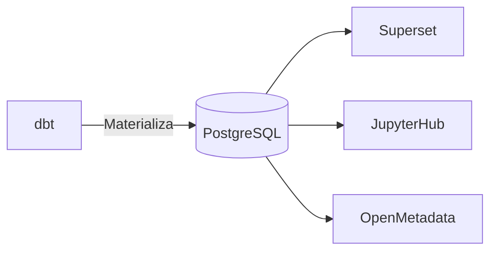

# PostgreSQL

Banco de dados analítico para as camadas Silver e Gold do GovHub BR.

## Papel na Arquitetura

PostgreSQL armazena os dados transformados pelo dbt e serve como backend para Superset, JupyterHub e Trino (acesso governado a dados sensíveis).



## Schemas

| Schema | Camada | Conteúdo |
|--------|--------|----------|
| `silver` | Silver | Dados limpos e normalizados (pipeline principal) |
| `gold` | Gold | Dados agregados, fatos e dimensões (pipeline principal) |
| `public` | Staging | Tables de staging carregadas pelo Airflow |
| `cidades_silver` | Silver | Fork leve — dados municipais |
| `cidades_gold` | Gold | Fork leve — dados municipais |
| `minc_silver` | Silver | Fork leve — Ministério da Cultura |
| `minc_gold` | Gold | Fork leve — Ministério da Cultura |

!!! note "Convenção de schemas por fork"
    Cada fork leve cria seus próprios schemas no formato `<fork>_silver` e `<fork>_gold`.
    Isso permite isolamento lógico sem exigir bancos separados.

## Tabelas Principais

### Silver

| Tabela | Fonte | Descrição |
|--------|-------|-----------|
| `silver.transferencias` | TransfereGov | Convênios limpos |
| `silver.servidores` | Siape | Dados de pessoal |
| `silver.execucao_financeira` | Siafi | Execução orçamentária |
| `silver.contratos` | ComprasGov | Contratos públicos |
| `silver.orgaos` | Siorg | Estrutura organizacional |

### Gold

| Tabela | Tipo | Descrição |
|--------|------|-----------|
| `gold.fato_transferencias` | Fato | Transferências por órgão/período |
| `gold.fato_servidores` | Fato | Indicadores de pessoal |
| `gold.fato_compras` | Fato | Métricas de compras |
| `gold.dim_orgaos` | Dimensão | Órgãos consolidados |
| `gold.dim_tempo` | Dimensão | Calendário |

## Conexão

### Local

```bash
# Via Docker Compose
psql -h localhost -p 5432 -U postgres_dw -d data_warehouse
```

### dbt (profiles.yml)

```yaml
ipea:
  target: dev
  outputs:
    dev:
      type: postgres
      host: localhost
      port: 5432
      user: postgres_dw
      password: "{{ env_var('DB_DW_PASSWORD', 'postgres_dw') }}"
      dbname: data_warehouse
      schema: ipea
      threads: 4
```

### Superset Dataset

```
Database: GovHub Analytics
SQLAlchemy URI: postgresql://postgres_dw:<password>@postgres:5432/data_warehouse
```

## Deploy (Produção)

Gerenciado via Argo CD:

```
continuous-deployment/
└── postgres/
    ├── values.yaml
    └── values.prod.yaml
```

## Backups

Configurados via manifests Kubernetes (CronJob ou operador).

## Referências

- [PostgreSQL Docs](https://www.postgresql.org/docs/)
- Repo: [`continuous-deployment/postgres`](https://github.com/GovHub-br/continuous-deployment/tree/main/postgres)
