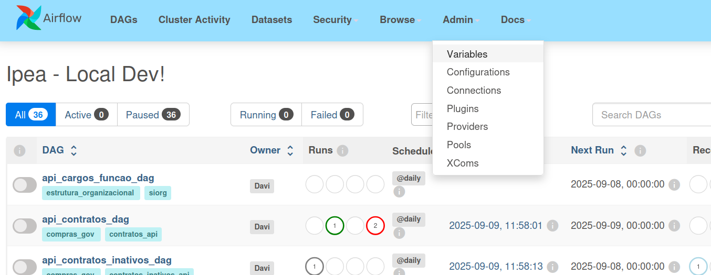
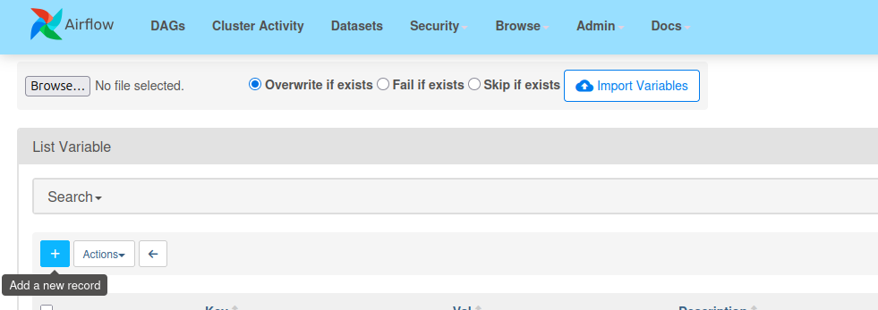
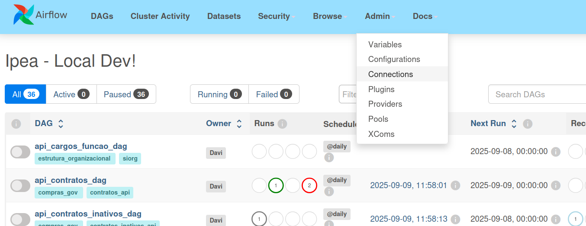
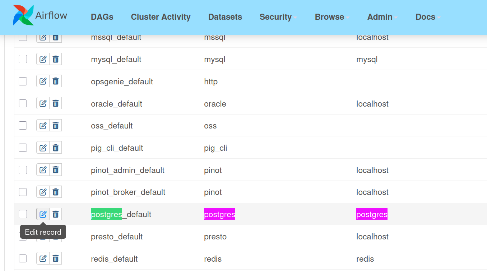

# Instalação

O **Data Pipeline Project** é uma solução moderna que utiliza ferramentas como **Airflow**, **DBT**, **Jupyter** e **Superset** para orquestração, transformação, análise e visualização de dados. Este guia ajudará você a começar rapidamente.

---

## Pré-requisitos

Antes de começar, certifique-se de ter os seguintes softwares instalados:

- **Docker e Docker Compose**: Para gerenciamento de contêineres.
- **Make**: Ferramenta de automação de build.
- **Python 3.11**: Para execução de scripts e desenvolvimento.
- **Git**: Controle de versão.

Caso precise de ajuda para instalar esses componentes, consulte a documentação oficial de cada ferramenta:

- [Instalação do Docker](https://docs.docker.com/get-docker/)
- [Guia do Python](https://www.python.org/downloads/)
- [Guia do Git](https://git-scm.com/book/en/v2/Getting-Started-Installing-Git)

---

## Instalação

### 1. Clonando o Repositório

Para obter o código-fonte do projeto, clone o repositório Git:

```bash
git clone https://github.com/GovHub-br/data-application-gov-hub.git
cd app-lappis-ipea
```

### 2. Configurando o Ambiente

Execute o comando abaixo para configurar automaticamente o ambiente de desenvolvimento:

```bash
make setup
```

Este comando irá:

- Criar ambientes virtuais necessários.
- Instalar dependências do projeto.
- Configurar hooks de pré-commit.
- Preparar o ambiente de desenvolvimento para execução local.

!!! note "Dica" Caso encontre problemas durante a configuração, verifique se o Docker está rodando corretamente e se você possui permissões administrativas no sistema.

## Executando o Projeto Localmente

Após a configuração, inicialize todos os serviços com o Docker Compose:

```bash
docker-compose up -d
```

### Acessando os Componentes

Uma vez que os serviços estejam em execução, você pode acessar as ferramentas principais nos seguintes URLs:

- Airflow: http://localhost:8080

Login: `airflow`<br>
Senha: `airflow`

- Jupyter: http://localhost:8888
- Superset: http://localhost:8088

Login: `admin`<br>
Senha: `admin`

Certifique-se de que todas as portas mencionadas estejam disponíveis no seu ambiente.

## Estrutura do Projeto

A estrutura do projeto é organizada para separar cada componente da stack, facilitando a manutenção e o desenvolvimento:

```bash 
.
├── airflow_lappis
│   ├── dags
│   │   ├── data_ingest
│   │   │   ├── compras_gov
│   │   │   ├── siafi
│   │   │   ├── siape
│   │   │   ├── siorg
│   │   │   ├── tesouro_gerencial
│   │   │   └── transfere_gov
│   │   └── dbt
│   │       └── ipea
│   │           ├── cosmos_dag.py
│   │           ├── dbt_project.yml
│   │           ├── descriptions.yml
│   │           ├── macros
│   │           ├── models
│   │           │   ├── contratos_dbt
│   │           │   │   ├── bronze
│   │           │   │   ├── silver
│   │           │   │   ├── gold
│   │           │   │   └── views
│   │           │   ├── orcamento_dbt
│   │           │   │   └── bronze
│   │           │   ├── pessoas_dbt
│   │           │   │   ├── bronze
│   │           │   │   ├── silver
│   │           │   │   └── gold
│   │           │   ├── schema.yml
│   │           │   ├── sources.yml
│   │           │   └── ted_dbt
│   │           │       ├── bronze
│   │           │       ├── silver
│   │           │       ├── gold
│   │           │       └── views
│   │           ├── profiles.yml
│   │           └── snapshots
│   ├── helpers
│   ├── plugins
│   └── templates
├── docker
├── docker-compose.yml
├── Dockerfile
├── Makefile
├── pyproject.toml
├── README.md
├── requirements.txt

```

Essa organização modular permite que cada componente seja desenvolvido e mantido de forma independente.

---

## Comandos Úteis no Makefile

O **Makefile** facilita a execução de tarefas repetitivas e a configuração do ambiente. Aqui estão os principais comandos disponíveis:

#### `make setup`

> **Prepara o ambiente do projeto.**
> Instala todas as dependências do projeto definidas no `pyproject.toml`, incluindo as dependências de desenvolvimento. Também exporta essas dependências para um arquivo `requirements.txt` (útil para ambientes como Docker ou CI/CD) e executa um script de configuração de *git hooks*.

---

#### `make format`

> **Formata o código automaticamente.**
> Executa ferramentas de formatação para padronizar o estilo do código:

* [`black`](https://black.readthedocs.io/) para código Python
* [`ruff`](https://docs.astral.sh/ruff/) para correções rápidas
* [`sqlfmt`](https://sqlfmt.com/) para formatar scripts SQL localizados na pasta `airflow_lappis/dags/dbt`

---

#### `make lint`

> **Verifica a qualidade do código.**
> Executa validações de estilo e qualidade estática:

* Verifica se o código está corretamente formatado com `black` (`--check`)
* Analisa problemas com `ruff` (sem corrigir)
* Executa `mypy` para checar tipos estáticos
* Valida formatação SQL com `sqlfmt`
* Roda o `sqlfluff` (caso não esteja em ambiente CI) para validações avançadas de SQL

---

#### `make test`

> **Executa os testes automatizados.**
> Roda os testes presentes na pasta `tests/` usando o framework [`pytest`](https://docs.pytest.org/).


---

# Configuração e Teste dos Componentes

Este passo a passo descreve como configurar e executar o pipeline completo, desde a ingestão de dados no **Airflow** até o tratamento no **dbt** e visualização no **Superset**.

---

## 1. Configurar Airflow

### 1.1 Configurar variáveis de ambiente do Airflow

- Acesse o airflow:

Airflow: http://localhost:8080

Login: `airflow`<br>
Senha: `airflow`


- Após subir os containers via Docker (`docker compose up -d`), é necessário configurar as variáveis de ambiente no **Airflow → Admin → Variables**.



- Clique em "+" para adicionar uma nova variável de ambiente




- Adicione as três Key & Value, uma de cada vez, e salve-as:

<details>
  <summary>1- Key & Value</summary>

  <pre>Key: <code>
    airflow_orgao
  </code></pre>
  
  <pre>Value: <code>
    ipea
  </code></pre>

</details>

<details>
  <summary>2- Key & Value</summary>

  <pre>Key: <code>
    airflow_variables
  </code></pre>
  <pre>Value: <code>{
    "ipea": {
      "codigos_ug": [113601, 113602]
    },
    "unb": {
      "codigos_ug": [154040]
    },
    "ibama": {
      "codigos_ug": [440001, 440048, 440050]
    },
    "mgi": {
      "codigos_ug": [201082]
    }
  }</code></pre>
</details>

<details>
  <summary>3- Key & Value</summary>

  <pre>Key: <code>
    dynamic_schedules
  </code></pre>
  <pre>Value: <code>{
    "contratos_inativos_ingest_dag": {
      "type": "preset",
      "value": "@daily"
    },
    "contratos_ingest_dag": {
      "type": "preset",
      "value": "@daily"
    },
    "cronograma_ingest_dag": {
      "type": "preset",
      "value": "@daily"
    },
    "empenhos_ingest_dag": {
      "type": "preset",
      "value": "@daily"
    },
    "faturas_ingest_dag": {
      "type": "preset",
      "value": "@daily"
    },
    "terceirizados_ingest_dag": {
      "type": "preset",
      "value": "@daily"
    },
    "nota_credito_siafi_ingest_dag": {
      "type": "preset",
      "value": "@daily"
    },
    "nota_empenho_siafi_ingest_dag": {
      "type": "preset",
      "value": "@daily"
    },
    "programacao_financeira_siafi_ingest_dag": {
      "type": "preset",
      "value": "@daily"
    },
    "dados_afastamento_historico_siape_ingest_dag": {
      "type": "preset",
      "value": "@daily"
    },
    "dados_afastamento_siape_ingest_dag": {
      "type": "preset",
      "value": "@daily"
    },
    "dados_curriculo_siape_ingest_dag": {
      "type": "preset",
      "value": "@daily"
    },
    "dados_dependentes_siape_ingest_dag": {
      "type": "preset",
      "value": "@daily"
    },
    "dados_escolares_siape_ingest_dag": {
      "type": "preset",
      "value": "@daily"
    },
    "dados_financeiros_siape_dag": {
      "type": "preset",
      "value": "@daily"
    },
    "dados_funcionais_siape_ingest_dag": {
      "type": "preset",
      "value": "@daily"
    },
    "dados_pa_siape_ingest_dag": {
      "type": "preset",
      "value": "@daily"
    },
    "dados_pessoais_siape_ingest_dag": {
      "type": "preset",
      "value": "@daily"
    },
    "dados_uorg_siape_ingest_dag": {
      "type": "preset",
      "value": "@daily"
    },
    "lista_aposentadoria_siape_ingest_dag": {
      "type": "preset",
      "value": "@daily"
    },
    "lista_servidores_siape_ingest_dag": {
      "type": "preset",
      "value": "@daily"
    },
    "lista_uorgs_siape_ingest_dag": {
      "type": "preset",
      "value": "@daily"
    },
    "pensoes_instituidas_siape_ingest_dag": {
      "type": "preset",
      "value": "@daily"
    },
    "cargos_funcao_ingest_dag": {
      "type": "preset",
      "value": "@daily"
    },
    "estrutura_organizacional_cargos_ingest_dag": {
      "type": "preset",
      "value": "@daily"
    },
    "unidade_organizacional_ingest_dag": {
      "type": "preset",
      "value": "@daily"
    },
    "empenhos_tesouro_ingest_dag": {
      "type": "cron",
      "value": "0 13 * * 1-6"
    },
    "nc_tesouro_ingest_dag": {
      "type": "cron",
      "value": "0 13 * * 1-6"
    },
    "pf_tesouro_ingest_dag": {
      "type": "cron",
      "value": "0 13 * * 1-6"
    },
    "visao_orcamentaria_ingest": {
      "type": "cron",
      "value": "0 13 * * 1-6"
    },
    "plano_acao_ingest_dag": {
      "type": "preset",
      "value": "@daily"
    },
    "notas_de_credito_ingest_dag": {
      "type": "preset",
      "value": "@daily"
    },
    "programa_beneficiario_ingest_dag": {
      "type": "preset",
      "value": "@daily"
    },
    "programacao_financeira_ingest_dag": {
      "type": "preset",
      "value": "@daily"
    },
    "programas_ingest_dag": {
      "type": "preset",
      "value": "@daily"
    }
  }</code></pre>
</details>
<br><br>

### 1.2 Configurar banco local com o Airflow

- Clique em connections:

<br><br>

- Busque pela conexão pré configurada do postgres e clique em edit record:

 <br><br>

- Altere apenas Host, Database, Login, Password e Porta

```bash
HOST=postgres
DBNAME=postgres
USER=postgres
PASSWORD=postgres
PORT=5432
``` 

- Clique em `Test` para testar a conexão com o banco e depois salve!


---

## 2. Configuração do Superset com PostgreSQL

Para conectar o Superset ao banco PostgreSQL e visualizar os dados:

### 2.1 Acesse o Superset

- URL: http://localhost:8088
- Login: `admin`
- Senha: `admin`

### 2.2 Configure a Conexão com PostgreSQL

1. **Vá em Settings → Database Connections → + Database**
2. **Selecione PostgreSQL** na lista de bancos
3. **Preencha os seguintes campos:**

| Campo | Valor |
|-------|-------|
| **Host** | `postgres` |
| **Port** | `5432` |
| **Database name** | `postgres` |
| **Username** | `postgres` |
| **Password** | `postgres` |
| **Display Name** | `PostgreSQL Local` |

4. **Clique em "Test Connection"** para verificar
5. **Clique em "Connect"** para salvar

A conexão deve funcionar perfeitamente!

### 2.3 Explore os Dados

Após conectar, você poderá:
- **Criar datasets** baseados nas tabelas do PostgreSQL
- **Construir dashboards** com os dados processados pelo dbt
- **Visualizar métricas** dos contratos e outros dados governamentais

---

## 3. Rodar a DAG de contratos

No painel do Airflow:

1. Localize a DAG `api_contratos_dag`.
2. Ative a DAG clicando no botão de "play"(▶️) - Trigger DAG.
3. Aparecerá a cor verde escuro, indicando sucesso ao rodar a DAG.

Essa DAG fará a ingestão dos dados de contratos a partir das fontes configuradas.

---

## 4. Validar a ingestão no banco de dados

Após a execução da DAG, conecte-se ao banco de dados Postgres para validar se as tabelas de contratos foram populadas.

As credenciais do banco estão definidas no arquivo **`.env`** do repositório:

```dotenv
POSTGRES_USER=postgres
POSTGRES_PASSWORD=postgres
POSTGRES_DB=postgres
HOST=localhost
```

A porta padrão exposta no Docker é **5432**.
Comando de conexão (exemplo via `psql`):

```bash
psql -h localhost -U postgres -d postgres
```

---

## 5. Ajustar a configuração do dbt

Antes de rodar os modelos do dbt, é necessário garantir que os arquivos de configuração apontem para o banco **postgres**(local) e não mais para **analytics**(produção).

### a) Arquivo `profiles.yml`

Deve estar assim:

```yaml
ipea:
  target: prod
  outputs:
    prod:
      type: postgres
      host: localhost
      user: postgres
      password: postgres
      port: 5432
      dbname: postgres
      schema: ipea
```

### b) Arquivo `dbt_project.yml`

Altere a linha onde aparece `+database: analytics` para:

```yaml
+database: postgres
```

### c) Arquivos de snapshots

Nos arquivos de snapshot (`tables_snapshot.yml`), troque todos os `database: analytics` por `database: postgres`.

<details>
  <summary>Resultado arquivo snapshots</summary>

  <pre>tables_snapshot.yml <code>
  snapshots:
    - name: contratos_snapshot
      relation: ref('contratos')
      config:
        schema: snapshots
        database: postgres
        unique_key: id
        strategy: check
        check_cols: [situacao, num_parcelas, valor_parcela, valor_global, valor_acumulado]

    - name: faturas_snapshot
      relation: ref('faturas')
      config:
        schema: snapshots
        database: postgres
        unique_key: [id, id_empenho]
        strategy: check
        check_cols: [situacao, valor, juros, multa, glosa]

    - name: empenhos_snapshot
      relation: ref('empenhos')
      config:
        schema: snapshots
        database: postgres
        unique_key: [id, contrato_id]
        strategy: check
        check_cols: [empenhado, aliquidar, liquidado, pago, rpinscrito, rpaliquidar, rpliquidado, rppago]

    - name: cronogramas_snapshot
      relation: ref('cronogramas')
      config:
        schema: snapshots
        database: postgres
        unique_key: id
        strategy: check
        check_cols: [valor, retroativo, observacao]
  </code></pre>
</details>


---

## 6. Testar conexão do dbt com o banco

No diretório do projeto dbt, navegue até o diretório `airflow_lappis/dags/dbt/ipea` e rode:

```bash
dbt debug
```

Você deve ver no log algo como:

```
Connection:
  host: localhost
  port: 5432
  user: postgres
  database: postgres
  schema: ipea
  Connection test: OK connection ok
```

---

## 7. Rodar o modelo de contratos no dbt

Agora rode o modelo `contratos` para iniciar o fluxo de tratamento dos dados da camada **raw → bronze**:

```bash
dbt run -m contratos
```

Esse comando executa apenas o modelo `contratos.sql`, responsável por transformar os dados brutos em uma tabela organizada na camada bronze.

---

## Conclusão

Seguindo estes passos, você terá configurado com sucesso o ambiente completo do **Data Pipeline Project**, incluindo:

1. **Airflow** configurado com variáveis de ambiente e conexão ao banco de dados
2. **Superset** conectado ao PostgreSQL para visualização de dados
3. **DAG de contratos** executada com sucesso para ingestão de dados
4. **Banco Postgres** validado com dados importados
5. **dbt** configurado e rodando modelos para tratamento dos dados
6. **Pipeline completo** funcionando da ingestão até a visualização

O ambiente está pronto para desenvolvimento e análise de dados governamentais usando as melhores práticas de engenharia de dados moderna.

## Documentação Útil
Para aproveitar ao máximo os componentes do projeto, consulte as documentações oficiais:

- [Documentação do Airflow](https://airflow.apache.org/docs/)
- [Documentação do DBT](https://docs.getdbt.com/)
- [Documentação do Superset](https://superset.apache.org/docs/intro)
