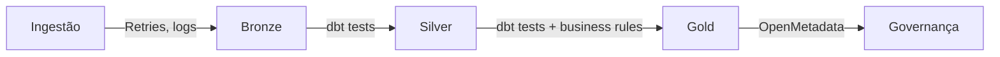

# Qualidade de Dados

Estratégia de validação e monitoramento da qualidade dos dados no GovHub BR.

## Abordagem Multi-Camada



## Testes dbt

### Schema Tests

Aplicados automaticamente via `schema.yml`:

| Teste | Descrição | Camada |
|-------|-----------|--------|
| `not_null` | Coluna não pode ser nula | Silver, Gold |
| `unique` | Valores únicos | Silver |
| `accepted_values` | Valores dentro de conjunto esperado | Silver |
| `relationships` | Integridade referencial | Gold |

### Custom Tests

```sql
-- tests/assert_transferencias_valor_positivo.sql
-- Garante que não há transferências com valor negativo
SELECT *
FROM {{ ref('transferencias') }}
WHERE valor < 0

-- tests/assert_datas_validas.sql
-- Garante que datas estão em range razoável
SELECT *
FROM {{ ref('transferencias') }}
WHERE data_celebracao < '2000-01-01'
   OR data_celebracao > CURRENT_DATE + INTERVAL '1 day'
```

### Freshness

```yaml
# models/staging/schema.yml
sources:
  - name: bronze
    freshness:
      warn_after: {count: 24, period: hour}
      error_after: {count: 48, period: hour}
    loaded_at_field: _loaded_at
    tables:
      - name: transferegov_raw
      - name: comprasgov_raw
```

## Métricas de Qualidade

| Métrica | Definição | Threshold |
|---------|-----------|-----------|
| Completeness | % de campos não-nulos | > 95% |
| Uniqueness | % de registros únicos (por PK) | 100% |
| Timeliness | Idade do dado mais recente | < 48h |
| Validity | % dentro de valores aceitos | > 99% |
| Consistency | Integridade referencial | 100% |

## Execução

```bash
# Rodar todos os testes
dbt test

# Testes apenas de Silver
dbt test --select silver.*

# Testes de freshness
dbt source freshness

# Verbose (ver falhas)
dbt test --select silver.* --store-failures
```

## Monitoramento

### Alertas

Callbacks de falha e regras de freshness não fazem parte da configuração base
atual. Ao habilitá-los, adote como referência:

- falha em `dbt test`: notificação pelo mecanismo configurado no Airflow;
- freshness acima do limite de atenção: aviso ao time responsável;
- freshness acima do limite crítico: alerta operacional.

Os limites devem refletir o schedule e o SLA de cada fonte, em vez de usar um
valor único para todos os pipelines.

### OpenMetadata

Quando a integração com OpenMetadata estiver habilitada, ela pode:

- Visualizar resultados de testes por dataset
- Rastrear tendências de qualidade ao longo do tempo
- Atribuir ownership a problemas de qualidade
- Dashboard de data quality score

## Boas Práticas

1. Models Silver devem testar `not_null` e `unique` nas chaves quando aplicável
2. Models Gold devem testar relacionamentos relevantes com dimensões
3. Sources com campo confiável de atualização devem configurar freshness
4. **Custom tests** para regras de negócio específicas
5. Use `--store-failures` em ambiente controlado quando for necessário preservar evidências para diagnóstico
