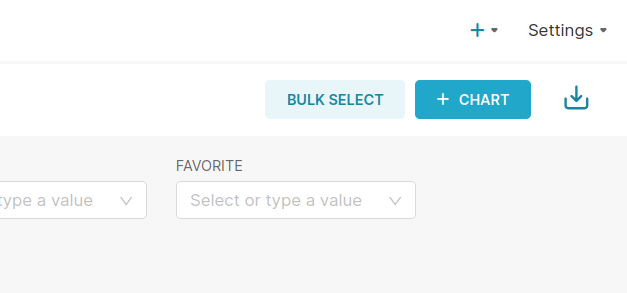
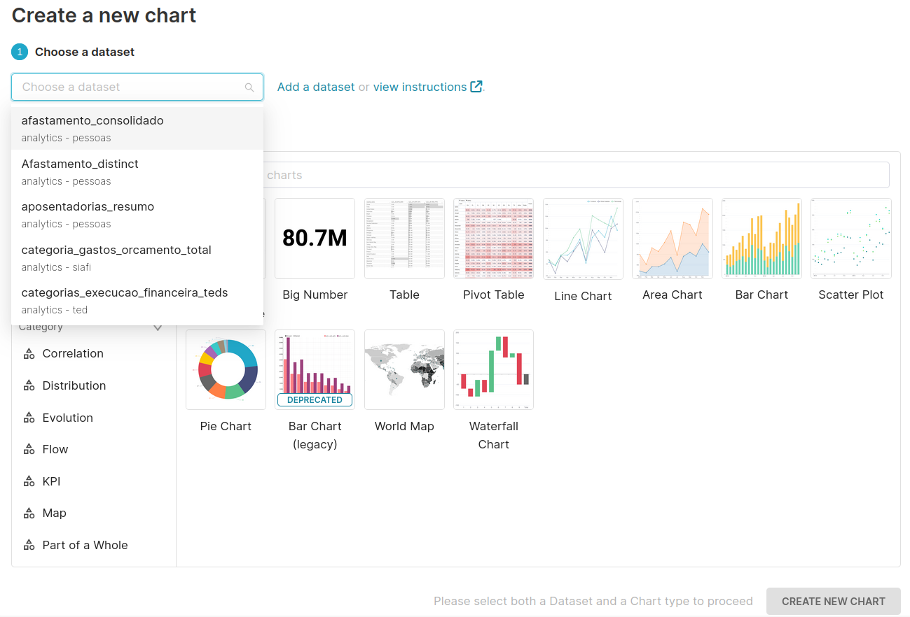
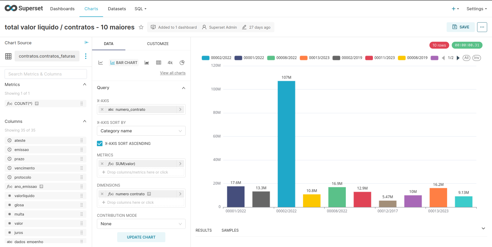

# Como criar uma visualização no Superset

## Visão Geral

No Superset, uma visualização é chamada de **Chart** (Gráfico). Cada chart é construído a partir de um **dataset previamente cadastrado**, e pode ser adicionado a um ou mais **dashboards**. A criação de um gráfico envolve:

1. Escolher o dataset
2. Selecionar o tipo de gráfico
3. Definir métricas, dimensões e filtros
4. Salvar e adicionar ao dashboard (opcional)

---

## 1. Acessar a área de gráficos (Charts)

### Etapas:

* No menu superior, clique em **Charts**.
* Você verá uma lista de gráficos já criados.
* Cada gráfico mostra o nome, tipo, dataset relacionado, dashboards associados, dono e última modificação.

**Exemplo da lista de gráficos:**

* *Nome*: "Orçamento alocado não utilizado"
* *Tipo*: Big Number
* *Dataset*: `orcamento.visao_orcamentaria_total`
* *Dashboard*: "Visão geral do IPEA"

---

## 2. Criar um novo gráfico

### Etapas:

* Clique no botão azul **+ CHART** no canto superior direito.
* A interface de criação será aberta com duas etapas principais:

    - **Escolher dataset** 
    - **Escolher tipo de gráfico**

---

## 3. Escolher um dataset

### Etapas:

* No campo **Choose a dataset**, clique para exibir a lista de datasets disponíveis.
* Você pode digitar para filtrar os datasets por nome.
* Exemplo de datasets disponíveis:

    * `afastamento_consolidado`
    * `contratos.contratos`
    * `categorias_execucao_financeira_teds`

**Importante**: O dataset deve estar previamente cadastrado no Superset com colunas e métricas detectadas ou configuradas.

---

## 4. Escolher o tipo de gráfico

### Etapas:

* Após escolher o dataset, selecione o tipo de gráfico:

  * Exemplos: **Big Number**, **Table**, **Pivot Table**, **Line Chart**, **Area Chart**, **Bar Chart**, **Pie Chart**, **Scatter Plot**, etc.
* O Superset categoriza os tipos em:

    * **Popular**
    * **ECharts**
    * **Advanced-Analytics**
    * **Por categoria**: KPI, Distribution, Evolution, etc.

**Exemplo de escolha**: "Bar Chart" (gráfico de barras) para visualizar agrupamentos por categoria.

---

## 5. Configurar os dados do gráfico

Após escolher o dataset e o tipo de gráfico, você será levado à tela de configuração do chart. Essa etapa é fundamental, pois é onde definimos **quais colunas e métricas** vão alimentar a visualização.

Na imagem, temos um exemplo de **Bar Chart (Gráfico de Barras)** baseado no dataset `contratos.contratos_faturas`.

### Painel lateral esquerdo

Aqui você encontra:

* **Metrics**: operações matemáticas pré-definidas, como `COUNT(*)`, `SUM(coluna)`, `AVG(coluna)`.
* **Columns**: todas as colunas disponíveis no dataset (ex: `numero_contrato`, `valor`, `valorliquido`, `prazo`, etc).

---

### Configurações do gráfico

#### X-Axis (Eixo X)

- Define as **categorias** que aparecerão no gráfico.
- No exemplo: foi selecionado **`numero_contrato`**, ou seja, cada barra representa um contrato.

#### X-Axis Sort By

- Define como os valores do eixo X serão ordenados.
- No exemplo: **ordenado por “Category name”**, em ordem crescente.

#### Metrics (Métricas)

- Define o **valor numérico** que será agregado e exibido.
- No exemplo: **`SUM(valor)`**, ou seja, soma do valor de cada contrato.

#### Dimensions

- Permite segmentar ou detalhar os dados por categorias adicionais.
- No exemplo: foi repetido **`numero_contrato`**, indicando que cada barra corresponde a um contrato específico.

---

## 6. Gerar e visualizar o gráfico

* Após preencher os campos obrigatórios, clique em **CREATE CHART**.
* O gráfico será renderizado no painel direito.
* Você pode continuar ajustando as colunas e filtros até atingir a visualização desejada.

---

## 7. Salvar o gráfico

* Clique em **SAVE** no canto superior direito.
* Defina:

    * **Nome do gráfico**
    * **Dashboard** onde ele será incluído (opcional)
    * **Descrição** (opcional)

* Finalize clicando em **SAVE & GO TO DASHBOARD** ou apenas **SAVE**.

---

* **Visualizações no Superset são dinâmicas**: você pode atualizar os dados e o gráfico será renderizado novamente.
* **Dashboards** são compostos por múltiplos charts. Você pode reutilizar o mesmo gráfico em vários dashboards.
* Os **tipos de gráfico mais usados para dados governamentais** costumam ser:

    * *Big Number*: Destaques
    * *Bar Chart*: Comparações categóricas
    * *Line Chart*: Séries temporais
    * *Table*: Listagens e relatórios detalhados

* Use **filtros por data** para melhorar a performance em datasets grandes.

