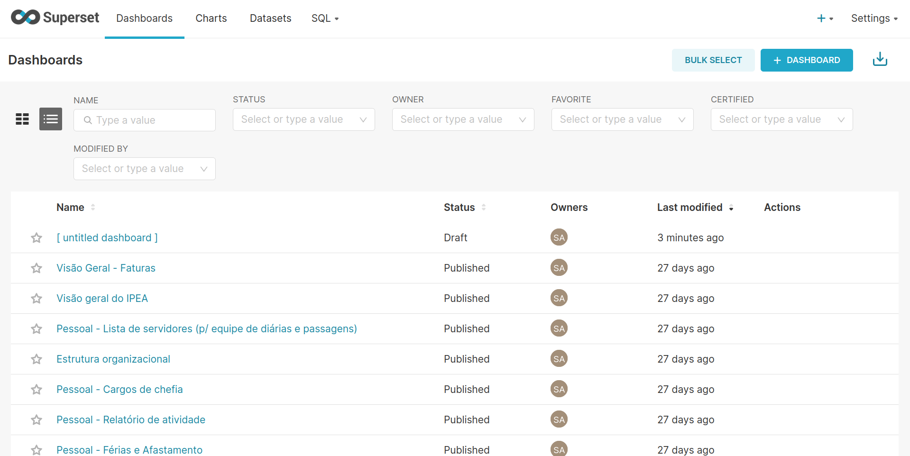
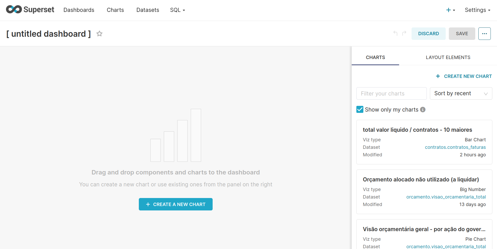

# Como criar um Dashboard no Superset

## O que é um Dashboard?

Um **dashboard** no Superset é um painel interativo que agrega **diversos gráficos (charts)** em uma única visualização, permitindo análise integrada e dinâmica dos dados. Ele é usado para acompanhar indicadores, relatórios e comparações de forma visual e organizada.

---

## 1. Acessar a seção de Dashboards

* No menu superior, clique em **Dashboards**.
* Você verá a lista de dashboards existentes.
* Cada item mostra:

    * **Nome do dashboard**
    * **Status** (Published ou Draft)
    * **Owner**
    * **Última modificação**

*Exemplo:* dashboards como *“Visão Geral - Faturas”*, *“Estrutura Organizacional”*, *“Visão Geral - Contratos”*.

---

## 2. Criar um novo Dashboard

* Clique no botão azul **+ DASHBOARD** (canto superior direito).
* Um novo dashboard em branco será criado com o título **\[untitled dashboard]**.
* Você poderá renomear depois.

---

## 3. Adicionar gráficos ao Dashboard

No painel lateral direito, você verá a aba **Charts**, que lista os gráficos disponíveis.

1. **Selecionar gráficos já existentes**:

    * Pesquise pelo nome ou selecione na lista.
    * Clique no gráfico desejado.
    * Ele será adicionado automaticamente ao painel do dashboard.

2. **Criar um novo gráfico direto do dashboard**:

    * Clique em **+ CREATE NEW CHART**.
    * O fluxo de criação de chart será aberto (igual ao processo documentado antes).
    * Após salvar, o gráfico pode ser inserido no dashboard.

*Exemplo:*
O gráfico *“total valor líquido / contratos - 10 maiores”* foi adicionado ao dashboard diretamente a partir da lista de gráficos já criados.

---

## 4. Organizar os gráficos no Dashboard

* Os gráficos adicionados aparecem no painel central.
* Você pode **arrastar e soltar** para reorganizá-los.
* É possível redimensionar cada gráfico para ajustar melhor o layout.

*Exemplo:* O gráfico de contratos aparece em destaque no painel central, podendo ser reposicionado ou dimensionado conforme a necessidade.

---

## 5. Usar elementos de layout

Além de gráficos, o Superset permite adicionar elementos de layout para personalizar o dashboard:

* **Tabs** → dividir o dashboard em abas.
* **Headers** → adicionar títulos e descrições.
* **Dividers** → separar seções.
* **Markdown** → inserir textos explicativos ou notas.

Esses elementos estão na aba **LAYOUT ELEMENTS** do painel direito.

---

## 6. Salvar e publicar o Dashboard

* Quando terminar de organizar, clique em **SAVE** no canto superior direito.
* Você pode:

    * **Save** → apenas salvar alterações.
    * **Discard** → descartar mudanças não salvas.

* Depois de salvo, o dashboard aparecerá na lista da aba **Dashboards** e poderá ser acessado por outros usuários (se publicado).

---

* **Dashboards podem ser editados a qualquer momento**: basta abrir e clicar em *Edit dashboard*.
* Use **filtros globais** quando quiser permitir que o usuário escolha parâmetros (ex: período, região).
* Mantenha uma **organização lógica** (ex: KPIs no topo, detalhes abaixo).
* Combine diferentes tipos de gráficos (Big Number, Bar, Line, Table) para enriquecer a análise.

---

## Exemplo prático:

Criando o dashboard **“Visão Geral - Contratos”**:

1. Criar um novo dashboard.
2. Adicionar os gráficos:

    * *“total valor líquido / contratos - 10 maiores”* (Bar Chart).
    * *“Quantidade total de contratos”* (Big Number).
    * *“Despesas pagas”* (Big Number).

3. Organizar os gráficos em seções (ex: visão geral em cima, detalhamento embaixo).
4. Salvar o dashboard.
