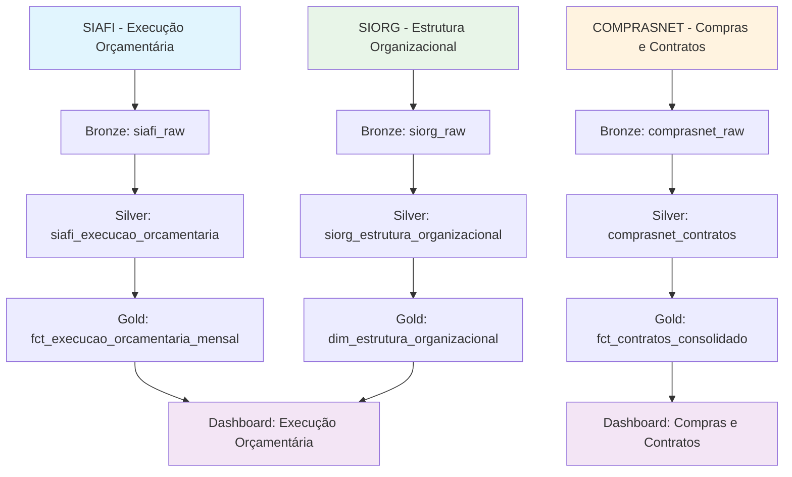
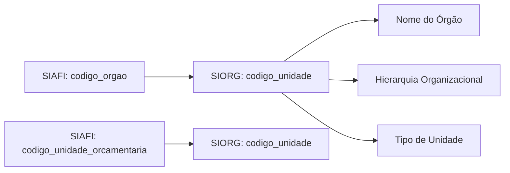
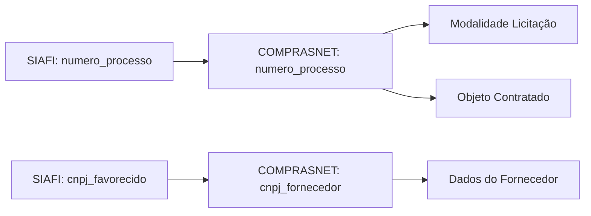

# Jornada dos Dados - Domínio Orçamentário

O domínio orçamentário no GovHub integra dados do SIAFI (Sistema Integrado de Administração Financeira) com informações organizacionais do SIORG e dados de compras do COMPRASNET, criando uma visão completa da execução orçamentária governamental.

## Fluxo de Dados do Domínio



## Sistemas Fonte

### SIAFI - Sistema Integrado de Administração Financeira

**Dados Coletados:**
- Execução orçamentária por órgão/unidade
- Empenhos, liquidações e pagamentos
- Dotações orçamentárias e créditos
- Restos a pagar
- Transferências e convênios

**Frequência de Atualização:** Diária (dados do dia anterior)

**Chaves Principais:**
- `codigo_orgao`: Identifica o órgão executor
- `codigo_unidade_orcamentaria`: Unidade orçamentária específica
- `numero_empenho`: Identificador único do empenho

### SIORG - Sistema de Organização e Inovação Institucional

**Dados Coletados:**
- Estrutura hierárquica dos órgãos
- Denominações e siglas
- Situação das unidades (ativa/inativa)
- Histórico de mudanças organizacionais

**Frequência de Atualização:** Semanal

**Chaves Principais:**
- `codigo_unidade`: Código único da unidade organizacional
- `codigo_unidade_pai`: Hierarquia organizacional

### COMPRASNET - Portal de Compras do Governo Federal

**Dados Coletados:**
- Processos licitatórios
- Contratos firmados
- Fornecedores cadastrados
- Modalidades de licitação

**Frequência de Atualização:** Diária

**Chaves Principais:**
- `numero_processo`: Processo de compra
- `numero_contrato`: Contrato específico
- `cnpj_fornecedor`: Identificação do fornecedor

## Transformações por Camada

### Camada Bronze → Silver

#### 1. SIAFI: Padronização da Execução Orçamentária

**Transformações Aplicadas:**

```sql
-- Exemplo de transformação Silver para SIAFI
WITH siafi_padronizado AS (
    SELECT 
        -- Padronização de códigos
        LPAD(codigo_orgao, 5, '0') AS codigo_orgao,
        LPAD(codigo_unidade_orcamentaria, 5, '0') AS codigo_unidade_orcamentaria,
        
        -- Conversão de tipos
        CAST(valor_dotacao_inicial AS DECIMAL(15,2)) AS valor_dotacao_inicial,
        CAST(valor_empenhado AS DECIMAL(15,2)) AS valor_empenhado,
        
        -- Padronização de datas
        TO_DATE(data_referencia, 'YYYY-MM-DD') AS data_referencia,
        
        -- Limpeza de dados
        CASE 
            WHEN valor_dotacao_inicial < 0 THEN 0 
            ELSE valor_dotacao_inicial 
        END AS valor_dotacao_inicial_limpo,
        
        -- Metadados de qualidade
        CASE 
            WHEN codigo_orgao IS NULL THEN 'ERRO_ORGAO_NULO'
            WHEN valor_dotacao_inicial IS NULL THEN 'ERRO_VALOR_NULO'
            ELSE 'OK'
        END AS status_qualidade
        
    FROM {{ source('bronze', 'siafi_raw') }}
    WHERE data_extracao >= CURRENT_DATE - INTERVAL '30 days'
)
```

**Validações Implementadas:**
- Códigos de órgão devem ter 5 dígitos
- Valores financeiros não podem ser negativos (exceto estornos)
- Datas devem estar no formato padrão
- Campos obrigatórios não podem ser nulos

#### 2. SIORG: Enriquecimento Organizacional

**Transformações Aplicadas:**

```sql
-- Criação de hierarquia organizacional
WITH hierarquia_completa AS (
    SELECT 
        codigo_unidade,
        nome_unidade,
        sigla_unidade,
        codigo_unidade_pai,
        
        -- Construção da hierarquia
        CASE 
            WHEN nivel_hierarquico = 1 THEN nome_unidade
            ELSE CONCAT(nome_unidade_pai, ' > ', nome_unidade)
        END AS caminho_hierarquico,
        
        -- Classificação por tipo
        CASE tipo_unidade
            WHEN '1' THEN 'Órgão Superior'
            WHEN '2' THEN 'Órgão Subordinado'
            WHEN '3' THEN 'Unidade Administrativa'
            ELSE 'Outros'
        END AS tipo_unidade_desc
        
    FROM {{ source('bronze', 'siorg_raw') }}
)
```

### Camada Silver → Gold

#### Tabela Gold: Execução Orçamentária Consolidada

**Objetivo:** Agregar dados de execução orçamentária com informações organizacionais para análise gerencial.

```sql
-- models/gold/orcamento/fct_execucao_orcamentaria_consolidada.sql
WITH base_execucao AS (
    SELECT 
        e.ano_exercicio,
        e.mes_referencia,
        
        -- Dimensões organizacionais enriquecidas
        e.codigo_orgao,
        o.nome_orgao,
        o.sigla_orgao,
        o.tipo_orgao,
        o.caminho_hierarquico,
        
        -- Dimensões programáticas
        e.codigo_funcao,
        f.nome_funcao,
        e.codigo_programa,
        p.nome_programa,
        e.codigo_acao,
        a.nome_acao,
        
        -- Métricas financeiras agregadas
        SUM(e.valor_dotacao_inicial) AS dotacao_inicial,
        SUM(e.valor_dotacao_atual) AS dotacao_atual,
        SUM(e.valor_empenhado) AS valor_empenhado,
        SUM(e.valor_liquidado) AS valor_liquidado,
        SUM(e.valor_pago) AS valor_pago
        
    FROM {{ ref('silver_siafi_execucao_orcamentaria') }} e
    LEFT JOIN {{ ref('silver_siorg_estrutura') }} o 
        ON e.codigo_orgao = o.codigo_unidade
    LEFT JOIN {{ ref('dim_funcoes_orcamentarias') }} f 
        ON e.codigo_funcao = f.codigo_funcao
    LEFT JOIN {{ ref('dim_programas_orcamentarios') }} p 
        ON e.codigo_programa = p.codigo_programa
    LEFT JOIN {{ ref('dim_acoes_orcamentarias') }} a 
        ON e.codigo_acao = a.codigo_acao
        
    GROUP BY 1,2,3,4,5,6,7,8,9,10,11,12,13,14
),

metricas_calculadas AS (
    SELECT 
        *,
        -- Indicadores de performance
        CASE 
            WHEN dotacao_atual > 0 
            THEN (valor_empenhado / dotacao_atual) * 100
            ELSE 0 
        END AS percentual_empenhamento,
        
        CASE 
            WHEN valor_empenhado > 0 
            THEN (valor_liquidado / valor_empenhado) * 100
            ELSE 0 
        END AS percentual_liquidacao,
        
        CASE 
            WHEN valor_liquidado > 0 
            THEN (valor_pago / valor_liquidado) * 100
            ELSE 0 
        END AS percentual_pagamento,
        
        -- Saldos disponíveis
        dotacao_atual - valor_empenhado AS saldo_disponivel,
        valor_empenhado - valor_liquidado AS saldo_empenhado,
        valor_liquidado - valor_pago AS saldo_liquidado
        
    FROM base_execucao
)

SELECT * FROM metricas_calculadas
```

## Chaves de Integração Detalhadas

### 1. SIAFI ↔ SIORG

**Relacionamento:** Execução Orçamentária com Estrutura Organizacional



**Implementação:**
```sql
-- Junção entre SIAFI e SIORG
SELECT 
    s.codigo_orgao,
    s.valor_empenhado,
    o.nome_unidade AS nome_orgao,
    o.sigla_unidade AS sigla_orgao,
    o.caminho_hierarquico
FROM siafi_execucao s
LEFT JOIN siorg_estrutura o 
    ON s.codigo_orgao = o.codigo_unidade
    AND o.situacao = 'A'  -- Apenas unidades ativas
```

### 2. SIAFI ↔ COMPRASNET

**Relacionamento:** Execução Orçamentária com Processos de Compra



**Implementação:**
```sql
-- Integração SIAFI com COMPRASNET
SELECT 
    s.numero_empenho,
    s.valor_empenho,
    s.cnpj_favorecido,
    c.modalidade_licitacao,
    c.objeto_resumido,
    f.razao_social_fornecedor
FROM siafi_empenhos s
LEFT JOIN comprasnet_processos c 
    ON s.numero_processo = c.numero_processo
LEFT JOIN comprasnet_fornecedores f 
    ON s.cnpj_favorecido = f.cnpj_fornecedor
```

### 3. Validação Cruzada de Dados

**Controles de Consistência:**

```sql
-- Teste de consistência: Soma de empenhos por órgão
WITH validacao_empenhos AS (
    SELECT 
        codigo_orgao,
        SUM(valor_empenhado) AS total_siafi,
        (
            SELECT SUM(valor_contrato) 
            FROM comprasnet_contratos c 
            WHERE c.codigo_orgao_contratante = s.codigo_orgao
        ) AS total_comprasnet,
        
        ABS(
            SUM(valor_empenhado) - 
            COALESCE((
                SELECT SUM(valor_contrato) 
                FROM comprasnet_contratos c 
                WHERE c.codigo_orgao_contratante = s.codigo_orgao
            ), 0)
        ) AS diferenca_absoluta
        
    FROM siafi_execucao s
    GROUP BY codigo_orgao
)

SELECT * 
FROM validacao_empenhos 
WHERE diferenca_absoluta > 1000000  -- Diferenças > R$ 1 milhão
```

## Casos de Uso e Dashboards

### 1. Dashboard de Execução Orçamentária

**Métricas Principais:**
- Percentual de execução por órgão
- Evolução mensal dos empenhos
- Saldo disponível por programa
- Top 10 órgãos por volume executado

**Filtros Disponíveis:**
- Ano/mês de referência
- Órgão/unidade orçamentária
- Função/programa orçamentário
- Faixa de valores

### 2. Dashboard de Compras Governamentais

**Métricas Principais:**
- Volume de contratos por modalidade
- Distribuição por fornecedor
- Tempo médio de processos licitatórios
- Economia gerada por pregões

**Integração com SIAFI:**
- Vinculação de contratos com empenhos
- Acompanhamento de pagamentos
- Análise de desvios contratuais

### 3. Relatórios de Transparência

**Dados Disponibilizados:**
- Execução orçamentária detalhada
- Lista de fornecedores e contratos
- Transferências e convênios
- Restos a pagar por órgão

## Monitoramento e Qualidade

### Indicadores de Qualidade

1. **Completude dos Dados**
   - % de registros com todos os campos obrigatórios
   - Cobertura temporal dos dados
   - Disponibilidade por sistema fonte

2. **Consistência Entre Sistemas**
   - Diferenças entre SIAFI e COMPRASNET
   - Validação de códigos organizacionais
   - Conferência de valores financeiros

3. **Atualidade dos Dados**
   - Defasagem média por sistema
   - Frequência de atualizações
   - Tempo de processamento

### Alertas Configurados

```python
# Exemplo de alerta para inconsistências
def validar_consistencia_orcamentaria():
    query = """
    SELECT COUNT(*) as registros_inconsistentes
    FROM gold.fct_execucao_orcamentaria_consolidada
    WHERE valor_pago > valor_liquidado
       OR valor_liquidado > valor_empenhado
       OR valor_empenhado > dotacao_atual * 1.1  -- Tolerância de 10%
    """
    
    resultado = execute_query(query)
    
    if resultado['registros_inconsistentes'] > 0:
        send_alert(
            subject="Inconsistências na Execução Orçamentária",
            message=f"Encontrados {resultado['registros_inconsistentes']} registros inconsistentes",
            recipients=["equipe-dados@govhub.gov.br"]
        )
```

## Próximos Passos

Para mais detalhes sobre implementação técnica, consulte a [documentação de desenvolvimento DBT](../../documentacao/tutoriais/dbt/modelos.md).
