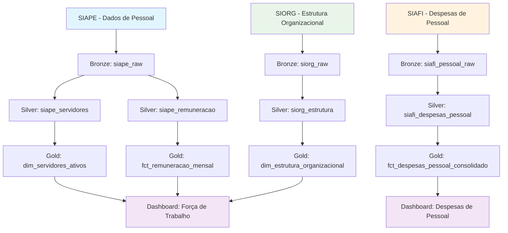
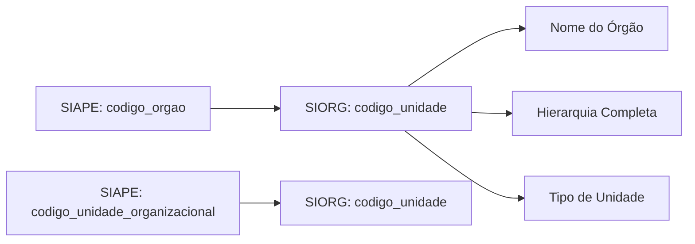
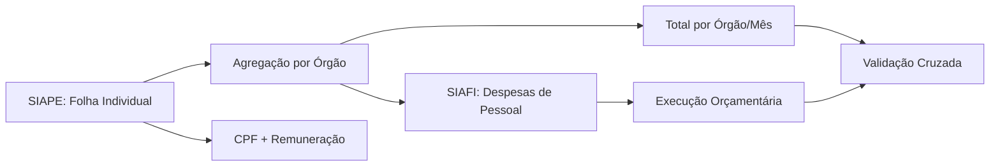

# Jornada dos Dados - Domínio de Pessoal

O domínio de pessoal no GovHub integra dados do SIAPE (Sistema Integrado de Administração de Recursos Humanos) com informações organizacionais do SIORG e dados financeiros do SIAFI, proporcionando uma visão completa da gestão de recursos humanos no governo federal.

## Fluxo de Dados do Domínio



## Sistemas Fonte

### SIAPE - Sistema Integrado de Administração de Recursos Humanos

**Dados Coletados:**

1. **Cadastro de Servidores**
   - Dados pessoais (CPF, nome, data nascimento)
   - Informações funcionais (matrícula, cargo, função)
   - Lotação organizacional
   - Situação funcional (ativo, aposentado, etc.)
   - Histórico de movimentações


**Frequência de Atualização:** Mensal (dados da folha de pagamento)

**Chaves Principais:**
- `cpf`: Identificador único do servidor
- `matricula_siape`: Matrícula funcional
- `codigo_orgao`: Órgão de lotação

### SIORG - Estrutura Organizacional

**Dados Utilizados:**
- Hierarquia organizacional completa
- Denominações e siglas dos órgãos
- Classificação por tipo de unidade
- Situação das unidades (ativa/inativa)

**Chaves de Integração:**
- `codigo_unidade`: Vincula com `codigo_orgao` do SIAPE

### SIAFI - Despesas de Pessoal

**Dados Coletados:**
- Execução orçamentária de despesas com pessoal
- Empenhos específicos de folha de pagamento
- Transferências para aposentadorias e pensões
- Encargos sociais e benefícios

**Chaves de Integração:**
- `codigo_orgao`: Vincula despesas com estrutura organizacional
- Classificação orçamentária específica de pessoal

## Transformações por Camada

### Camada Bronze → Silver

#### 1. SIAPE: Padronização de Dados de Servidores

**Transformações Aplicadas:**

```sql
-- Padronização de dados de servidores
WITH servidores_padronizado AS (
    SELECT 
        -- Identificadores únicos
        REGEXP_REPLACE(cpf, '[^0-9]', '') AS cpf_limpo,
        LPAD(matricula_siape, 7, '0') AS matricula_siape_padrao,
        
        -- Dados pessoais limpos
        UPPER(TRIM(nome_servidor)) AS nome_servidor_padrao,
        TO_DATE(data_nascimento, 'YYYY-MM-DD') AS data_nascimento_padrao,
        
        -- Códigos organizacionais padronizados
        LPAD(codigo_orgao, 5, '0') AS codigo_orgao_padrao,
        LPAD(codigo_unidade_organizacional, 10, '0') AS codigo_unidade_padrao,
        
        -- Classificação funcional
        LPAD(cargo_codigo, 6, '0') AS cargo_codigo_padrao,
        CASE 
            WHEN funcao_codigo IS NOT NULL 
            THEN LPAD(funcao_codigo, 6, '0')
            ELSE NULL 
        END AS funcao_codigo_padrao,
        
        -- Situação funcional padronizada
        CASE situacao_funcional
            WHEN '01' THEN 'ATIVO_PERMANENTE'
            WHEN '02' THEN 'APOSENTADO'
            WHEN '03' THEN 'PENSIONISTA'
            WHEN '05' THEN 'CEDIDO'
            WHEN '08' THEN 'NOMEADO_CARGO_COMISSAO'
            ELSE 'OUTROS'
        END AS situacao_funcional_desc,
        
        -- Cálculos de tempo de serviço
        EXTRACT(YEAR FROM AGE(CURRENT_DATE, data_ingresso_servico_publico)) AS anos_servico_publico,
        EXTRACT(YEAR FROM AGE(CURRENT_DATE, data_ingresso_orgao)) AS anos_orgao_atual,
        
        -- Metadados de qualidade
        CASE 
            WHEN cpf IS NULL OR LENGTH(REGEXP_REPLACE(cpf, '[^0-9]', '')) != 11 
            THEN 'ERRO_CPF_INVALIDO'
            WHEN nome_servidor IS NULL OR LENGTH(TRIM(nome_servidor)) < 3 
            THEN 'ERRO_NOME_INVALIDO'
            WHEN codigo_orgao IS NULL 
            THEN 'ERRO_ORGAO_NULO'
            ELSE 'OK'
        END AS status_qualidade
        
    FROM {{ source('bronze', 'siape_servidores_raw') }}
    WHERE data_extracao >= CURRENT_DATE - INTERVAL '60 days'
)
```

#### 2. SIAPE: Processamento de Remuneração

**Transformações Aplicadas:**

```sql
-- Padronização de dados de remuneração
WITH remuneracao_processada AS (
    SELECT 
        cpf_limpo,
        
        -- Período de referência
        CAST(SUBSTRING(ano_mes_referencia, 1, 4) AS INTEGER) AS ano_referencia,
        CAST(SUBSTRING(ano_mes_referencia, 5, 2) AS INTEGER) AS mes_referencia,
        
        -- Valores financeiros padronizados
        COALESCE(remuneracao_basica, 0) AS remuneracao_basica_valor,
        COALESCE(gratificacoes, 0) AS gratificacoes_valor,
        COALESCE(adicionais, 0) AS adicionais_valor,
        COALESCE(descontos_obrigatorios, 0) AS descontos_valor,
        COALESCE(remuneracao_liquida, 0) AS remuneracao_liquida_valor,
        
        -- Cálculos derivados
        (COALESCE(remuneracao_basica, 0) + 
         COALESCE(gratificacoes, 0) + 
         COALESCE(adicionais, 0)) AS remuneracao_bruta_calculada,
        
        -- Indicadores de análise
        CASE 
            WHEN COALESCE(remuneracao_basica, 0) > 0 
            THEN (COALESCE(gratificacoes, 0) / remuneracao_basica) * 100
            ELSE 0 
        END AS percentual_gratificacoes,
        
        -- Faixas salariais
        CASE 
            WHEN remuneracao_liquida <= 3000 THEN 'FAIXA_1_ATE_3K'
            WHEN remuneracao_liquida <= 6000 THEN 'FAIXA_2_3K_6K'
            WHEN remuneracao_liquida <= 12000 THEN 'FAIXA_3_6K_12K'
            WHEN remuneracao_liquida <= 20000 THEN 'FAIXA_4_12K_20K'
            ELSE 'FAIXA_5_ACIMA_20K'
        END AS faixa_salarial
        
    FROM {{ source('bronze', 'siape_remuneracao_raw') }}
    WHERE ano_mes_referencia >= '202001'  -- Dados a partir de 2020
)
```

### Camada Silver → Gold

#### Tabela Gold: Força de Trabalho Consolidada

**Objetivo:** Visão consolidada da força de trabalho por órgão e características funcionais.

```sql
-- models/gold/pessoal/dim_forca_trabalho_consolidada.sql
WITH base_servidores AS (
    SELECT 
        s.cpf,
        s.matricula_siape,
        s.nome_servidor,
        s.codigo_orgao,
        s.situacao_funcional_desc,
        s.cargo_codigo,
        s.funcao_codigo,
        s.anos_servico_publico,
        s.anos_orgao_atual,
        
        -- Enriquecimento organizacional
        o.nome_unidade AS nome_orgao,
        o.sigla_unidade AS sigla_orgao,
        o.tipo_unidade_desc,
        o.caminho_hierarquico,
        
        -- Enriquecimento funcional
        c.denominacao_cargo,
        c.nivel_cargo,
        c.classe_cargo,
        COALESCE(f.denominacao_funcao, 'SEM_FUNCAO') AS denominacao_funcao,
        
        -- Última remuneração
        r.remuneracao_liquida_valor AS ultima_remuneracao,
        r.faixa_salarial,
        
        -- Classificações para análise
        CASE 
            WHEN s.anos_servico_publico < 5 THEN 'INICIANTE'
            WHEN s.anos_servico_publico < 15 THEN 'INTERMEDIARIO'
            WHEN s.anos_servico_publico < 25 THEN 'EXPERIENTE'
            ELSE 'VETERANO'
        END AS perfil_experiencia,
        
        CASE 
            WHEN EXTRACT(YEAR FROM AGE(CURRENT_DATE, s.data_nascimento)) < 30 THEN 'JOVEM'
            WHEN EXTRACT(YEAR FROM AGE(CURRENT_DATE, s.data_nascimento)) < 50 THEN 'ADULTO'
            ELSE 'SENIOR'
        END AS faixa_etaria
        
    FROM {{ ref('silver_siape_servidores') }} s
    LEFT JOIN {{ ref('silver_siorg_estrutura') }} o 
        ON s.codigo_orgao = o.codigo_unidade
    LEFT JOIN {{ ref('dim_cargos_publicos') }} c 
        ON s.cargo_codigo = c.codigo_cargo
    LEFT JOIN {{ ref('dim_funcoes_publicas') }} f 
        ON s.funcao_codigo = f.codigo_funcao
    LEFT JOIN {{ ref('silver_siape_remuneracao') }} r 
        ON s.cpf = r.cpf 
        AND r.ano_referencia = EXTRACT(YEAR FROM CURRENT_DATE)
        AND r.mes_referencia = EXTRACT(MONTH FROM CURRENT_DATE) - 1
        
    WHERE s.situacao_funcional_desc IN ('ATIVO_PERMANENTE', 'NOMEADO_CARGO_COMISSAO')
)

SELECT * FROM base_servidores
```

#### Tabela Gold: Despesas de Pessoal Consolidadas

**Objetivo:** Integrar dados de remuneração do SIAPE com execução orçamentária do SIAFI.

```sql
-- models/gold/pessoal/fct_despesas_pessoal_consolidado.sql
WITH despesas_siafi AS (
    SELECT 
        ano_exercicio,
        mes_referencia,
        codigo_orgao,
        
        -- Agregação por tipo de despesa de pessoal
        SUM(CASE WHEN codigo_natureza_despesa LIKE '31901%' 
            THEN valor_pago ELSE 0 END) AS despesa_pessoal_ativo,
        SUM(CASE WHEN codigo_natureza_despesa LIKE '31903%' 
            THEN valor_pago ELSE 0 END) AS despesa_obrigacoes_patronais,
        SUM(CASE WHEN codigo_natureza_despesa LIKE '31905%' 
            THEN valor_pago ELSE 0 END) AS despesa_terceirizados,
        SUM(CASE WHEN codigo_natureza_despesa LIKE '3190%' 
            THEN valor_pago ELSE 0 END) AS despesa_pessoal_total
            
    FROM {{ ref('silver_siafi_execucao_orcamentaria') }}
    WHERE codigo_natureza_despesa LIKE '3190%'  -- Despesas de pessoal
    GROUP BY 1, 2, 3
),

remuneracao_siape AS (
    SELECT 
        r.ano_referencia,
        r.mes_referencia,
        s.codigo_orgao,
        
        -- Agregações de remuneração
        COUNT(DISTINCT r.cpf) AS qtd_servidores_pagos,
        SUM(r.remuneracao_liquida_valor) AS folha_liquida_total,
        SUM(r.remuneracao_bruta_calculada) AS folha_bruta_total,
        SUM(r.descontos_valor) AS descontos_total,
        AVG(r.remuneracao_liquida_valor) AS remuneracao_media,
        
        -- Distribuição por faixa salarial
        COUNT(CASE WHEN r.faixa_salarial = 'FAIXA_1_ATE_3K' THEN 1 END) AS qtd_faixa_1,
        COUNT(CASE WHEN r.faixa_salarial = 'FAIXA_2_3K_6K' THEN 1 END) AS qtd_faixa_2,
        COUNT(CASE WHEN r.faixa_salarial = 'FAIXA_3_6K_12K' THEN 1 END) AS qtd_faixa_3,
        COUNT(CASE WHEN r.faixa_salarial = 'FAIXA_4_12K_20K' THEN 1 END) AS qtd_faixa_4,
        COUNT(CASE WHEN r.faixa_salarial = 'FAIXA_5_ACIMA_20K' THEN 1 END) AS qtd_faixa_5
        
    FROM {{ ref('silver_siape_remuneracao') }} r
    JOIN {{ ref('silver_siape_servidores') }} s ON r.cpf = s.cpf
    WHERE s.situacao_funcional_desc = 'ATIVO_PERMANENTE'
    GROUP BY 1, 2, 3
),

consolidado AS (
    SELECT 
        COALESCE(d.ano_exercicio, r.ano_referencia) AS ano_referencia,
        COALESCE(d.mes_referencia, r.mes_referencia) AS mes_referencia,
        COALESCE(d.codigo_orgao, r.codigo_orgao) AS codigo_orgao,
        
        -- Dados do SIAFI
        COALESCE(d.despesa_pessoal_ativo, 0) AS despesa_pessoal_ativo_siafi,
        COALESCE(d.despesa_obrigacoes_patronais, 0) AS despesa_obrigacoes_patronais_siafi,
        COALESCE(d.despesa_pessoal_total, 0) AS despesa_pessoal_total_siafi,
        
        -- Dados do SIAPE
        COALESCE(r.qtd_servidores_pagos, 0) AS qtd_servidores_siape,
        COALESCE(r.folha_liquida_total, 0) AS folha_liquida_siape,
        COALESCE(r.folha_bruta_total, 0) AS folha_bruta_siape,
        COALESCE(r.remuneracao_media, 0) AS remuneracao_media_siape,
        
        -- Análise de consistência
        ABS(COALESCE(d.despesa_pessoal_ativo, 0) - COALESCE(r.folha_bruta_total, 0)) AS diferenca_siafi_siape,
        
        CASE 
            WHEN COALESCE(r.folha_bruta_total, 0) > 0 
            THEN ABS(COALESCE(d.despesa_pessoal_ativo, 0) - COALESCE(r.folha_bruta_total, 0)) / r.folha_bruta_total * 100
            ELSE 0 
        END AS percentual_divergencia
        
    FROM despesas_siafi d
    FULL OUTER JOIN remuneracao_siape r 
        ON d.ano_exercicio = r.ano_referencia 
        AND d.mes_referencia = r.mes_referencia 
        AND d.codigo_orgao = r.codigo_orgao
)

SELECT * FROM consolidado
```

## Chaves de Integração Detalhadas

### 1. SIAPE ↔ SIORG

**Relacionamento:** Servidores com Estrutura Organizacional



**Implementação:**
```sql
-- Enriquecimento organizacional dos servidores
SELECT 
    s.cpf,
    s.nome_servidor,
    s.codigo_orgao,
    o.nome_unidade AS nome_orgao_lotacao,
    o.sigla_unidade AS sigla_orgao,
    o.caminho_hierarquico AS hierarquia_completa,
    
    -- Unidade organizacional específica
    uo.nome_unidade AS nome_unidade_organizacional,
    uo.tipo_unidade_desc AS tipo_unidade
    
FROM siape_servidores s
LEFT JOIN siorg_estrutura o 
    ON s.codigo_orgao = o.codigo_unidade
LEFT JOIN siorg_estrutura uo 
    ON s.codigo_unidade_organizacional = uo.codigo_unidade
WHERE o.situacao = 'A' AND uo.situacao = 'A'
```

### 2. SIAPE ↔ SIAFI

**Relacionamento:** Remuneração Individual com Despesas Orçamentárias



**Implementação:**
```sql
-- Validação cruzada SIAPE vs SIAFI
WITH siape_agregado AS (
    SELECT 
        s.codigo_orgao,
        r.ano_referencia,
        r.mes_referencia,
        SUM(r.remuneracao_bruta_calculada) AS total_folha_siape,
        COUNT(DISTINCT r.cpf) AS qtd_servidores
    FROM siape_remuneracao r
    JOIN siape_servidores s ON r.cpf = s.cpf
    GROUP BY 1, 2, 3
),

siafi_agregado AS (
    SELECT 
        codigo_orgao,
        ano_exercicio,
        mes_referencia,
        SUM(valor_pago) AS total_despesa_siafi
    FROM siafi_execucao_orcamentaria
    WHERE codigo_natureza_despesa LIKE '31901%'  -- Pessoal ativo
    GROUP BY 1, 2, 3
)

SELECT 
    sp.codigo_orgao,
    sp.ano_referencia,
    sp.mes_referencia,
    sp.total_folha_siape,
    sf.total_despesa_siafi,
    ABS(sp.total_folha_siape - COALESCE(sf.total_despesa_siafi, 0)) AS diferenca,
    
    CASE 
        WHEN sp.total_folha_siape > 0 
        THEN ABS(sp.total_folha_siape - COALESCE(sf.total_despesa_siafi, 0)) / sp.total_folha_siape * 100
        ELSE 0 
    END AS percentual_divergencia
    
FROM siape_agregado sp
LEFT JOIN siafi_agregado sf 
    ON sp.codigo_orgao = sf.codigo_orgao 
    AND sp.ano_referencia = sf.ano_exercicio 
    AND sp.mes_referencia = sf.mes_referencia
```

### 3. Chave Única: CPF do Servidor

**Uso do CPF como Chave Universal:**

```sql
-- Visão 360° do servidor usando CPF
SELECT 
    s.cpf,
    s.nome_servidor,
    s.matricula_siape,
    
    -- Dados funcionais atuais
    s.codigo_orgao,
    o.nome_unidade AS orgao_atual,
    s.cargo_codigo,
    c.denominacao_cargo,
    s.situacao_funcional_desc,
    
    -- Histórico de remuneração (últimos 12 meses)
    AVG(r.remuneracao_liquida_valor) AS remuneracao_media_12m,
    MAX(r.remuneracao_liquida_valor) AS maior_remuneracao_12m,
    MIN(r.remuneracao_liquida_valor) AS menor_remuneracao_12m,
    
    -- Movimentações organizacionais
    COUNT(DISTINCT h.codigo_orgao_origem) AS qtd_orgaos_historico,
    MAX(h.data_movimentacao) AS ultima_movimentacao
    
FROM siape_servidores s
LEFT JOIN siorg_estrutura o ON s.codigo_orgao = o.codigo_unidade
LEFT JOIN dim_cargos_publicos c ON s.cargo_codigo = c.codigo_cargo
LEFT JOIN siape_remuneracao r 
    ON s.cpf = r.cpf 
    AND r.ano_referencia >= EXTRACT(YEAR FROM CURRENT_DATE) - 1
LEFT JOIN siape_historico_movimentacoes h ON s.cpf = h.cpf

GROUP BY 1,2,3,4,5,6,7,8
```

## Casos de Uso e Dashboards

### 1. Dashboard de Força de Trabalho

**Métricas Principais:**
- Distribuição de servidores por órgão
- Pirâmide etária da força de trabalho
- Distribuição por cargo e função
- Tempo médio de serviço por órgão

**Análises Disponíveis:**
- Evolução do quadro de pessoal
- Rotatividade por órgão
- Perfil de aposentadorias futuras
- Gaps de competências por área

### 2. Dashboard de Despesas de Pessoal


**Indicadores de Gestão:**
- Custo médio por servidor
- Eficiência da força de trabalho
- Projeções orçamentárias
- Alertas de inconsistências

### 3. Relatórios de Compliance

**Dados para Transparência:**
- Estrutura de cargos e salários
- Terceirizações e consultorias

## Monitoramento e Qualidade


### Alertas Específicos do Domínio

```python
# Alerta para inconsistências na folha de pagamento
def validar_folha_pagamento():
    query = """
    SELECT 
        codigo_orgao,
        ano_referencia,
        mes_referencia,
        percentual_divergencia
    FROM gold.fct_despesas_pessoal_consolidado
    WHERE percentual_divergencia > 5  -- Divergência > 5%
       OR qtd_servidores_siape = 0    -- Sem servidores no SIAPE
       OR despesa_pessoal_total_siafi = 0  -- Sem despesa no SIAFI
    """
    
    resultado = execute_query(query)
    
    if len(resultado) > 0:
        send_alert(
            subject="Inconsistências na Folha de Pagamento",
            message=f"Encontradas {len(resultado)} inconsistências entre SIAPE e SIAFI",
            recipients=["rh@govhub.gov.br", "orcamento@govhub.gov.br"]
        )

# Alerta para servidores sem remuneração
def validar_servidores_sem_remuneracao():
    query = """
    SELECT COUNT(*) as servidores_sem_remuneracao
    FROM gold.dim_forca_trabalho_consolidada
    WHERE situacao_funcional_desc = 'ATIVO_PERMANENTE'
      AND (ultima_remuneracao IS NULL OR ultima_remuneracao = 0)
    """
    
    resultado = execute_query(query)
    
    if resultado['servidores_sem_remuneracao'] > 10:
        send_alert(
            subject="Servidores Ativos Sem Remuneração",
            message=f"{resultado['servidores_sem_remuneracao']} servidores ativos sem remuneração registrada",
            recipients=["rh@govhub.gov.br"]
        )
```

## Próximos Desenvolvimentos


Para implementação técnica detalhada, consulte a [documentação DBT de modelos](../../documentacao/tutoriais/dbt/modelos.md) e o [guia de criação de tabelas Gold](../tabelas-gold/index.md).
