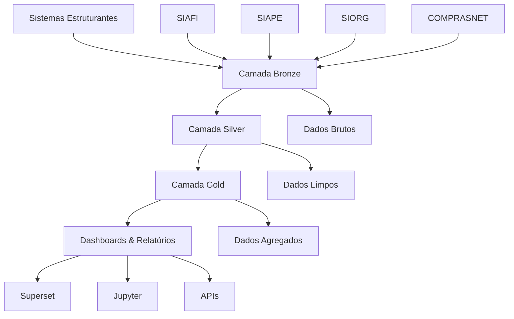
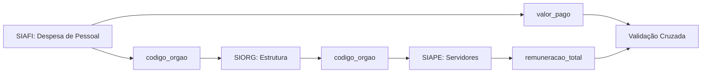
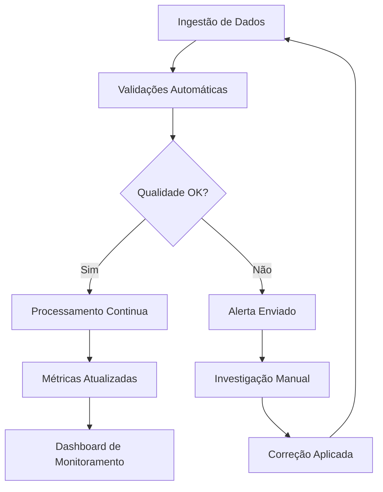

# Jornada dos Dados - Visão Geral

A jornada dos dados no GovHub representa o fluxo completo desde a coleta nos sistemas estruturantes até a disponibilização em dashboards e relatórios. Este documento apresenta uma visão abrangente de como os dados transitam pela plataforma.

## Arquitetura da Jornada

## Camadas de Dados

### 1. Sistemas Estruturantes (Fonte)

**Características:**
- Dados operacionais em tempo real
- Estruturas específicas de cada sistema
- Diferentes formatos e padrões
- Atualizações contínuas

**Principais Sistemas:**
- **SIAFI**: Execução orçamentária e financeira
- **SIAPE**: Gestão de pessoal
- **SIORG**: Estrutura organizacional
- **COMPRASNET**: Compras e contratos

### 2. Camada Bronze (Raw Data)

**Objetivo:** Armazenar dados brutos sem transformação

**Características:**
- Cópia fiel dos sistemas fonte
- Histórico completo preservado
- Formato original mantido
- Metadados de ingestão adicionados

**Tecnologias:**
- PostgreSQL para dados estruturados
- Airflow para orquestração
- APIs para extração

### 3. Camada Silver (Clean Data)

**Objetivo:** Padronizar e limpar os dados

**Transformações Aplicadas:**
- Padronização de formatos
- Limpeza de dados inconsistentes
- Enriquecimento com metadados
- Aplicação de regras de negócio
- Criação de chaves de integração

**Tecnologias:**
- DBT para transformações
- SQL para lógica de negócio
- Testes automatizados de qualidade

### 4. Camada Gold (Analytics Ready)

**Objetivo:** Dados otimizados para análise

**Características:**
- Agregações por dimensões de negócio
- Desnormalização para performance
- Métricas calculadas
- Estrutura otimizada para consultas

**Tipos de Tabelas:**
- Fatos (métricas quantitativas)
- Dimensões (atributos descritivos)
- Agregações específicas por caso de uso

## Fluxo de Integração

### Processo de Ingestão

1. **Extração (Extract)**
   - Conexão com APIs dos sistemas
   - Coleta incremental de dados
   - Validação de conectividade
   - Log de operações

2. **Carregamento (Load)**
   - Inserção na camada Bronze
   - Preservação de dados históricos
   - Controle de duplicatas
   - Metadados de processamento

3. **Transformação (Transform)**
   - Limpeza e padronização
   - Aplicação de regras de negócio
   - Enriquecimento de dados
   - Criação de relacionamentos

### Chaves de Integração

As chaves de integração são fundamentais para conectar dados entre sistemas:

#### Chaves Principais

| Sistema Origem | Sistema Destino | Chave de Integração | Descrição |
|----------------|-----------------|-------------------|-----------|
| SIORG | SIAFI | `codigo_orgao` | Vincula estrutura organizacional com execução orçamentária |
| SIORG | SIAPE | `codigo_orgao` | Conecta estrutura com dados de pessoal |
| SIAFI | COMPRASNET | `numero_processo` | Liga execução orçamentária com processos de compra |
| SIAPE | SIAFI | `cpf` + `codigo_orgao` | Relaciona despesas de pessoal com servidores |

#### Exemplo de Integração: SIAFI ↔ SIAPE

## Qualidade dos Dados

### Controles de Qualidade

1. **Validações de Entrada**
   - Formato dos dados
   - Completude obrigatória
   - Consistência temporal
   - Integridade referencial

2. **Testes Automatizados**
   - Testes unitários por tabela
   - Testes de relacionamento
   - Validações de regras de negócio
   - Monitoramento de anomalias

3. **Métricas de Qualidade**
   - Percentual de completude
   - Taxa de erro por fonte
   - Tempo de processamento
   - Volume de dados processados

### Monitoramento

## Governança de Dados

### Responsabilidades

- **Equipe de Dados**: Manutenção da infraestrutura e pipelines
- **Analistas de Negócio**: Definição de regras e validações
- **Gestores de Sistema**: Qualidade dos dados na origem
- **Usuários Finais**: Feedback sobre inconsistências

### Políticas

1. **Retenção de Dados**
   - Bronze: 7 anos (dados históricos completos)
   - Silver: 5 anos (dados limpos)
   - Gold: 3 anos (dados agregados)

2. **Acesso e Segurança**
   - Controle de acesso por perfil
   - Auditoria de consultas
   - Anonimização quando necessário

3. **Documentação**
   - Dicionário de dados atualizado
   - Linhagem de dados documentada
   - Changelog de alterações

## Casos de Uso por Domínio

### Domínio Orçamentário
- Acompanhamento de execução orçamentária
- Relatórios de transparência
- Dashboards gerenciais

### Domínio de Pessoal
- Análise da força de trabalho
- Controle de despesas de pessoal
- Relatórios de estrutura organizacional
- Indicadores de RH

### Domínio de Compras
- Monitoramento de contratos
- Análise de fornecedores
- Eficiência de processos licitatórios

## Próximos Passos

Para entender em detalhes como os dados fluem em cada domínio específico, consulte:

- [Domínio Orçamentário](dominio-orcamentario.md)
- [Domínio de Pessoal](dominio-pessoal.md)

Cada seção detalha as transformações específicas, chaves de integração e casos de uso particulares de cada área.
