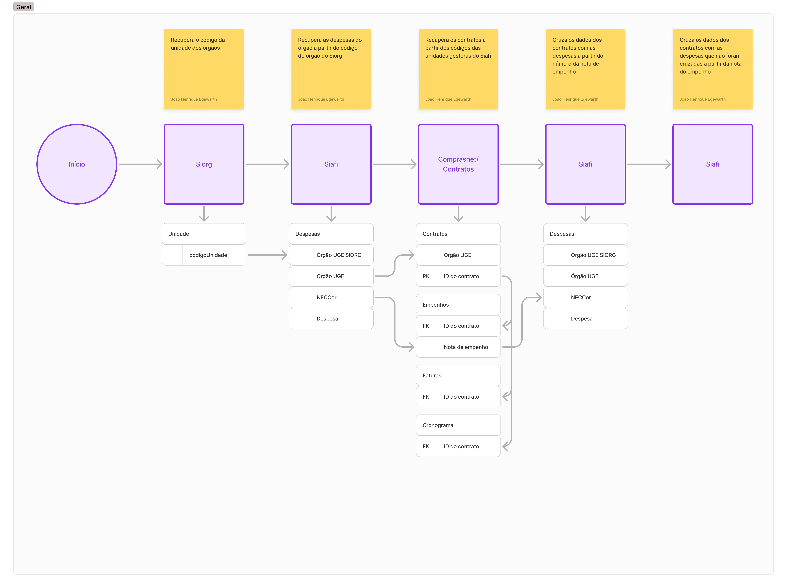

# O Que São os Sistemas Estruturantes?

Os sistemas estruturantes são o núcleo operacional do governo federal, projetados para apoiar atividades essenciais de gestão e garantir a padronização e eficiência na administração pública. Eles desempenham um papel fundamental na consolidação, integração e qualificação de dados, tornando-se indispensáveis para a formulação e execução de políticas públicas.

Os sistemas estruturantes são plataformas de software gerenciadas por órgãos centrais do governo federal, projetadas para organizar e otimizar as principais operações administrativas. Eles servem como ponto de conexão entre diversos órgãos governamentais, promovendo interoperabilidade e integridade de dados.

## Quais os sistemas Estruturantes Integrados no GovHub?

Hoje o GovHub integra  sistemas estruturantes relacionados a dois domínios: planejamento/execução orçamentária e gestão de pessoal do governo federal.

Os Sistemas Estruturantes referentes ao domínui do planejamento/execução orçamentária são:

- **SIAFI (Sistema Integrado de Administração Financeira):**  
  Responsável pela gestão financeira e execução orçamentária do governo federal.
  
- **ComprasNet**: Responsável pela gestão de contratos, licitações e aquisições públicas.

- **TransfereGov**: Responsável pela gestão de transferências entre órgãos públicos e TED (Termo de Execução Descentralizada).

A integração desses três sistemas estruturantes permite que o GovHub tenha acesso a dados relevantes para a gestão orçamentária e financeira do governo federal. Permite gestores terem acesso a dados consolidados e atualizados, facilitando a tomada de decisões e a execução orçamentária. A imagem abaixo ilustra o fluxo de coleta de dados dos sistemas estruturantes.

[{ loading=lazy }](../assets/images/FluxoColetaDados-SistemasEstruturantes.png)

Já os sistemas estruturantes referentes à gestão de pessoal do governo federal são:

- **SIAPE (Sistema Integrado de Administração de Recursos Humanos):**  
  Utilizado para o gerenciamento de pessoal no âmbito federal.
  
- **SIORG (Sistema de Organização e Inovação Institucional):**  
  Centraliza informações sobre a estrutura organizacional dos órgãos governamentais.

A integração desses dois sistemas estruturantes permite que o GovHub tenha acesso a dados relevantes para a gestão de pessoal do governo federal, tanto quanto ao perfil do servidor público, quanto a estrutura organizacional dos órgãos governamentais. Permite gestores terem acesso a dados consolidados e atualizados, facilitando a tomada de decisões e a execução orçamentária.

---

## Desafios e Problemas Estruturantes

Embora os sistemas sejam indispensáveis, muitos enfrentam desafios históricos relacionados à sua fragmentação e falta de integração.

### Fragmentação de Dados

- **Sistemas Legados:**  
  Muitos sistemas estruturantes foram desenvolvidos de forma independente, o que dificulta a comunicação entre eles.

- **Redundância e Inconsistências:**  
  A ausência de interoperabilidade eficiente leva à duplicação de dados e inconsistências nas informações armazenadas.

### Impacto na Gestão Pública

- **Dificuldade na Tomada de Decisão:**  
  A fragmentação exige que gestores realizem processos manuais de cruzamento de dados, reduzindo a agilidade nas respostas governamentais.
  
- **Barreiras à Transparência:**  
  Dados não integrados dificultam a geração de relatórios abrangentes, impactando negativamente a prestação de contas pública.

---

## Soluções e Abordagem do Projeto

O projeto desenvolvido pelo **IPEA e Lab Livre** visa solucionar os problemas dos sistemas estruturantes através de:

### Integração e Interoperabilidade

Por meio de APIs bem documentadas e processos automatizados, o projeto promove a comunicação entre diferentes sistemas estruturantes, eliminando redundâncias e inconsistências.

### Qualificação de Dados

Os dados coletados são processados, cruzados e organizados em tabelas otimizadas dentro de um Data Warehouse, criando uma base sólida para análises estratégicas.

### Visualização e Relatórios Automatizados

Dashboards interativos desenvolvidos com ferramentas como **Apache Superset** oferecem relatórios personalizáveis, permitindo uma análise mais acessível e estratégica.

---

## Benefícios para a Administração Pública

### Decisões Baseadas em Evidências

Os sistemas integrados permitem que gestores acessem informações precisas e atualizadas, promovendo uma governança mais assertiva.

### Eficiência Operacional

A automação de processos reduz custos e aumenta a produtividade dos órgãos públicos.

### Transparência e Responsabilidade

A integração de dados facilita a publicação de relatórios consistentes e compreensíveis, promovendo maior confiança entre governo e sociedade.

# Requisitos de Interoperabilidade

A integração entre sistemas estruturantes é realizada por meio do mapeamento de identificadores ou chaves que permitam relacionar informações entre bases distintas. Por exemplo, os dados de planejamento de um contrato estão disponíveis no Compras.gov.br (ComprasNet), enquanto o contrato executado e seus registros financeiros são armazenados no SIAFI.

Apesar de, em um primeiro momento, ser possível considerar o CNPJ da empresa como chave de integração, esse atributo não é suficiente para garantir unicidade, uma vez que uma mesma empresa pode estar vinculada a múltiplos contratos. Idealmente, o número do contrato seria o identificador adequado, por ser único — no entanto, esse dado não está disponível no SIAFI, o que impede seu uso direto como chave de junção.

Para contornar essa limitação, desenvolvemos heurísticas que combinam e correlacionam conjuntos de atributos capazes de identificar vínculos únicos entre os registros dos sistemas. Esse processo, além de viabilizar a integração, também evidencia lacunas e requisitos de interoperabilidade que precisam ser endereçados para permitir a comunicação consistente e confiável entre os sistemas estruturantes.

Para acessar os requitos de interoperabilidade até o momento mapeados, clique no link abaixo:

TODO